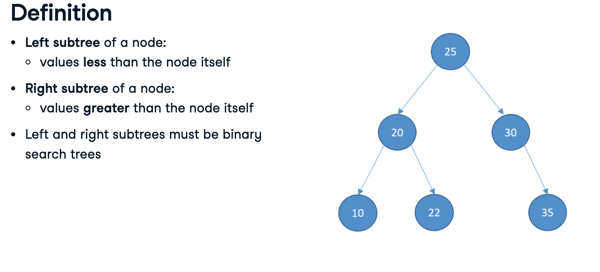

*based on [link][1]*
*created on: 2024-09-09 10:50:13*
# Algorithm Course Data Camp 


## [Stack](https://docs.python.org/3/library/collections.html#collections.deque)

FIFO queue

```python 
from collections import deque

stack = deque() # use maxlen if needed by default None
stack.append('x') # add element 
stack.pop() # get last added element 
len(stack) # get length of elements 
stack[-1] # view last added element

# other methods 
stack.appendleft(x) # append to left - (first element)
stack.extend([1,2,3,4]) # append all elements from an iterable 
stack.popleft() # get element from left side 
stack.reverse() # reverse queue
```

## [Queue](https://docs.python.org/3/library/queue.html#simplequeue-objects)

```python 
import queue

orders_queue = queue.SimpleQueue()
orders_queue.put("Sushi") # add element 
orders_queue.get() # pop an element (long time standing)
orders_queue.empty() # check if empty 
orders_queue.qsize() # equivalent of len 
```

## [Binary Tree]

binary tree

```python

class TreeNode:
    def __init__(self, data, left=None, right=None):
        self.data = data
        self.left_child = left
        self.right_child = right

# add some elements 
node1 = TreeNode("B")
node2 = TreeNode("C")
root_node = TreeNode("A", node1, node2)
```

## [Graph]

```python
class Graph:
    def__init(self):
        self.vertices = {}
    def add_vertex(self, vertex):
        self.vertices[vertex] = []
    def add_edge(self, source, target):
        self.vertices[source].append(target)

my_graph = Graph()
my_graph.add_vertex('David')
my_graph.add_vertex('Miriam')
my_graph.add_vertex('Martin')
my_graph.add_edge('David', 'Miriam')
my_graph.add_edge('David', 'Martin')
my_graph.add_edge('Miriam', 'Martin')
print(my_graph.vertices)
```

## Binary Search

```python 
    
    def search(self, nums: List[int], target: int, acc:Optional[int] = 0) -> int:
        mid = len(nums)//2
        if nums[mid] == target:
            return mid + acc 
        elif len(nums) <=1:
            return -1
        if nums[mid] > target:
            return self.search(nums[:mid], target) 
        elif nums[mid] < target: 
            return self.search(nums[mid:], target, acc=mid + acc)
        
```
## Binary Search Tree (BST)



```python 
class TreeNode:
    def __init__(self, data, left=None, right=None):
        self.data = data
        self.left_child = left
        self.right_child = right
class BinarySearchTree:
    def __init__(self):
        self.root = None


# search - non recursive
def search(self, search_value):
    current_node = self.root
    while current_node:
        if search_value == current_node.data:
            return True
        elif search_value < current_node.data:
            current_node = current_node.left_child
        else:
            current_node = current_node.right_child
    return False

def insert(self, data):
    new_node = TreeNode(data)
    if self.root == None:
        self.root = new_node
        return
    else:
        current_node = self.root
        while True:
        if data < current_node.data:
            if current_node.left_child == None:
                current_node.left_child = new_node
            return
            else:
                current_node = current_node.left_child
        elif data > current_node.data:
            if current_node.right_child == None:
                current_node.right_child = new_node
                return
        else:
            current_node = current_node.right_child
def deleting(self):
    #PITA
    pass
```


## Depth First Search (DFS)
starts from the root, then left, then right, the return part has 3 versions 

```python 
def in_order(self, current_node):
    if current_node:
        self.in_order(current_node.left_child) # left first 
        # (once left explored then print the current node)
        print(current_node.data)
        # then explore right 
        self.in_order(current_node.right_child)

# pre order is the same but it prints first and then explore left 
def pre_order(self, current_node):
    if current_node:
        print(current_node.data)
        self.pre_order(current_node.left_child)
        self.pre_order(current_node.right_child)

# post order explore left then right then print
def post_order(self, current_node):
    if current_node:
        self.pre_order(current_node.left_child)
        self.pre_order(current_node.right_child)
        print(current_node.data) 

my_tree.in_order(my_tree.root)

# graph version, adds visited nodes and explore all neighbors 
def dfs(visited_vertices, graph, current_vertex):
    if current_vertex not in visited_vertices:
        print(current_vertex)
        visited_vertices.add(current_vertex)
        for adjacent_vertex in graph[current_vertex]:
            dfs(visited_vertices, graph, adjacent_vertex)

```
## Breadth first search (BFS)

explore level by level 
```python 
def bfs(self):
    if self.root:
        visited_nodes = []
        bfs_queue = queue.SimpleQueue()
        bfs_queue.put(self.root)
    while not bfs_queue.empty():
        current_node = bfs_queue.get() # select one node from the queue "to be visited" 
        visited_nodes.append(current_node.data) # mark as visited 
        if current_node.left: # add child's onto the queue
            bfs_queue.put(current_node.left)
        if current_node.right:
            bfs_queue.put(current_node.right)
    return visited_nodes
```

## Bubble Sort
```python 
def bubble_sort(my_list):
    list_length = len(my_list)
    for i in range(list_length-1): # repeat n times 
        for j in range(list_length-1-i): # go thought the array up to n-i 
            if my_list[j] > my_list[j+1]: # swap items if they are not sorted 
                my_list[j] , my_list[j+1] = my_list[j+1] , my_list[j]
return my_list
```
## Merge Sort 

```python 
def merge_sort(my_list):
    if len(my_list) > 1: # base case (this is a recursive implementation)
        mid = len(my_list)//2
        # split and sort 
        left_half = my_list[:mid]
        right_half = my_list[mid:]
        merge_sort(left_half) # recursive call on left side 
        merge_sort(right_half) # recursive call on right side  side 

    # merge routine 
    i = j = k = 0
    # i will iterate over left half and j on the right one 
    # given that both are sorted we will go trough them in order and appending
    # the minimum item from both
    while i < len(left_half) and j < len(right_half): 
        if left_half[i] < right_half[j]:
            my_list[k] = left_half[i] # destructive, but it should work (?)
            i += 1
        else:
            my_list[k] = right_half[j]
            j += 1
        k += 1
        while i < len(left_half): # if i haven't go trough the entire left side, complete
            my_list[k] = left_half[i]
            i += 1
            k += 1
        while j < len(right_half): # or if the right side haven't been completed either same
            my_list[k] = right_half[j]
            j += 1
            k += 1
```


[//]: <> (References)
[1]: <https://google.com>

[//]: <> (Some snippets)
[//]: # (add an image )