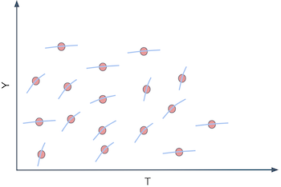

*based on [chapter 18][1] from The Causal Inference for the Brave and True*
*created on: 2024-05-26 19:19:33*
## Heterogeneous Treatment

In the causal inference discipline we usually focus on measuring the  **average** effect of a treatment $T$ in an outcome variable $Y$. This effect, known as ATE (**Average** Treatment Effect) $\bar{\mu}$

$$ATE = \bar{\mu} = \frac{\sum_{i \in units} \mu_i}{n} $$

While we known that there's heterogenity on the treatment effect $\mu_i$, we usually don't focus on studying the treatment effect at the unit level, usually because we use causal inference analysis to understand to launch/roll-out certain treatment or not. 

However, when we are deciding, **who to treat?** the understanding of the effect at the unit level becomes way more interesting. This estimation, the effect of the treatment at the unit level, can be framed as the effect of the treatment conditioned by the observable variables of the unit $i$ $X_i$. This effect estimation its usually referred as $CATE$ (conditional average treatment effect)

$$CATE = E[Y_1−Y_0 | X] $$

Note that on the formula if two units have the same observable variables $X_i = X_j$ their CATE estimation will be the same.

Given a continuous treatment $T$, we could study the _sensitivity_ to the treatment for each unit:  

$$\frac{\delta Y_i}{ \delta T_i}$$

We could visualize it thinking on a plot with each unit and their slope associated.



For us to see the individual slopes, we would have to observe each unit under two different treatments, and calculate their outcome change, but we can't do that. This is the fundamental problem of causal inference all over again. We can’t ever see the same unit under different treatment conditions. So, what can we do?

### Predicting Sensitivity 

for predicting the slope we can't use a ML algorithm directly, given that I don't have a observed target for the slopes -unobservables-. But maybe we can "model it". 

Let’s say you fit the following linear model to your data.

$$y_i = \beta_0 + \beta_1 t_i + \beta_2 X_i + e_i$$

If you differentiate it on the treatment, you will end up with

$$\frac{\delta y_i}{\delta t_i} = \beta_1$$
 
And since you can estimate the model above to get 
, we might even be as bold as to say that **you can predict sensitivity even though you can’t observe it**. In the case above, it is a rather simple prediction, that is, we are predicting the constant value for everyone. That’s something, but not yet what we want. That’s the ATE, not the CATE. However, we can do the following simple change

$$y_i = \beta_0 + \beta_1 t_i + \beta_2 X_i + \beta_3 t_i X_i  + e_i$$

Which would in turn give us the following sensitivity prediction

$$\widehat{\frac{\delta y_i}{\delta t_i}} = \hat{\beta_1} + \hat{\beta_3}X_i  \tag{3}$$
 
Where $\beta_3$ is a vector coefficient for the features in $X$.

Now each entity defined by a different $X_i$ will have a different sensitivity prediction. In other words, the sensitivity prediction will change as $X$ changes. Alas, regression can give us a way of estimating the CATE $E[y'(t)|X]$.

So, how to actually make those sensitivity predictions?. One way is to extract the sensitivity parameters from the model and use the formula above $(3)$. However, we will resort to a more general approximation. Since sensitivity is nothing more than the derivative of the outcome on treatment, we can use the definition of the derivative.

$$\frac{\delta y}{\delta t} = \dfrac{y(t+\epsilon) - y(t)}{ (t + \epsilon) - t }  \approx \hat{y}(t+1) - \hat{y}(t)$$


using `statsmodels` we can easily get the sensitivity

```python
import statsmodels.formula.api as smf
model = smf.ols("y ~ t + t*x", data=df).fit()
sensitivity = model.predict(df.assign(**{t:df[t]+1})) - m.predict(df)
```


### APPENDIX: Evaluating Causal Models. 

Let's assume that we try to understand how good does our sensitivity model predicts sensitivity, and how useful its that prediction to understand the treatment effectiveness. To do that we will compare three models 

1. Sensitivity Model -Linear Regression- 
2. Y Prediction Model -ML model predicting target Y-
3. Random model -a random number- 

To do the test more realistic we will train our models in biased historical data, but we will evaluate in a random treatment dataset (ie, a dataset where the treatment was applied randomly). why do we do that?, because given that the treatment was randomly applied we could sort the samples by each model score (sensitivity_score, y_pred_score, random_score), and visualize how the ATE for an specific group, sorted by any of the model scores, its good to "target" the "higher ATE" cohort. 


we estimate the ATE thinking on a continous treatment effect, therefore we can use the following regression. 

$$y_i = \beta_0 + \beta_1t_i + e_i$$

In our case the ATE will be given by $\beta_1$ (because its the $t$ effect on $y$). The estimator for  $\beta_1$ its given by (from LR theory):

$$\hat{\beta_1}=\dfrac{\sum (t_i - \bar{t}) (y_i - \bar{y})}{\sum(t_i - \bar{t})^2}$$

Using the image from [the text][2] we obtain the following results of ATE for 10 bands given the 3 models described above. 


### Cumulative Gain Curve

using this scores, and after inverting model 2, we can estimate the cumulative gain curve. 

$$\widehat{F(t)}_k = \hat{\beta_1}_k * \frac{k}{N} =\dfrac{\sum_i^k (t_i - \bar{t}) (y_i - \bar{y})}{\sum_i^k(t_i - \bar{t})^2} * \frac{k}{N}$$

the idea is that $\frac{k}{N}$ will represent the proportion of the population subject to the treatment and $ \hat{\beta_1}_k$ the ATE for that population. This can help us draw the ATE curve 


as we mention before in this case our ATE $ \hat{\beta_1}_k$ has a negative effect on the outcome variable, therefore we would like to sort our population from the "higher ATE", meaning the "less negative value" -this example its about elasticity-. so we can increase prices on the "less elastic days", and then the rest of days. 


[//]: <> (References)
[1]: <https://matheusfacure.github.io/python-causality-handbook/18-Heterogeneous-Treatment-Effects-and-Personalization.html>
[2]: <https://matheusfacure.github.io/python-causality-handbook/19-Evaluating-Causal-Models.html#sensitivity-by-model-band>

[//]: <> (Some snippets)
[//]: # (add an image )