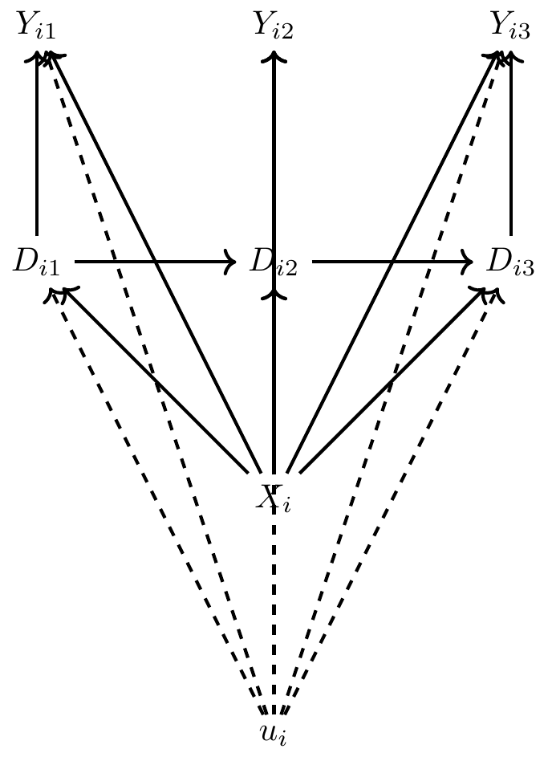
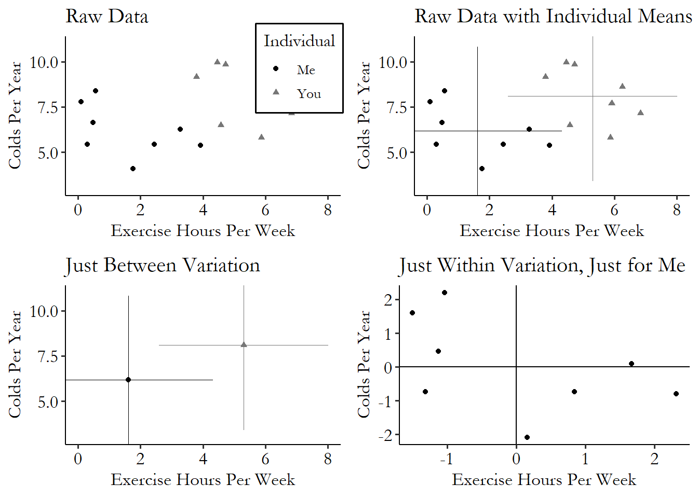
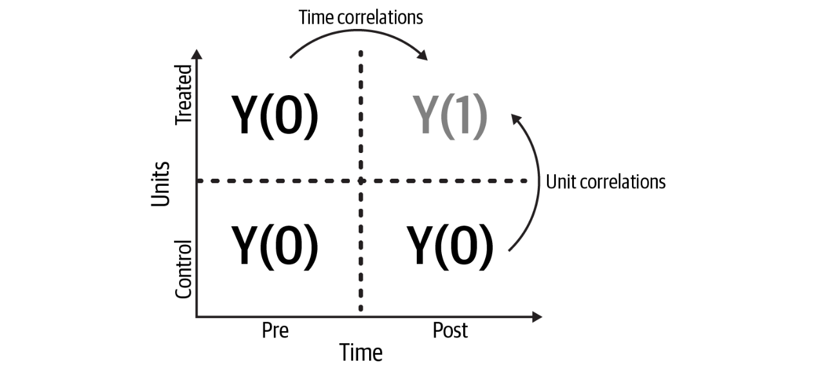

## Panel (causal Inference The Mixtape)

A panel is a (randomly selected from a population) group of entities observed overtime. The outcome variable will be $Y_{i,t}$ for the unit $i \in N$ on the time $t \in T$. There is a covariate $D_{i,t}$ that represent the status of the treatment, and two other variables $X_i$ and $u_i$ both are different by entity but they both **don't change overtime** the only difference is that we know $X_i$ but we don't observe $u_i$. 

#### Assumptions:

1. The treatment $D_{i,t}$ affects the value of the outcome $Y_{i,t}$ but also affects the next week treatment $D_{i,t+1}$
2. $X_i$ and $u_i$ affect both the treatment ( $D_{i,t}$ ) and the outcome( $Y_{i,t}$ ), (this opens a backdoor), therefore the treatment is an endogenous variable when regressing, because $u_i$ (unobserved) will be absorbed by the error $\varepsilon$.
3. **Unobserved heterogeneity**: there is no unobserved variable that varies overtime, in other words, the panel is heterogenic ( $u_i, X_i$ ) but the panel entities **don't change over time** (except for $D,Y$) or if they change that variable don't affect $D,Y$. **This is a very strong assumption**
4. **Past outcomes don't *directly* affect current outcomes** ( $Y_{i,t-1}  \bot Y_{i,t}$ ). This is also a very strong assumption considering things like earnings/health/purchases, anything where $Y_{i,t} \sim Y_{i,t-1}$ 
5. Past treatments do not directly affect current treatments. That means ( $Y_{i,t-1}  \bot D_{i,t}$ ). This is a less strong assumption compared to 3. and 4., but still might be concerning in things such as $Y$ earnings, $D$ education (for example).  
6. Past treatments do not affect present outcomes [not directly at least, but via $D_{i,t}$ ]( $D_{i,t-1}  \bot Y_{i,t}$ ). This is also a more easy-to-meet assumption. 

Under this 6 assumptions we can estimate the effect of $D \to Y $ using the **Fixed Effect Estimator** (FE). Our estimations model will be something like the following linear formula:

$$Y_{i,t} = \delta D_{i,t} + u_i + \varepsilon_{i,t}$$

we will call $u_i$ the _"unobserved heterogeneity"_ (that varies by entity but not over time). and $\varepsilon_{i,t}$ called the "idiosyncratic error" will be the time-varying unobserved factors that determinate $Y_{i,t}$. Adding this factor is the same as adding a control by entity $u_i$, at the end $u_i$ is another parameter that we need to fit in our regression ( $\beta_i$ )

**Why not run directly the regression?** $Y_{i,t} \sim D_{i,t}$?. we will get something like this:

$$Y_{i,t} = \delta D_{i,t} + \eta_{i,t}$$ 

where $\eta_{i,t} = u_i + \varepsilon_{i,t}$ is a composite error. that means that we have to assume  that $u_i \bot D_{i,t}$ This a assumption that is rarely hold in observational studies, the dag presented at the begging also explicitly link $u_i$ with $D_{i,t}$ breaking this premise.

### Fixed Effects (FE)
there are two methods to run that regression: 

1. _"within regression"_ or _"absorbing the fixed effect"_ ( $y-\overline{y}$ )
2. _"binary regression"_: adding the $u_i$ as binary variables ( $\beta_i$ )

In the first method idea is to make a transformation over the model $Y_{i,t} = \delta D_{i,t} + u_i + \varepsilon_{i,t}$ so we can remove the $u_i$ variable from it ( $\beta_i$ ). Using the following transformations should be _numerically equivalent_ to the regression of $Y_{i,t} \sim D_{i,t} $ and **unit specific dummy variables** ( $u_i$ ), as we said before, same to add a binary parameter $\beta_i$ that controls by entity. 

$$\widetilde{Y_{i,t}} = Y_{i,t} - \overline{Y_{i}}$$
$$\widetilde{D_{i,t}} = D_{i,t} - \overline{D_{i}}$$

where:

$$
\overline{D_{i}} \equiv \dfrac{1}{T}\sum_{t=1}^TD_{it}
$$

$$
\overline{Y_{i}} \equiv \dfrac{1}{T} \sum_{t=1}^T Y_{it}
$$

finally the model to run will be:

$$Y_{i,t} - \overline{Y_i} = \beta_0 + \beta_1*(D_{i,t}-\overline{D_i}) + \varepsilon_{i,t}$$

In other words adding this transformation is equivalent of adding a set of $u_i$ dummy variables to control for the _**Unobserved heterogeneity**_, actually you can use both methods indistinctly (1),(2) (adding binaries or calculate the differences). From The Effect Book:

> Fixed effects is a method of controlling for all variables, whether they’re observed or not, as long as they stay constant within some larger category.

The idea is that, if we control for the larger category therefore we will be controlling that is constant over that category. For example, we want to study the effect of $D$ (some new policy in a Country) in $Y$ (GDP) but we have some unobserved variables $u_i$ that affect $D$ and $Y$ (unobserved heterogeneity) such as culture, geography, industries. We can control for it measuring many countries ("larger category") to control by $u_i$. **Note**: again this will not consider other variables that vary overtime $u_{i,t}$ such as Education, Climate change, etc. 

**Notes about the $R^{2}$**

There is a difference in the $R^2$ value from the first method (*within* regression) vs the second one (*binary regression*) and that's because 

$$
R^2 = 1- \frac{\sum_i{y_i-\hat{y_i}}}{\sum_i{y_i-\overline{y}}}
$$

but the $y$ is different in both regressions, in the *within* method $y_i = y_i-\overline{y}$ and in the _binary regression_ y is simply y. basically $R^2$ explains the variance of the ind variable over the residuals variance, I think that the _within regression_ tends to reduce the variance, therefore reduce the $R^2$ against the _binary regression_

### Known issues with Fixed Effects (FE)
1. **Fixed effects cannot solve reverse causality**: If there is an inverse relationship between $Y_{i,t} \to D_{i,t} $ the FE estimator will not work, for example in $Y$:crime rates and $D$: police investment. Is it possible that our regression show that an increase in police investment increase the crime rates too. (but there is a reverse causality problem, also called _simultaneity bias_).

2. **Fixed Effects cannot address time-variant unobserved heterogeneity**: that means that our unobserved heterogeneity depends also on the time $u_{i,t}$. In that case FE estimator will also be biased by an omitted variable. 

3. **Fixed Effects weights more the effect of entities with higher variance**: given that we normalize all the entities and transform their "coordinate reference"

Given that we estimate the effect _"within"_ entities, we will weight the higher variance entities and omit the effect of the lower ones (because, yes, that's why we call it "mean" effect). There is a way to "fix that" [weighting by variance][1]. 

### Notes from Panel Data [The Brave and True]

Using the Panel data (and therefore DnD -thinking that DnD is just a specific case of Panel data) we have an easier time if we want to estimate ATT vs ATC (or ATE). The reason is that we have $Y(0)$ data for all the units pre treatment, so we can "extrapolate" easier the conterfactual for the treated units as control than the other way around. we only have $Y(1)$ for the treated units on the period after the intervention. 

[comment]: References 
[1]: <https://theeffectbook.net/ch-FixedEffects.html#:~:text=address%20the%20problem.-,23,-23%20The%20Gibbons>
