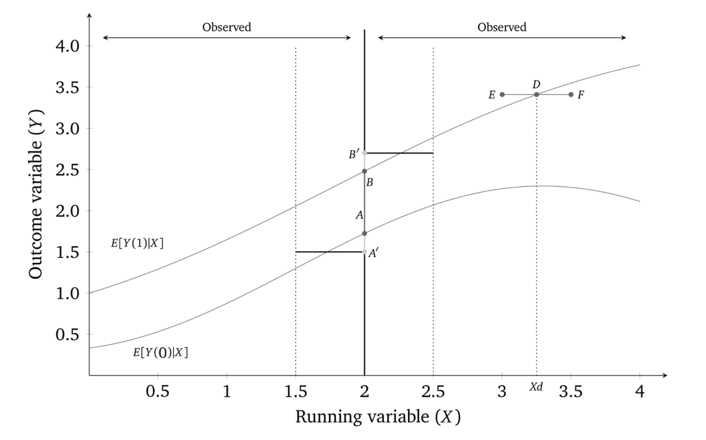
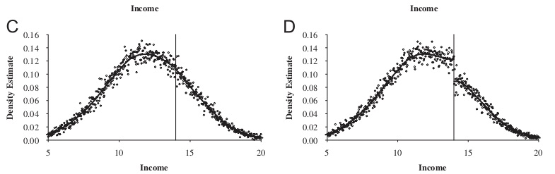

*based on ["Causal Inference The Mixtape"][1]*
*created on: 2024-11-16 20:00:43*

## Chapter 6: Regression Discontinuity (RDD)

In some situations, the treatment is assigned based on an arbitrary cohort or threshold score, $C_0$ over the "running variable" $X$. Examples include admission scores or penalties from alcohol tests. 

We are never able to observe units with the same value of the running variable $X$ on both groups (Control and Treatment), therefore we can't apply CIA (given that we are not fulfilling the common support assumption). 

We can assume that, if the threshold score was randomly assigned, (or at least independently of the outcome variable) we fulfill the **"continuity assumption"**, that is translated into: "at the cutoff the potential outcomes are continuous".

Having the Continuity assumption, and specification assumption (given that we will need to extrapolate) we are able to estimate LATE (local average treatment effect) on the units right on the cutoff. Assuming LATE is the same for all units, we can estimate the ATE (average treatment effect) for the whole population.

The validity of an RDD doesn’t require that the assignment rule be arbitrary. It only requires that it be known, precise and free of manipulation. The most effective RDD studies involve programs where $X$ has a “hair trigger” that is not tightly related to the outcome being studied.  Examples include the probability of being arrested for DWI jumping at greater than 0.08 blood-alcohol content (Hansen 2015); the probability of receiving health-care insurance jumping at age 65, (Card, Dobkin, and Maestas 2008); the probability of receiving medical attention jumping when birthweight falls below 1,500 grams.

There are two known accepted methods to estimate the treatment effect in RDD: 
1. Sharp Design: the treatment goes from 0 to 1 at the cutoff (sharply)
2. Fuzzy Design: the treatment varies in proportions between $[0,1]$ at the cutoff.

### Sharp RDD

More formally, in a sharp RDD, treatment status is a deterministic and discontinuous function of a running variable 
$X_i$, where

$$
D_i =
   \begin{cases} 1
       \text{ if } & X_i\geq{c_0}
       \\ 0
       \text{ if } & X_i < c_0    
   \end{cases}
$$

where $c_0$ is a known threshold or cutoff. Finally the specification will be given by: 

$$\begin{align}
   Y_i & =\alpha+\beta X_i + \delta D_i + \varepsilon_i
\end{align}
$$

The sharp RDD estimation is interpreted as an average causal effect of the treatment as the running variable approaches the cutoff in the limit, for it is only in the limit that we have overlap. This average causal effect is the local average treatment effect (LATE). Since identification in an RDD is a limiting case, **we are technically only identifying an average causal effect for those units at the cutoff**. We define this local average treatment effect as follows:

$$\delta_{SRD}=E\big[Y^1_i - Y_i^0\mid X_i=c_0]$$

RDD does not have common support, which is one of the reasons we rely on extrapolation for our estimation.

#### Continuity Assumption 

The key identifying assumption in an RDD is called the continuity assumption. It states that $E[Y^0_i\mid X=c_0]$ and 
$E[Y_i^1\mid X=c_0]$ are continuous (smooth) functions of $X$ even across the $C_0$ threshold. Absent the treatment, in other words, the expected potential outcomes wouldn’t have jumped; they would’ve remained smooth functions of $X$. Continuity, in other words, explicitly rules out omitted variable bias at the cutoff itself. All other unobserved determinants of $Y$ are continuously related to the running variable $X$. Formally, this is exactly what is implied by continuity—the absence of simultaneous treatments at the cutoff. 

In a way the continuity assumption is nothing more than the "single treatment" assumption for RDD. 

#### Estimation of local and global least squares regression.

While not necessary, it is nonetheless quite common for authors to transform the running variable $X$ by recentering at $c_0$:

$$Y_i=\alpha+\beta(X_i-c_0)+\delta D_i+\varepsilon_i$$

Given the regression model that we are using to estimate the treatment effect $\delta$ we are also relying on the specification assumption. This assumption is that the relationship between $X$ and $Y$ is linear. We could other polinomial terms on $X$ to control for non-linearity. but this is just a way to extend the model, but still relies on the specification assumption. here is an example with a polynomial of degree $p$: 

$$Y_i= \alpha + \beta_{01}\tilde{X}_i + \dots + \beta_{0p}\tilde{X}_i^p +
   \delta D_i+ \beta_1^*D_i \tilde{X}_i + \dots + \beta_p^* D_i \tilde{X}_i^p + \varepsilon_i$$

But, as we mentioned earlier, Gelman and Imbens (2019) have discouraged the use of higher-order polynomials when estimating local linear regressions. An alternative is to use kernel regression. The nonparametric kernel method has problems because you are trying to estimate regressions at the cutoff point, which can result in a boundary problem (see Figure 6.11). In this picture, the bias is caused by strong trends in expected potential outcomes throughout the running variable.

While the true effect in this diagram is $AB$, with a certain bandwidth a rectangular kernel would estimate the effect as $A'B'$, which is as you can see a biased estimator. The standard solution to this problem is to run local linear nonparametric regression (Hahn, Todd, and Klaauw 2001). In the case described above, this would substantially reduce the bias. So what is that? Think of kernel regression as a weighted regression restricted to a window (hence “local”). The kernel provides the weights to that regression.

How to calculate confidence intervals? you should use the heteroskedastic robust standard errors on the regression, given that there is a specification bias when the bandwidth is too large and when the bandwidth is too small you have a bias due to standard deviation 

### Fuzzy RDD
In the sharp RDD, treatment was determined when $X_i \geq c_0$. But that kind of deterministic assignment does not always happen. Sometimes there is a discontinuity, but it’s not entirely deterministic, though it nonetheless is associated with a discontinuity in treatment assignment. When there is an increase in the probability of treatment assignment, we have a fuzzy RDD.

The estimation of the ATE on RDDs is very similar to the one on IVs design, so there are a few options:

1. **Wald Estimator (type of)**

   $$\delta_{\text{Fuzzy RDD}} = \dfrac{\lim_{X \rightarrow c_0}
       E\big[Y\mid X = c_0\big]-\lim_{X_0 \leftarrow X}
       E\big[Y\mid X=c_0\big]}{\lim_{X \rightarrow c_0}
       E\big[D\mid X=c_0\big]-\lim_{X_0 \leftarrow X}
       E\big[D\mid X=c_0\big]}$$

   The assumptions for identification here are the same as with any instrumental variables design: all the caveats about exclusion restrictions, monotonicity, SUTVA, and the strength of the first stage

2. **Two stages least squares (2SLS)**
   
   We will separate the problem on two events, the running variable effect on the treatment $X \rightarrow D$ and the treatment effect on the outcome $D \rightarrow Y$. 
   
   First, We will create a new variable  $Z_i$ that will be 1 if $X_i >C_0$ and 0 otherwise. $Z_i$ will be the instrument for the treatment effect. (remember than in a fuzzy RDD $Z_i$ is not a guarantee of the treatment $D_i$, but an indicator of increase of probability of treatment)

   The first stage will be:
   $$D_i = \gamma_0 + \gamma_1X_i+\gamma_2X_i^2 + \dots + \gamma_pX_i^p + \pi{Z}_i + \zeta_{1i}$$

   where $\pi_i$ is the causal effect of $Z_i$ on the conditional probability of treatment ($D_i$). A second alternative for the first stage is to add also the interactio terms between $Z_i$ and $X_i$ to the model. Using the following alternative formulation:

   $$D_i= \gamma_{00} + \gamma_{01}\tilde{X}_i + \gamma_{02}\tilde{X}_i^2 + \dots + \gamma_{0p}\tilde{X}_i^p
   + \pi Z_i + \gamma_1^*\tilde{X}_i Z_i + \gamma_2^* \tilde{X}_i Z_i + \dots + \gamma_p^*Z_i + \zeta_{1i}$$

   The second-stage model with interaction terms would be:
   
   $$
   \begin{align}
     Y_i & =\alpha + \beta_{01}\tilde{x}_i + \beta_{02}\tilde{x}_i^2 + \dots + \beta_{0p}\tilde{x}_i^p \\
     & + \delta \widehat{D_i} + \beta_1^*\widehat{D_i}\tilde{x}_i + \beta_2^*\widehat{D_i}\tilde{x}_i^2 + \dots + \beta_p^*\widehat{D_i}\tilde{x}_i^p + \eta_i
   \end{align}
   $$

   Where $\tilde{x}$ are now not only normalized with respect to $c_0$ but are also fitted values obtained from the first-stage regressions.

3. **Reduced form**

   If we wanted to forgo estimating the full IV model, we might estimate the reduced form only.  The reduced form would regress the outcome $Y$ onto the instrument and the running variable. The form of this fuzzy RDD reduced form is:

   $$Y_i = \mu + \kappa_1X_i + \kappa_2X_i^2 + \dots + \kappa_pX_i^p + \delta \pi Z_i + \zeta_{2i}$$

   But let’s say you wanted to present the estimated effect of the treatment on some outcome. That requires estimating a first stage, using fitted values from that regression, and then estimating a second stage on those fitted values. **The reduced form only estimates the causal effect of the instrument on the outcome**. 

One needs the same assumptions for identification as one needs with IV. As with other binary instrumental variables, the fuzzy RDD is estimating the local average treatment effect (LATE) (Guideo W. Imbens and Angrist 1994), which is the average treatment effect for the compliers.

### Challenges to identification

The requirement for RDD to estimate a causal effect are the continuity assumptions. That is, the expected potential outcomes change smoothly as a function of the running variable through the cutoff. In words, this means that the only thing that causes the outcome to change abruptly at $C_0$ is the treatment. But, this can be violated in practice if any of the following is true:

1. The assignment rule is known in advance.
1. Agents are interested in adjusting.
1. Agents have time to adjust.
1. **The cutoff is endogenous** to factors that independently cause potential outcomes to shift.
1. There is nonrandom heaping along the running variable.

Examples include retaking an exam, self-reporting income, and so on. Other violations can include other treatments happening at the same time, such as 18 year-olds being persecuted by crimes, and also have the driver license. we violate the single treatment assumption. 

#### (McCrary) Density Test 

The McCrary test is a test for the presence of manipulation in the assignment of treatment. The test is based on the idea that if the assignment of treatment is random, then the density of the running variable should be continuous at the cutoff. If there is manipulation, then the density of the running variable will be discontinuous at the cutoff.

To implement the McCrary density test, partition the assignment variable into bins and calculate frequencies (i.e., the number of observations) in each bin. Treat the frequency counts as the dependent variable in a local linear regression.

This is a high-powered test. You need a lot of observations at $c_o$ to distinguish a discontinuity in the density from noise. On the upper image at the left we have a continuous density, and on the right, we have a discontinuous density.

#### Covariate Balance and other Placebos 

A second test is a covariate balance test. For RDD to be valid in your study, there must not be an observable discontinuous change in the average values of reasonably chosen covariates around the cutoff. 

Guido W. Imbens and Lemieux (2008) suggest looking at one side of the discontinuity, taking the median value of the running variable in that section, and pretending it was a discontinuity, $c_0'$. Then test whether there is a discontinuity in the outcome at $c_0'$. You do not want to find anything.

[//]:the_mixtape_summary_32.md> (References)
[1]: <https://mixtape.scunning.com/>
[2]: <https://stats.stackexchange.com/a/55891/274422>
[3]: <https://en.wikipedia.org/wiki/Ramsey_RESET_test>
[4]: <https://www.mattblackwell.org/files/teaching/s05-fisher.pdf>

[//]:the_mixtape_summary_32.md> (Some snippets)
[//]: # (add an image )