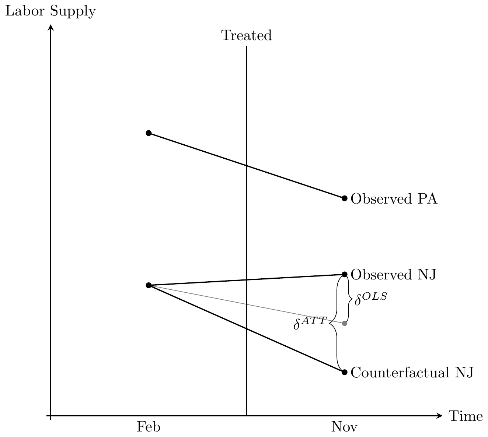
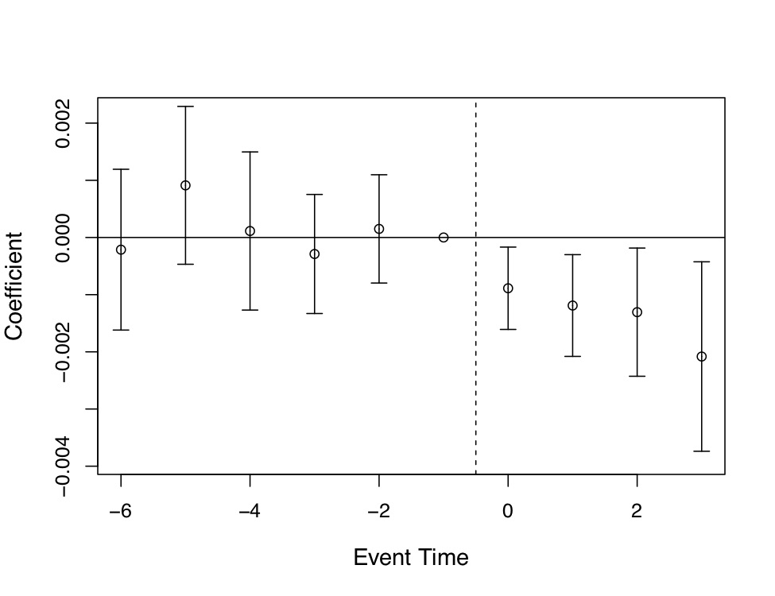

*based on ["Causal Inference The Mixtape"][1]*
*created on: 2024-11-16 20:00:43*

## Chapter 7: Difference-in-Differences

### The Simple 2x2 DD

The $2x2$ DD design has a treatment group $k$ and untreated group $U$. There is a pre-period for the treatment group, 
$\text{pre}(k)$; a post-period for the treatment group, $\text{post}(x)$; a pre-treatment period for the untreated group, $\text{pre}(U)$; and a post-period for the untreated group, $\text{post}(U)$ So:
$$
\widehat{\delta}^{2\times 2}_{kU} = \bigg ( \overline{y}_k^{\text{post}(k)} - \overline{y}_k^{\text{pre}(k)} \bigg ) - \bigg ( \overline{y}_U^{\text{post}(k)} - \overline{y}_U^{\text{pre}(k)} \bigg )
$$

That translated to:

$$
\begin{align}
&\widehat{\delta}^{2\times 2}_{kU} = \underbrace{E\big[Y^1_k |\text{Post}\big] - E\big[Y^0_k | \text{Post}\big]}_{\text{ATT}} \\
&+\Big[\underbrace{E\big[Y^0_k | \text{Post}\big] - E\big[Y^0_k |\text{Pre}\big] \Big] - \Big[E\big[Y^0_U |\text{Post}\big] - E\big[Y_U^0 |\text{Pre}\big] }_{\text{Non-parallel trends bias in $2\times 2$ case}} \Big]
\end{align}
$$

As you can see the estimator will give us the ATT estimator, if (and only if) the parallel trends bias is equal to zero, in this case whe see that the term is based on some conterfactual expectations, that we can't observed. but keep in mind that it will be zero (and only if) the difference between both groups (treatment and control) stay constant, if there's no treatment. 


Here we see the importance of the parallel trends assumption. The only situation under which the OLS estimate equals the ATT is when the counterfactual NJ just coincidentally lined up with the gray OLS line, which is a line parallel to the slope of the Pennsylvania line. Herein lies the source of understandable skepticism of many who have been paying attention: why should we base estimation on this belief in a coincidence? After all, this is a counterfactual trend, and therefore it is unobserved, given it never occurred. Maybe the counterfactual would’ve been the gray line, but maybe it would’ve been some other unknown line. It could’ve been anything—we just don’t know.

This is why I like to tell people that the parallel trends assumption is actually just a restatement of the strict exogeneity assumption we discussed in the panel chapter. What we are saying when we appeal to parallel trends is that we have found a control group who approximates the traveling path of the treatment group and that the treatment is not endogenous. If it is endogenous, then parallel trends is always violated because in counterfactual the treatment group would’ve diverged anyway, regardless of the treatment.

While differences in sample averages will identify the ATT under the parallel assumption, we may want to use multivariate regression instead. For instance, if you need to avoid omitted variable bias through controlling for endogenous covariates that vary over time, then you may want to use regression. Such strategies are another way of saying that you will need to close some known critical backdoor. Another reason for the equation is that by controlling for more appropriate covariates, you can reduce residual variance and improve the precision of your DD estimate.

### Estimation of the confidence intervals

Bertrand, Duflo, and Mullainathan (2004) point out that the conventional standard errors often severely understate the standard deviation of the estimators, and so standard errors are biased downward, “too small,” and therefore overreject the null hypothesis. Bertrand, Duflo, and Mullainathan (2004) propose the following solutions:

1. Block bootstrapping standard errors. 
    
    If the block is a state, then you simply sample states with replacement for bootstrapping. Block bootstrap is straightforward and only requires a little programming involving loops and storing the estimates. 
1. Aggregating the data into one pre and one post period. (not recommended)
1. Clustering standard errors at the group level.
    
    You simply adjust standard errors by clustering at the group level (you can use the OLS clustering option). For state-level panels, that would mean clustering at the state level, Here is a simple code snippet to illustrate this:

    ```python
    import statsmodels.api as sm
    import statsmodels.formula.api as smf

    # Assuming df is your DataFrame and 'y', 'treatment', 'time', 'state' are your columns
    # https://www.statsmodels.org/dev/generated/statsmodels.regression.linear_model.RegressionResults.get_robustcov_results.html
    model = smf.ols('y ~ treatment * time', data=df).fit(cov_type='cluster', cov_kwds={'groups': df['state']})
    print(model.summary())
    ```

    Clustering works better to estimate the standard errors because it accounts for the within-group correlation. In many cases, observations within the same group (e.g., state) are not independent of each other, which violates the assumption of independent errors in conventional standard error estimation. By clustering at the group level, we allow for intragroup correlation, leading to more accurate and robust standard error estimates. This adjustment helps to avoid underestimating the standard errors and thus reduces the risk of overrejecting the null hypothesis.


### Providing evidence for the parallel trends assumption through event studies and parallel leads

What economists typically do, instead, is compare placebo pre-treatment leads of the DD coefficient. If DD coefficients in the pre-treatment periods are statistically zero, then the difference-in-differences between treatment and control groups followed a similar trend prior to treatment. And here’s the rhetorical art of the design: if they had been similar before, then why wouldn’t they continue to be post-treatment?

But notice that this rhetoric is a kind of proof by assertion. Just because they were similar before does not logically require they be the same after. Assuming that the future is like the past is a form of the gambler’s fallacy called the “reverse position.” Just because a coin came up heads three times in a row does not mean it will come up heads the fourth time—not without further assumptions. Likewise, we are not obligated to believe that that counterfactual trends would be the same post-treatment.

One situation where parallel trends would be obviously violated is if the treatment itself was endogenous. In such a scenario, **the assignment of the treatment status would be directly dependent on potential outcomes**, and absent the treatment, **potential outcomes would’ve changed regardless**.

Nevertheless multiple ways have been proposed  to check the parallel trends assumption:
1. visual inspection of raw data 
2. placebo test 
3. leads and lags model


### leads and lags model{###leads-and-lags}    
(checking PTA and non-anticipatory assumption)

As with many contemporary DD designs, Miller et al. (2019) evaluate the pre-treatment leads instead of plotting the raw data by treatment and control. Post-estimation, they plotted regression coefficients with 95% confidence intervals on their treatment leads and lags. Including leads and lags into the DD model allowed the reader to check both the degree to which the post-treatment treatment effects were dynamic, and whether the two groups were comparable on outcome dynamics pre-treatment. Models like this one usually follow a form like:

$$
Y_{its} = \gamma_s + \lambda_t + \sum_{\tau=-q}^{-1}\gamma_{\tau}D_{s\tau} + \sum_{\tau=0}^m\delta_{\tau}D_{s\tau}+x_{ist}+ \varepsilon_{ist}
$$

In the equation above:
- $Y_{its}$ is the outcome variable for individual $i$, in time $t$, in state $s$
- $\gamma_s$ represents state fixed effects
- $\lambda_t$ represents time fixed effects
- $D_{s\tau}$ is a dummy variable equal to 1 when state $s$ is $\tau$ periods away from treatment
- The summation $\sum_{\tau=-q}^{-1}\gamma_{\tau}D_{s\tau}$ represents pre-treatment effects (leads)
- The summation $\sum_{\tau=0}^m\delta_{\tau}D_{s\tau}$ represents post-treatment effects (lags)
- $x_{ist}$ represents time-varying covariates
- $\varepsilon_{ist}$ is the error term

This model allows us to:
1. Test pre-trends by examining if $\gamma_{\tau}$ coefficients are statistically zero
2. Analyze dynamic treatment effects through the $\delta_{\tau}$ coefficients
3. Account for state-specific and time-specific unobserved factors




### Triple Differences

The DDD model introduces a third dimension to the analysis, often referred to as a placebo group or an additional control group. This helps to further isolate the treatment effect by controlling for unobserved factors that might affect the treatment and control groups differently over time.

If the placebo group shows no significant changes, it strengthens the argument that the observed effects in the treatment group are due to the treatment itself and not other confounding factors.

$$
\begin{align}
Y_{ijt} &= \alpha + \psi X_{ijt} + \beta_1 \tau_t + \beta_2 \delta_j + \beta_3 D_i + \beta_4(\delta \times \tau)_{jt}
\nonumber \\
& +\beta_5(\tau \times D)_{ti} + \beta_6(\delta \times D)_{ij} + \beta_7(\delta \times \tau \times D)_{ijt}+ \varepsilon_{ijt} \nonumber
\end{align}
$$

where:
1. $j$ indexes whether it’s the main category of interest (e.g., low-wage employment) or the within-state comparison group (e.g., high-wage employment)
1. $Y_{ijt}$ is the outcome variable for individual (i), group (j), at time (t).
1. $\tau_t$ post treatment dummy indicator. 
1. $\delta_j$ is a "category" group indicator. -1 for the main category of interest, 1 for the placebo group.-
1. $D_i$ is a treatment state indicator.
1. The interaction terms ($(\delta \times \tau)$, $(\tau \times D)$, $(\delta \times D)$, $(\delta \times \tau \times D)$ ) capture the combined effects of time, group, and treatment.

One of these will be dropped due to multicollinearity, but I include them in the equation so that you can visualize all the factors used in the product of these terms.

Ideally when you do a DDD estimate, the causal effect estimate will come from changes in the treatment units $\beta_7$, not changes in the control units. That’s precisely what we see in Gruber (1994): the action comes from changes in the married women age 20–40 (-0.062); there’s little movement among the placebo units (-0.008). Thus when we calculate the DDD, we know that most of that calculation is coming from the first DD, and not so much from the second. We emphasize this because DDD is really just another falsification exercise, and just as we would expect no effect had we done the DD on this placebo group, we hope that our DDD estimate is also based on negligible effects among the control group

### Two way fixed effects with differential timing

The two-way fixed effects model with differential timing is a more general version of the DDD model. It allows for different treatment timing across groups, which can be useful when the treatment is not implemented at the same time across all groups. The model is specified as follows

Assume in this design that there are three groups: an early treatment group $k$, a group treated later $l$, and a group that is never treated $U$. Groups $k$ and $l$ are similar in that they are both treated but they differ in that $k$ is treated earlier than $l$.

$$
\begin{align}
\widehat{\delta}^{2\times 2}_{lk} &=
ATT_{l,\text{Post}(l)} \nonumber
\\
&+ \underbrace{\Delta Y^0_l(\text{Post}(l),MID) - \Delta Y^0_k (\text{Post}(l), MID)}_{\text{Parallel-trends bias}} \nonumber
\\
& - \underbrace{(ATT_k(\text{Post}) - ATT_k(Mid))}_{\text{Heterogeneity in time bias!}}
\end{align}
$$
The first line is the ATT that we desperately hope to identify. The selection bias zeroes out insofar as $Y^0$ for $k$ and $l$ has the same parallel trends from $mid$ to $post$ period. And the treatment effects bias in the third line zeroes out so long as **there are constant treatment effects for a group over time**. But if there is heterogeneity in time for a group, then the two ATT terms will not be the same, and therefore will not zero out.

For the estimation of this model, we can use the Bacon decomposition. The Bacon decomposition method allows us to decompose the treatment effect into various components based on the timing of the treatment. This is particularly useful in the context of difference-in-differences (DiD) with staggered treatment adoption.

The model specification using Bacon decomposition in the context of time-differenced DiD is as follows:

$$
Y_{it} = \alpha_i + \lambda_t + \sum_{g \neq 0} \beta_g D_{it}^g + \varepsilon_{it}
$$

where:
- $Y_{it}$ is the outcome variable for unit $i$ at time $t$.
- $\alpha_i$ are unit fixed effects.
- $\lambda_t$ are time fixed effects.
- $D_{it}^g$ is an indicator variable that equals 1 if unit $i$ is treated in group $g$ at time $t$, and 0 otherwise.
- $\beta_g$ are the treatment effects for each group $g$.
- $\varepsilon_{it}$ is the error term.

The Bacon decomposition helps to identify and separate the treatment effects for different groups based on their treatment timing, allowing for a more nuanced understanding of the treatment effects over time.


What we know now is that there are two fundamental problems with the DD design. First, there is the issue of weighting itself. The twoway fixed-effects estimator weights the individual 2x2s in ways that do not make a ton of theoretical sense. For instance, why do we think that groups at the middle of the panel should be weighted more than those at the end? There’s no theoretical reason we should believe that. But as Goodman-Bacon (2019) revealed, that’s precisely what twoway fixed effects does. And this is weird because you can change your results simply by adding or subtracting years to the panel—not just because this changes the 2x2, but also because it changes the variance in treatment itself! So that’s weird.20

But this is not really the fatal problem, you might say, with twoway fixed-effects estimates of a DD design. The bigger issue was what we saw in the Bacon decomposition—you will inevitably use past treated units as controls for future treated units, or what I called the “late to early 2x2”. This happens both in the event study and in the designs modeling the average treatment effect with a dummy variable. Insofar as it takes more than one period for the treatment to be fully incorporated, then insofar as there’s substantial weight given to the late to early 
2x2s, the existence of heterogeneous treatment effects skews the parameter away from the ATT—maybe even flipping signs!

The theoretical insight from all these papers is the coefficients on the static twoway fixed-effects leads and lags will be unintelligible if there is heterogeneity in treatment effects over time. In this sense, we are back in the world that Goodman-Bacon (2019) revealed, in which heterogeneity treatment effect biases create real challenges for the DD design using twoway fixed effects. (TWFE) especification:

$$
Y_{it} = \tau_{gt}D_{it}+\alpha_i + \gamma_t +\epsilon_{it}
$$

where $g$ is the group index adoption (cohort). $D_{it}$ is the treatment indicator, $\tau_{gt}$ is the treatment effect, $\alpha_i$ is the individual fixed effect, $\gamma_t$ is the time fixed effect, and $\epsilon_{it}$ is the error term.

```python 
formula = "downloads ~ treated:post:C(cohort):C(date) + C(city)+C(date)"
 twfe_model = smf.ols(formula, data=mkt_data_cohorts_w).fit()

df_pred = (
 mkt_data_cohorts_w
 .query("post==1 & treated==1")
 .assign(y_hat_0=lambda d: twfe_model.predict(d.assign(treated=0))) # create conterfactual prediction
 .assign(effect_hat=lambda d: d["downloads"] - d["y_hat_0"]) #estimate the lift based on the conterfactual prediction
 )
 print("Number of param.:", len(twfe_model.params))
 print("True Effect: ", df_pred["tau"].mean())
 print("Pred. Effect: ", df_pred["effect_hat"].mean())
```


[//]:the_mixtape_summary_32.md> (References)
[1]: <https://mixtape.scunning.com/>
[2]: <https://stats.stackexchange.com/a/55891/274422>
[3]: <https://en.wikipedia.org/wiki/Ramsey_RESET_test>
[4]: <https://www.mattblackwell.org/files/teaching/s05-fisher.pdf>


[//]:the_mixtape_summary_32.md> (Some snippets)
[//]: # (add an image )