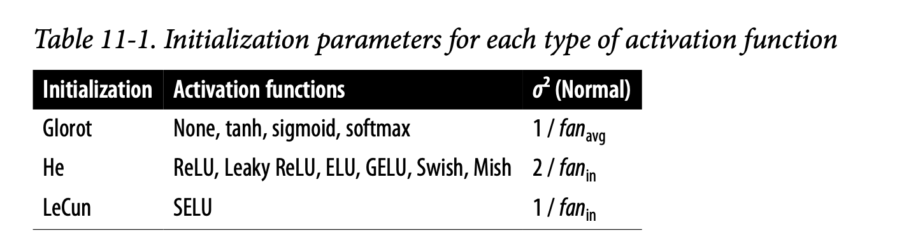

_Some notes from the book [Hands On Machine Learning - OReilly][1]_
_created on: 2022-11-06 11:01:20_
# Hands On Machine Learning Notes - Part 2- DL
## Chapter 10 
### Artificial Neural Networks ANN

The perceptron is one of the simplest ANN architectures, invented in 1957 by Frank Rosenblatt. It is based on a slightly different artificial neuron (see Figure 10-4) called a threshold logic unit (TLU), or sometimes a linear threshold unit (LTU). The inputs and output are numbers (instead of binary on/off values), and each input connection is associated with a weight. The TLU first computes a linear function of its inputs: $z = w_1x_1 + w_2x_2 + ⋯ + w_nx_n + b = w^t x + b$. Then it applies a **step function** to the result: $h_w(x) = step(z)$. 

The most common **step function** used in perceptrons is the Heaviside step function. Sometimes the sign function is used instead.

$$\text{heaviside}(z) = 
\begin{cases}
0  & \text{if} \; z \lt 0 \\
1  & \text{if} \; z \ge 0 
\end{cases}
$$

$$\text{sgn}(z) = 
\begin{cases}
-1  & \text{if} \; z \lt 0 \\
0  & \text{if} \; z = 0 \\
1  & \text{if} \; z \gt 0 
\end{cases}
$$

A perceptron is composed of one or more TLUs organized in a single layer, where every TLU is connected to every input. Such a layer is called a fully connected layer, or a dense layer. The inputs constitute the input layer. And since the layer of TLUs produces the final outputs, it is called the output layer. For example, a perceptron with two inputs and three outputs is represented in Figure 10-5.


Computing the outputs of a fully connected layer

$$h_{W,b}(X) =\phi(XW+b)$$

- As always, $X$ represents the matrix of input features. It has one row per instance and one column per feature.
- The weight matrix $W$ contains all the connection weights. It has one row per input and one column per neuron.
- The bias vector $b$ contains all the bias terms: one per neuron.
- The function $\phi$ is called the activation function: when the artificial neurons are TLUs, it is a step function

**Training**

The perceptron is fed one training instance at a time, and for each instance it makes its predictions. For every output neuron that produced a wrong prediction, it reinforces the connection weights from the inputs that would have contributed to the correct prediction. Perceptron learning rule (weight update)

$$w_{i,j}^\text{next step} =w_{i,j}+\eta(y_j−\hat{y_j})x_i$$


- $w_{i, j}$ is the connection weight between the $i^{th}$ input and the $j^{th}$ neuron.
- $x_i$ is the $i^{th}$ input value of the current training instance.
- $\hat{y_j}$ is the output of the $j^{th}$ output neuron for the current training instance.
- $y_j$ is the target output of the $j^{th}$ output neuron for the current training instance.
- $\eta$ is the learning rate (see Chapter 4)

This is very similar to the gradient descent

### The Multilayer Perceptron and Backpropagation

An MLP is composed of one input layer, one or more layers of TLUs called hidden layers, and one final layer of TLUs called the output layer. 


Is trained using **Backpropagation**. This is how it works:

1. It handles one mini-batch at a time (for example, containing 32 instances each), and it goes through **the full training set multiple times. Each pass is called an epoch** I will re-use the same dataset n-epoch times.


1. Each mini-batch enters the network through the input layer. The algorithm then computes the output of all the neurons in the first hidden layer, for every instance in the mini-batch. The result is passed on to the next layer, its output is computed and passed to the next layer, and so on until we get the output of the last layer, the output layer. This is the _"forward pass"_: it is exactly like making predictions, except all intermediate results are preserved since they are needed for the backward pass.
1. Next, the algorithm measures the network’s output error (i.e., it uses a loss function that compares the desired output and the actual output of the network, and returns some measure of the error).
1. Then it computes how much each output bias and each connection to the output layer contributed to the error. This is done analytically by applying the chain rule (perhaps the most fundamental rule in calculus), which makes this step fast and precise.
1. The algorithm then measures how much of these error contributions came from each connection in the layer below, again using the chain rule, working backward until it reaches the input layer. As explained earlier, this reverse pass efficiently measures the error gradient across all the connection weights and biases in the network by propagating the error gradient backward through the network (hence the name of the algorithm).
1. This means that the gradient is calculated once per minibatch, and therefore minibatch/dataset*epoch evaluations. Each epoch contain multiples minibatches
1. Finally, the algorithm performs a gradient descent step to tweak all the connection weights in the network, using the error gradients it just computed.


Plot of learning curves 
```python
import matplotlib.pyplot as plt
    import pandas as pd
pd.DataFrame(history.history).plot(
figsize=(8, 5), xlim=[0, 29], ylim=[0, 1], grid=True, xlabel="Epoch", style=["r--", "r--.", "b-", "b-*"])
plt.show()
```


In order for backprop to work properly, Rumelhart and his colleagues made a key change to the MLP’s architecture: they replaced the step function with the logistic function, $σ(z) = 1 / (1 + exp(–z))$, also called the sigmoid function. This was essential because the step function contains only flat segments, so there is no gradient to work with (gradient descent cannot move on a flat surface), while the sigmoid function has a well-defined nonzero derivative everywhere, allowing gradient descent to make some progress at every step. other activation functions 

1. hyperbolic tangent function $tanh(z) = 2\sigma(2z)-1$
1. ReLU: $ReLU(z)=\max(o,z)$. it works very well and has the advantage of being fast to compute, so it has become the default


### Some Common Layers:

1. **Input Layer**: where the data is read from
    ```python
    model = tf.keras.Sequential()
    model.add(tf.keras.layers.Input(shape=[28, 28]))
    ```
1. **Flattern Layer**: Its role is to convert each input image into a 1D array: for example, if it receives a batch of shape [32, 28, 28], it will reshape it to [32, 784]
    ```python
    model.add(tf.keras.layers.Flatten())
    ```
1. **Dense Layer**: Next we add a Dense hidden layer with 300 neurons. It will use the ReLU activation function. Each Dense layer manages its own weight matrix, containing all the connection weights between the neurons and their inputs.
    ```python
    tf.keras.layers.Dense(100, activation="relu"),
    tf.keras.layers.Dense(10, activation="softmax") #output layer
    ```
1. **Normalization Layer (regression)**: it does the same thing as Scikit-Learn’s StandardScaler, but it must be fitted to the training data using its adapt() method before you call the model’s fit() method
    ```python
    norm_layer = tf.keras.layers.Normalization(input_shape=X_train.shape[1:])
    model = tf.keras.Sequential([
         norm_layer,
         tf.keras.layers.Dense(50, activation="relu"),
         tf.keras.layers.Dense(50, activation="relu"),
         tf.keras.layers.Dense(50, activation="relu"),
         tf.keras.layers.Dense(1)
     ])
     norm_layer.adapt(X_train)
     history = model.fit()...
    ```
1. **Output Layer (classification)**:  Finally, we add a Dense output layer with 10 neurons (one per class), using the softmax activation function because the classes are exclusive.
    ```python
    tf.keras.layers.Dense(10, activation="softmax")
    ```
1. **Output Layer (regression)**: the output layer has a single neuron (since we only want to predict a single value) and it uses no activation function, the loss function is the mean squared error, the metric is the RMSE, and we’re using an Adam optimizer 
    ```python 
    model = tf.keras.Sequential([
         norm_layer,
         tf.keras.layers.Dense(50, activation="relu"),
         tf.keras.layers.Dense(1) #output layer
     ])
    
    optimizer = tf.keras.optimizers.Adam(learning_rate=1e-3)
     model.compile(loss="mse", optimizer=optimizer, metrics=["RootMeanSquaredError"])
    ```

### Wide and Deep NN
this is a network architecture created on 2016 that consist on having two paths. It connects all or part of the inputs directly to the output layer, as shown in Figure 10-13. This architecture makes it possible for the neural network to learn both deep patterns (using the deep path) and simple rules (through the short path).


```python
    #layers declaration 
    #input layer 
    input_ = tf.keras.layers.Input(shape=X_train.shape[1:])
    normalization_layer = tf.keras.layers.Normalization() 
    # deep path  
    hidden_layer1 = tf.keras.layers.Dense(30, activation="relu")
    hidden_layer2 = tf.keras.layers.Dense(30, activation="relu")
    # conect layer   
    concat_layer = tf.keras.layers.Concatenate()
    output_layer = tf.keras.layers.Dense(1) # output layer  
    
    # graph connection declaration
    normalized = normalization_layer(input_)
    hidden1 = hidden_layer1(normalized)
    hidden2 = hidden_layer2(hidden1)
    concat = concat_layer([normalized, hidden2]) # conection of the wide and deep path 
    output = output_layer(concat)
    model = tf.keras.Model(inputs=[input_], outputs=[output])
```
An alternative version separate the inputs for both paths so not all the features are going via both paths 


```python
    # inputs 
    input_wide = tf.keras.layers.Input(shape=[5]) # features 0 to 4 
    input_deep = tf.keras.layers.Input(shape=[6]) # features 2 to 7 
    norm_layer_wide = tf.keras.layers.Normalization() 
    # deep path 
    norm_layer_deep = tf.keras.layers.Normalization()
    norm_wide = norm_layer_wide(input_wide)
    norm_deep = norm_layer_deep(input_deep)
    hidden1 = tf.keras.layers.Dense(30, activation="relu")(norm_deep)
    hidden2 = tf.keras.layers.Dense(30, activation="relu")(hidden1)
    # merge layer 
    concat = tf.keras.layers.concatenate([norm_wide, hidden2])
    output = tf.keras.layers.Dense(1)(concat)
    model = tf.keras.Model(inputs=[input_wide, input_deep],  # both inputs 
                            outputs=[output])

    # separate inputs 
    optimizer = tf.keras.optimizers.Adam(learning_rate=1e-3)
    model.compile(loss="mse", optimizer=optimizer, metrics=["RootMeanSquaredError"])
    X_train_wide, X_train_deep = X_train[:, :5], X_train[:, 2:]
    X_valid_wide, X_valid_deep = X_valid[:, :5], X_valid[:, 2:]
    X_test_wide, X_test_deep = X_test[:, :5], X_test[:, 2:]
    X_new_wide, X_new_deep = X_test_wide[:3], X_test_deep[:3]

    norm_layer_wide.adapt(X_train_wide)
    norm_layer_deep.adapt(X_train_deep)
    history = model.fit((X_train_wide, X_train_deep), y_train, epochs=20,
                        validation_data=((X_valid_wide, X_valid_deep), y_valid))
    mse_test = model.evaluate((X_test_wide, X_test_deep), y_test)
    y_pred = model.predict((X_new_wide, X_new_deep))
```
is also possible to add an additional output layer, for example for understanding the effect of one path. 


```python
[...] # Same as above, up to the main output layer output = tf.keras.layers.Dense(1)(concat)
aux_output = tf.keras.layers.Dense(1)(hidden2)
model = tf.keras.Model(inputs=[input_wide, input_deep],
                           outputs=[output, aux_output])
```

Each output will need its own loss function. Therefore, when we compile the model, we should pass a list of losses. Since we care much more about the main output than about the auxiliary output (as it is just used for regularization), we want to give the main output’s loss a much greater weight
```python
    optimizer = tf.keras.optimizers.Adam(learning_rate=1e-3)
    model.compile(loss=("mse", "mse"), loss_weights=(0.9, 0.1), optimizer=optimizer,
                  metrics=["RootMeanSquaredError"])
```

Now when we train the model, we need to provide labels for each output. In this example, the main output and the auxiliary output should try to predict the same thing, so they should use the same labels.

```python
    norm_layer_wide.adapt(X_train_wide)
    norm_layer_deep.adapt(X_train_deep)
    history = model.fit(
        (X_train_wide, X_train_deep), (y_train, y_train), epochs=20,
        validation_data=((X_valid_wide, X_valid_deep), (y_valid, y_valid))
    )
```
### Parameters and Common configurations 
    
1. **Number of Hidden Layers**
    
    For many problems, you can begin with a single hidden layer and get reasonable results. But for complex problems, deep networks have a much higher parameter efficiency than shallow ones. Not only does this hierarchical architecture help DNNs converge faster to a good solution, but it also improves their ability to generalize to new datasets.

    In summary, for many problems you can start with just one or two hidden layers and the neural network will work just fine. For instance, you can easily reach above 97% accuracy on the MNIST dataset using just one hidden layer with a few hundred neurons, and above 98% accuracy using two hidden layers with the same total number of neurons, in roughly the same amount of training time. For more complex problems, you can ramp up the number of hidden layers until you start overfitting the training set. 

2. **Number Of Neurons per Hidden Layer**

    The number of neurons in the input and output layers is determined by the type of input and output your task requires. For example, the MNIST task requires 28 × 28 = 784 inputs and 10 output neurons.
    
    Use similar number of neurons per layer, pyramid doesn't behave well. That said, depending on the dataset, it can sometimes help to make the first hidden layer bigger than the others. `[300,200,200]`

    Just like the number of layers, you can try increasing the number of neurons gradually until the network starts overfitting. Alternatively, you can try building a model with slightly more layers and neurons than you actually need, then use early stopping and other regularization techniques to prevent it from overfitting too much.

3. **Learning Rate**
    
    The learning rate is arguably the most important hyperparameter. In general, the optimal learning rate is about half of the maximum learning rate. One way to find a good learning rate is to train the model for a few hundred iterations, starting with a very low learning rate (e.g., 10–5) and gradually increasing it up to a very large value (e.g., 10). This is done by multiplying the learning rate by a constant factor at each iteration (e.g., by (10 / 10-5)1 / 500 to go from 10–5 to 10 in 500 iterations).

4. **Batch Size**
    
    Many researchers and practitioners recommend using the largest batch size that can fit in GPU RAM. There’s a catch, though: in practice, large batch sizes often lead to training instabilities, especially at the beginning of training, and the resulting model may not generalize as well as a model trained with a small batch size. In April 2018, Yann LeCun even tweeted “Friends don’t let friends use mini-batches larger than 32”, citing a 2018 paper21 by Dominic Masters and Carlo Luschi which concluded that using small batches (from 2 to 32) was preferable because small batches led to better models in less training time. Other research points in the opposite direction, however. For example, in 2017, papers by Elad Hoffer et al.22 and Priya Goyal et al.23 showed that it was possible to use very large batch sizes (up to 8,192) along with various techniques such as warming up the learning rate (i.e., starting training with a small learning rate, then ramping it up, as discussed in Chapter 11) and to obtain very short training times, without any generalization gap. **So, one strategy is to try to using a large batch size, with learning rate warmup, and if training is unstable or the final performance is disappointing, then try using a small batch size instead.**


## Chapter 11. Training Deep Neural Networks.
### The Vanishing Exploiding Gradients Problems

The backpropagation algorithm’s second phase works by going from the output layer to the input layer, propagating the error gradient along the way. Unfortunately, gradients often get smaller and smaller as the algorithm progresses down to the lower layers. As a result, the gradient descent update leaves the lower layers’ connection weights virtually unchanged, and training never converges to a good solution. This is called the **vanishing gradients problem**.

In some cases, the opposite can happen: the gradients can grow bigger and bigger until layers get insanely large weight updates and the algorithm diverges. This is the **exploding gradients problem**, which surfaces most often in recurrent neural networks.

The main hypothesis behind this problem is that it is due to the combination of the default activation function (sigmoid) and the initialization parameters `random(0,1)` leading to a variance of the outputs of each layer that is much greater than the variance of its inputs.

Looking at the sigmoid activation function (see Figure 11-1), you can see that when inputs become large (negative or positive), the function saturates at 0 or 1, with a derivative extremely close to 0 (i.e., the curve is flat at both extremes). Thus, when backpropagation kicks in it has virtually no gradient to propagate back through the network


For the signal to flow properly, the authors argue that we need the variance of the outputs of each layer to be equal to the variance of its inputs (Glorot and He Initialization).  It is actually not possible to guarantee both unless the layer has an equal number of inputs and outputs (these numbers are called the fan-in and fan-out of the layer), but Glorot and Bengio proposed a good compromise that has proven to work very well in practice: the connection weights of each layer must be initialized randomly as described here:

$$fan_{avg}=\frac{fan_{in} + fan_{out}}{2}$$

Initiation alternatives:

$$w_0 \sim \text{Normal}(0, \frac{1}{fan_{avg}})$$

or

$$w_0 \sim \text{Uniform}(-\sqrt{\frac{3}{fan_{avg}}},+\sqrt{\frac{3}{fan_{avg}}} )$$

Using Glorot initialization can speed up training considerably, and it is one of the practices that led to the success of deep learning. Depending on the activation function other strategies have been proposed. always with a Normal distribution but changing the $\sigma^2$




### Better activation Functions 

ReLU seems to be a great alternative but suffered form a problem known as **"Dying ReLU's"**: during training, some neurons effectively “die”, meaning they stop outputting anything other than 0. In some cases, you may find that half of your network’s neurons are dead, especially if you used a large learning rate.

**Leaky ReLU**

$$\text{LeakyReLU}(z) = max(\alpha*z,z)$$

The hyperparameter α defines how much the function “leaks”: it is the slope of the function for z < 0. Having a slope for z < 0 ensures that leaky ReLUs never die; they can go into a long coma, but they have a chance to eventually wake up. 


A 2015 paper by Bing Xu et al.5 compared several variants of the ReLU activation function, and one of its conclusions was that the leaky variants always outperformed the strict ReLU activation function. In fact, setting α = 0.2 (a huge leak) seemed to result in better performance than α = 0.01 (a small leak). The paper also evaluated the randomized leaky ReLU (RReLU), where α is picked randomly in a given range during training and is fixed to an average value during testing. 

RReLU also performed fairly well and seemed to act as a regularizer, reducing the risk of overfitting the training set. Finally, the paper evaluated the parametric leaky ReLU (PReLU), where α is authorized to be learned during training: instead of being a hyperparameter, it becomes a parameter that can be modified by backpropagation like any other parameter. PReLU was reported to strongly outperform ReLU on large image datasets, but on smaller datasets it runs the risk of overfitting the training set.

Keras includes the classes LeakyReLU and PReLU in the `tf.keras.layers package`. Just like for other ReLU variants, you should use He initialization with these. For example:

```python
leaky_relu = tf.keras.layers.LeakyReLU(alpha=0.2) # defaults to alpha=0.3 
dense = tf.keras.layers.Dense(50, activation=leaky_relu,
                              kernel_initializer="he_normal")
```

ReLU, leaky ReLU, and PReLU all suffer from the fact that they are not smooth functions: their derivatives abruptly change (at z = 0). This sort of discontinuity can make gradient descent bounce around the optimum, and slow down convergence. 


**ELU and SELU**

$$\text{ELU}_{alpha}(z) = 
\begin{cases}
\alpha (\exp(z)-1)  & \text{if} \; z \lt 0 \\
z  & \text{if} \; z \ge 0 
\end{cases}
$$

The ELU activation function looks a lot like the ReLU function. But with some differences: 

1. It takes on negative values when z < 0, which allows the unit to have an average output closer to 0 and helps alleviate the vanishing gradients problem. $-\alpha$ is the left limit, usually $\alpha$ set to 1.  

2. It has a nonzero gradient for z < 0, which avoids the dead neurons problem.

3. If $\alpha$ is equal to 1 then the function is smooth everywhere, including around $z = 0$, which helps speed up gradient descent since it does not bounce as much to the left and right of $z = 0$ (fixing the ReLU problem)


Not long after, a 2017 paper by Günter Klambauer et al.7 introduced the scaled ELU (SELU) activation function: as its name suggests, it is a scaled variant of the ELU activation function. $\text{SELU} = 1.05*ELU_{\alpha=1.67}$

The authors showed that if you build a neural network composed exclusively of a stack of dense layers, and if all hidden layers use the SELU activation function, then the network will self-normalize: the output of each layer will tend to preserve a mean of 0 and a standard deviation of 1 during training, which solves the vanishing/exploding gradients problem. but it has is limitations too. 

**GELU, Swish, and Mish**

$$\text{GELU} =  z*\Phi(z)$$

where $\Phi(z)$ is the accumulated density distribution of the normal dist. 

$$\Phi(z) = \mathbb{P}(x\le z)$$


GELU resembles ReLU: it approaches 0 when its input z is very negative, and it approaches z when z is very positive. However, whereas all the activation functions we’ve discussed so far were both convex and monotonic the GELU activation function is neither: from left to right, it starts by going straight, then it wiggles down, reaches a low point around –0.17 (near z ≈ –0.75), and finally bounces up and ends up going straight toward the top right.

In practice, it often outperforms every other activation function discussed so far. However, it is a bit more computationally intensive, and the performance boost it provides is not always sufficient to justify the extra cost

That said, it is possible to show that it is approximately equal to $z\sigma(1.702 z)$, where $\sigma$ is the sigmoid function. Using this approximation also works very well, and it has the advantage of being much faster to compute.


$$Swish_{\beta}(z) = z\sigma(\beta z)$$

Swish is a generalization of GELU approximation. In their paper, Swish outperformed every other function, including GELU. Ramachandran et al. later generalized Swish by adding an extra hyperparameter β to scale the sigmoid function’s input.

### conclusions (on activation functions)

1. ReLU remains a good default for simple tasks: it’s often just as good as the more sophisticated activation functions, plus it’s very fast to compute, and many libraries and hardware accelerators provide ReLU-specific optimizations

2. Swish is probably a better default for more complex tasks, and you can even try parametrized Swish with a learnable β parameter for the most complex tasks

3. If you care a lot about runtime latency, then you may prefer leaky ReLU, or parametrized leaky ReLU for more complex tasks.

### Batch Normalization (another technique for vanishing gradient)

In a 2015 paper,12 Sergey Ioffe and Christian Szegedy proposed a technique called batch normalization (BN) that addresses these problems. The technique consists of adding an operation in the model just before or after the activation function of each hidden layer. that consist on a Normalization Layer that normalizes the inputs based on the batch values distribution. 

You may find that training is rather slow, because each epoch takes much more time when you use batch normalization. This is usually counterbalanced by the fact that convergence is much faster with BN, so it will take fewer epochs to reach the same performance. All in all, wall time will usually be shorter

**Batch normalization has become one of the most-used layers in deep neural networks, especially deep convolutional neural networks** discussed in (Chapter 14), to the point that it is often omitted in the architecture diagrams: it is assumed that BN is added after every layer.

### Gradient Clipping 

Another technique to mitigate the exploding gradients problem is to clip the gradients during backpropagation so that they never exceed some threshold

```python
#This optimizer will clip every component of the gradient vector between –1.0 and 1.0.
optimizer = tf.keras.optimizers.SGD(clipvalue=1.0)
model.compile([...], optimizer=optimizer)
```

In practice, this approach works well. If you want to ensure that gradient clipping does not change the direction of the gradient vector, you should clip by norm by setting `clipnorm` instead of `clipvalue`.

If you observe that the gradients explode during training (you can track the size of the gradients using TensorBoard), you may want to try clipping by value or clipping by norm

### Pretrained Layers, Transfer Learning 

It is generally not a good idea to train a very large DNN from scratch without first trying to find an existing neural network that accomplishes a similar task to the one you are trying to tackle. This technique is called **transfer learning**. It will not only speed up training considerably, but also requires significantly less training data.

We usually can reuse the layers in between, modifying the input (and first layers) and the output layers


Try freezing all the reused layers first (i.e., make their weights non-trainable so that gradient descent won’t modify them and they will remain fixed). Then try unfreezing one or two of the top hidden layers to let backpropagation tweak them and see if performance improves.

**Pretraining**

There are other ways to use the capability of neural network to be transfered to new networks: 

1. **Unsupervised Pretraining**: train an autoencoder or a GAN, then use those weights/layers for another task, such as a label training problem (where labels are scare), just adding a new layer on top and fine-tunning for the new task 

2. **Pretraining on an Auxiliary Task**: train a network for another task using similar data, for example human face detection, and then use those weights for recognition of specific people. Or train a NLP model to predict missing words, and then use that for sentiment classification (for example)


### Faster Optimizers 

### Momentum and Nesterov momentum (NAG)

This two methods are based on an "accelerated" gradient descent, meaning each iteration we calculate a "momentum" vector that will be an updated vector based on the historical gradients. This momentum allow us to have bigger learning rates, and be "faster" than gradient descent. 

Nesterov, is a variation of the momentum optimization the only difference is that instead of calculating the gradient on the current min point, it moves in direction of the momentum $\beta m $ and estimate the gradient on that point. 


### Adam
Adam, which stands for adaptive moment estimation, combines ideas from moment estimation and another technique called "Adaptative Gradient" (AdaGrad), that consist on keeping track of an exponentially decaying average of past squared gradients (a pseudo "gradient variance" of past gradients), where momentum is a "mean" of gradients. 

$$\text{momentum or first moment} \quad  m \leftarrow \beta_1 m - (1-\beta_1)\nabla_{\theta}J(\theta)  $$
$$\text{variance or second moment} \quad  s \leftarrow \beta_2 s + (1-\beta_2)\nabla_{\theta}J\otimes(\theta)\nabla_{\theta}J(\theta)  $$

...

Since Adam is an adaptive learning rate algorithm, like AdaGrad and RMSProp, it requires less tuning of the learning rate hyperparameter η.

* is bad, ** is average, and *** is good


### Learning Rates
Finding a good learning rate is very important. If you set it much too high, training may diverge. If you set it too low, training will eventually converge to the optimum, but it will take a very long time.


We call "learning schedules" the possibility of a variable learning rate, depending on the current progress of the model. 

**Power scheduling**

Set the learning rate to a function of the iteration number $t: η(t) = η_0 / (1 + t/s)c$. The initial learning rate $η_0$, the power $c$ (typically set to 1), and the steps s are hyperparameters. The learning rate drops at each step. After s steps, the learning rate is down to $η_0 / 2$. After s more steps it is down to $η_0 / 3$, then it goes down to $η_0 / 4$, then $η_0 / 5$, and so on. As you can see, this schedule first drops quickly, then more and more slowly. Of course, power scheduling requires tuning $η_0$ and $s$ (and possibly $c$).

**Exponential scheduling**

Set the learning rate to $η(t) = η_0 0.1^{t/s}$. The learning rate will gradually drop by a factor of 10 every $s$ steps. While power scheduling reduces the learning rate more and more slowly, exponential scheduling keeps slashing it by a factor of 10 every s steps.

**Performance scheduling**

Measure the validation error every N steps (just like for early stopping), and reduce the learning rate by a factor of λ when the error stops dropping.

**1cycle scheduling**

Contrary to the other approaches, it starts by increasing the initial learning rate $η_0$, growing linearly up to $η_1$ halfway through training. Then it decreases the learning rate linearly down to η0 again during the second half of training, finishing the last few epochs by dropping the rate down by several orders of magnitude (still linearly)


To sum up, exponential decay, performance scheduling, and 1cycle can considerably speed up convergence, so give them a try!

### Regularization 

The l2() function returns a regularizer that will be called at each step during training to compute the regularization loss. This is then added to the final loss. L1 is the same. 

```python 
layer = tf.keras.layers.Dense(100, activation="relu",
                            kernel_initializer="he_normal",
                            kernel_regularizer=tf.keras.regularizers.l2(0.01))>

```
### Dropout
Dropout is one of the most popular regularization techniques for deep neural networks. it gives them a 1%–2% accuracy boost.

It is a fairly simple algorithm: at every training step, every neuron (including the input neurons, but always excluding the output neurons) has a probability p of being temporarily “dropped out”, meaning it will be entirely ignored during this training step, but it may be active during the next step

**The hyperparameter p is called the dropout rate, and it is typically set between 10% and 50%: closer to 20%–30% in recurrent neural nets. and closer to 40%–50% in convolutional neural networks**.

## Chapter 14 Convolutional Neural Networks 

Neurons in the first convolutional layer are not connected to every single pixel in the input image (like they were in the layers discussed in previous chapters), but only to pixels in their receptive fields (see Figure 14-2). In turn, each neuron in the second convolutional layer is connected only to neurons located within a small rectangle in the first layer.


Convolutional layers can have the same size as the image but we need to extend the image size to have data for the border networks, we can do this filling the data with 0. this is called zero padding. 

If the conv layer is smaller, we can start spacing out the "recepive field", this distance is called "stride"


## Chapter 15 RNN
Let’s look at the simplest possible RNN, composed of one neuron receiving inputs, producing an output, and sending that output back to itself, as shown in Figure 15-1 (left). At each time step t (also called a frame), this recurrent neuron receives the inputs x(t) as well as its own output from the previous time step, ŷ(t–1). Since there is no previous output at the first time step, it is generally set to 0. We can represent this tiny network against the time axis, as shown in Figure 15-1 (right). This is called unrolling the network through time (it’s the same recurrent neuron represented once per time step).


A recurrent layer, is the same layer plotted over time to show that the next "iteration" the layer will receive his own prediction of t-1.


Each recurrent neuron has two sets of weights: one for the inputs $x(t)$ and the other for the outputs of the previous time step, $\hat{y}(t–1)$. Let’s call these weight vectors $W_x$ and $W_{\hat{y}}$.

$$ŷ_{(t)} =φ(W_x^tx_{(t)} +W_{\hat{y}}^t\hat{y}_{(t-1)} +b)$$

where $φ()$ is the activation function. 

Just as with feedforward neural networks, we can compute a recurrent layer’s output in one shot for an entire mini-batch by placing all the inputs at time step t into an input matrix X(t)

**Memory Cells**

Since the output of a recurrent neuron at time step t is a function of all the inputs from previous time steps, you could say it has a form of memory. A part of a neural network that preserves some state across time steps is called a memory cell (or simply a cell). 

A cell’s state at time step t, denoted h(t) (the “h” stands for “hidden”), is a function of some inputs at that time step and its state at the previous time step: h(t) = f(x(t), h(t–1)). Its output at time step t, denoted ŷ(t), is also a function of the previous state and the current inputs. **In the case of the basic cells we have discussed so far, the output is just equal to the state**, but in more complex cells this is not always the case.


### taining 

To train an RNN, the trick is to unroll it through time (like we just did) and then use regular backpropagation (see Figure 15-5). This strategy is called **backpropagation through time (BPTT)**.

Just like in regular backpropagation, there is a first forward pass through the unrolled network (represented by the dashed arrows). Then the output sequence is evaluated using a loss function L(Y(0), Y(1), ..., Y(T); Ŷ(0), Ŷ(1), ..., Ŷ(T)) (where Y(i) is the ith target, Ŷ(i) is the ith prediction, and T is the max time step). Note that this loss function may ignore some outputs. For example, in a sequence-to-vector RNN, all outputs are ignored except for the very last one. In Figure 15-5, the loss function is computed based on the last three outputs only. 


## Chapter 16 NLP

### Character RNN
In a famous 2015 blog post titled “The Unreasonable Effectiveness of Recurrent Neural Networks”, Andrej Karpathy showed how to train an RNN to predict the next character in a sentence. This char-RNN can then be used to generate novel text, **one character at a time**.

```python 
    #tokenization per char, this will asociate each char a int
    text_vec_layer = tf.keras.layers.TextVectorization(split="character", # char level vectorization can be onehot or tf_idf
                                                       standardize="lower")
    
    text_vec_layer.adapt([shakespeare_text])
    encoded = text_vec_layer([shakespeare_text])[0]
```

The model can be written as follow:

```python
model = tf.keras.Sequential([ # Embedding the vector text to a 16 dim output - to connect with the next layer
                            tf.keras.layers.Embedding(input_dim=n_tokens, output_dim=16), 
                             # gated recurrent unit (GRU) is a RNN layer that has a "short term status" and "long term status" 
                              tf.keras.layers.GRU(128, return_sequences=True), 
                              # predict the probability of the next char (out of n_tokens)
                              tf.keras.layers.Dense(n_tokens, activation="softmax")
    ])
    model.compile(loss="sparse_categorical_crossentropy", optimizer="nadam",
                  metrics=["accuracy"])
    model_ckpt = tf.keras.callbacks.ModelCheckpoint(
"my_shakespeare_model", monitor="val_accuracy", save_best_only=True) history = model.fit(train_set, validation_data=valid_set, epochs=10,
                        callbacks=[model_ckpt])


```

Embeddings are vectorial representations of words/text/chars. it consist on a srinked space than the original space (for example a one hot encoding space). can be trained using a neural network to predict the words near any given word, or to predict the same X_train data (as a GAN). 

Autoencoders simply learn to copy their inputs to their outputs. This may sound like a trivial task, but as you will see, constraining the network in various ways can make it rather difficult. For example, you can limit the size of the latent rep‐ resentations, or you can add noise to the inputs and train the network to recover the original inputs. These constraints prevent the autoencoder from trivially copying the inputs directly to the outputs, which forces it to learn efficient ways of representing the data. In short, the codings are byproducts of the autoencoder learning the identity function under some constraints.

GANs are composed of two neural networks: a generator that tries to generate data that looks similar to the training data, and a discriminator that tries to tell real data from fake data. This architecture is very original in deep learning in that the generator and the discriminator compete against each other during training: the generator is often compared to a criminal trying to make realistic counterfeit money, while the discriminator is like the police investigator trying to tell real money from fake. Adversarial training (training competing neural networks) is widely considered one of the most important innovations of the 2010s. In 2016, Yann LeCun even said that it was “the most interesting idea in the last 10 years in machine learning”.

### Stateless and Stateful RNN 

the upper network is a stateless network in the sense that each iteration the hidden states are erased and started from 0 again. but we could store the last states from the previous prediction and use it for the next batch this is called a "Stateful RNN". 

### Reusing Pretrained Embeddings and Language Models

instead of training word embeddings, we could just download and use pretrained embeddings, such as Google’s Word2vec embeddings, Stanford’s GloVe embeddings, or Facebook’s FastText embeddings.

Using pretrained word embeddings was popular for several years, but this approach has its limits. In particular, a word has a single representation, no matter the context.

### An Encoder–Decoder Network for Neural Machine Translation

In short, the architecture is as follows: English sentences are fed as inputs to the encoder, and the decoder outputs the Spanish translations. 


[//]:1.sklearn-oreilly.md> (References)
[1]: <https://github.com/yanshengjia/ml-road/blob/master/resources/Hands%20On%20Machine%20Learning%20with%20Scikit%20Learn%20and%20TensorFlow.pdf>
