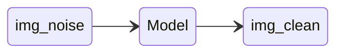

_Some notes from the book [Hands On Machine Learning - OReilly][1]_
_created on: 2022-11-06 11:01:20_
## Hands On Machine Learning Notes
### Chapter 1
#### The Unreasonable effectiveness of Data 

>In a famous paper published in 2001, Microsoft researchers Michele Banko and Eric Brill showed that very different Machine Learning algorithms, including fairly simple ones, performed almost identically well on a complex problem of natural language disambiguation once they were given enough data.


### Chapter 2 
#### Stratified Sampling Split 
> do stratified sampling based on the income category. For this you can use Scikit-Learn’s StratifiedShuffleSplit class:

```python 
from sklearn.model_selection import StratifiedShuffleSplit 

split = StratifiedShuffleSplit(n_splits=1, test_size=0.2, random_state=42)

for train_index, test_index in split.split(housing, housing["income_cat"]):
    strat_train_set = housing.loc[train_index]
    strat_test_set = housing.loc[test_index]
``` 

#### Randomized Search

The grid search approach is fine when you are exploring relatively few combinations, like in the previous example, but when the hyperparameter search space is large, it is often preferable to use `RandomizedSearchCV` instead. This class can be used in much the same way as the `GridSearchCV` class, but instead of trying out all possible combinations, it evaluates a given number of random combinations by selecting a random value for each hyperparameter at every iteration. 

#### Comparing two errors samples from CV

In some examples using the mean error of a number of CVsamples might be missing some variance of the error, to compare more effectively use a `scioy.stats.t.interval()` test. (a t-test confidence interval)

```python 
from scipy import stats 
squared_errors =  (final_predictions -  y_test)**2
ic = np.sqrt(stats.t.interval(
        confidence=0.95, 
        len(squared_errors)-1, # sample size 
        loc=squared_errors.mean(), # mean distr
        scale=stats.sem(squared_errors) # SE of the mean 
    ))
```
### Chapter 3 - Classification 
#### Metrics - Confusion Matrix 

|predicted|values|
|----|----|
| TN | FP |
| FN | TP |

$$Precision = \frac{TP}{FP+TP}$$
$$Recall = \frac{TP}{FN+TP}$$
$$F1 = \frac{2}{\frac{1}{Precision} + \frac{1}{Recall}} = \frac{Precision*Recall}{Precision +  Recall}$$

#### Precision Recall Trade-off 
you first get the scores from the model (this is the cross validate way to get the scores) `"decision_function"` returns the scores from the model. 

```python 
# the plain way to get the scores 
y_scores = sgd_clf.decision_function([some_digit])
# using cross validation (a more reliable way)
y_scores = cross_val_predict(sgd_clf, X_train, y_train_5, cv=3,method="decision_function")
```

#### ROC curve 
Is a plot with the `recall (TPR)` against the `false positive rate (FPR)` (this is equal to `1-TNR` also called `"specificity"`). We said than the ROC curve is the plot between `Recall/1-Specificity`. The trade-off is the higher the recall the higher false positives we will generate.

>Since the ROC curve is so similar to the precision/recall (or PR) curve, you may wonder how to decide which one to use. As a rule of thumb, **you should prefer the PR curve whenever the positive class is rare** or when you care more about the false positives than the false negatives, and the ROC curve otherwise.

#### Multiclass Classificator 

If you want to force Scikit Learn to use one-versus-one or one-versus-all, you can use the `OneVsOneClassifier` or `OneVsRestClassifier` classes. Simply create an instance and pass a binary classifier to its constructor. For example, this code creates a multiclass classifier using the OvO strategy, based on a `SGDClassifier`:

```python 
from sklearn.multiclass import OneVsOneClassifier
ovo_clf = OneVsOneClassifier(SGDClassifier(random_state=42))
ovo_clf.fit(X_train, y_train)
ovo_clf.predict([some_digit])
array([ 5.])
```

#### MultiLabel/Multioutput Classification 
Some models in SKlearn provide the possibility to generate many labels for the same sample. Also you can create multioutput Models than generate from multiples samples multiples outputs (but one output per sample)

This might be useful for example to clean images in a `MultiOutput-Classification` problem 


each pixel will be one prediction with a number between `[0,255]` 
### Chapter 4 
#### Linear Regression 

$$ \min \quad MSE(X, h_0) =  \frac{1}{m} \sum_{i \in m}{(\theta^{T}X^{(i)}-y^{i})^{2}}
$$
$$
\text{solution: } \hat{\theta} = (X^{t}X)^{-1}X^{t}Y
$$

The complexity of this estimation is between $O(n^{2.4})$ and $O(n^{3})$ depending on the matrix to invert $(X^{t}X)^{-1}$. There is a pseudo inversion using SVD that can lead to a reduction in complexity of $O(n^{2})$. Regardless, when the number of samples is too big, the approach is to use gradient descent. 

#### Gradient Descent 

Direction of descent: 
$$
\nabla_{\theta}MSE(\Theta) = \frac{2}{m}X^t(X\theta-y)
$$
Step calculation. Where $\eta$ is the learning rate.
$$
\theta^{(next step)} = \theta - \eta\nabla_{\theta}MSE(\Theta)
$$
We usually use a stopping criteria such as $\theta^{next} - \theta<\epsilon $. We call $\epsilon$ the `"tolerance"`

**Stochastic Gradient Descent**: we can perform the same Gradient Descent methodology but using just a sample from the entire dataset (to improve speed). It only uses one sample, therefore the convergence is very noisy. Because this algorithm is super noise it hardly converges to a minimum and stays there, therefore we could iteratively reduce the learning rate $\eta$ this is call **Simulated Annealing**. The reduction rate function is called _learning schedule_.

**MiniBatch Gradient Descent**: Minibatch Is the same as Stochastic Gradient Descent, but, instead of adding one sample at the time, it adds a batch of `n_samples` therefore making the computation harder, but increasing the stability of the convergence. 
#### Learning Curves 


#### Bias Variance Trade-off 
An important theoretical result of statistics and Machine Learning is the fact that a model’s generalization error can be expressed as the sum of three very different errors:
$$ 
\text{Model Generalization Error} = \text{Bias} + \text{Variance} +  \text{Irreductible Error} 
$$
**Bias**: Wrong assumptions on the data $f(X)$ is not a good fit to the data (**underfit**)

**Variance**: Too much sensitivity to data variance (**overfit**)

**Irreductible Error**: Error in the data acquisition method/instrument, underlying noise. 

1. More Model Complexity => Less Bias, More Variance 
1. Less Model Complexity => More Bias, Less Variance 
1. Adding Regularization => More Bias, Less Variance 

### Regularization

with regularization we basically add a penalty term to the objective function to punish based on the number of features used, there are two common [norms][2] to use here $|\theta|$ (Lasso) and $|\theta|_2$ (Ridge). Also known as L1 and L2 norms. $\theta$ is a vector with the coefficients, therefore we will try to make the $\beta$ coefficients `0` ( $\beta=\theta$  in this context). 

$$
\text{Ridge Regression} = MSE(\theta)+\alpha\frac{1}{2}\sum_{i}{\theta_i^2}
$$
$$
\text{Lasso Regression} = MSE(\theta)+\alpha\sum_{i}|{\theta_i}|
$$

There is a third way that is called **Elastic Net** that is basically a convex combination of the L1 and L2 Norms, using a mix ratio called $r \in [0,1]$

$$
\text{Elastic Net Regression} = MSE(\theta)+(r)\alpha\frac{1}{2}\sum_{i}{\theta_i^2}+(1-r)\alpha\sum_{i}|{\theta_i}|
$$

> So when should you use Linear Regression, Ridge, Lasso, or Elastic Net? It is almost always preferable to have at least a little bit of regularization, so generally you should avoid plain Linear Regression. Ridge is a good default, but if you suspect that only a few features are actually useful, you should prefer Lasso or Elastic Net since they tend
to reduce the useless features’ weights down to zero as we have discussed. In general, Elastic Net is preferred over Lasso since Lasso may behave erratically when the number of features is greater than the number of training instances or when several features are strongly correlated.

#### Early Stopping 
Another way to add regularization to a model (that uses gradient descent or other iterative optimization technique) is to stop the iterations whenever the test score reaches a minimum. To detect that you wait for a few iterations where the score haven't improve and you go back to the point were you have the highest score (or the lowest error).

### Logistic Regression 
Is the same as a regular regression but the output is transformed before using the [sigmoid function][3] Therefore we have a better estimator for probabilities. 

$$
\hat{\mathbb{P}} = \sigma(X^t\theta)= \frac{1}{1+exp(X^t\theta)}
$$

The cost function for the Logit will be called `log-loss`. This is basically the average of the errors, the errors will depend if the sample is positive (`y=1`) or negative (`y=0`), then one of the log probabilities will be summed to the cost total

$$
J(\theta) = -\frac{1}{m}\sum_{i \in m}{[y^{(i)} log(\hat{p}^{(i)}) + (1-y^{(i)}) log(1-\hat{p}^{(i)})]}
$$

The softmax Regression is nothing more than the extension of the Logit function to be used in a multiclass setup. The importance is that is not necessary to train multiples models because we can just extend the logit. 


$$
\hat{\mathbb{P}_k} = \frac{exp(X^t\theta_k)}{\sum_{j \in k}{exp(X^t\theta_j)}}
$$

### Support Vector Machine 

skipped

### Decision Trees - CART algorithm 
We first define `"Gini Impurity"`. Given a particular leaf of a tree $i$ we estimate the ratio of the $k$ class on that leaf $p_{i,k}$. Therefore we can estimate the "Impurity" of a leaf using the following formula:

$$
\text{Gini Impurity}: \quad G_i = 1 - \sum_{k = 1}^{n}{p_{i,k}^{2}}
$$

A Gini coefficient of 0 will represent a leaf with only one class, while a Gini of anything positive will have more than one class. The Gini coefficient is `1 - sum((ratios)**2)` the only clear scenario is when one ratio is 1 and the others are 0 (pure node), the other distances are weirder to explain, but probably a more impure node is when the ratios are equal (same number of samples of all classes). In the case of 2 classes, the Gini coefficient will have numbers between `0` to `0.5` (50%/50%) any other proportion e.g.: (70%/30%) will have something less than `<0.5`.

Finally, the CART algorithm will operate by iterating over this. Given a feature $k$ and a split-threshold $t_k$ we will choose those values minimizing the following cost function:

$$
\min_{k, t_k} J(k,t_k) = \frac{m_{left}}{m} G_{left} + \frac{m_{right}}{m}G_{right}
$$

This algorithm stops when a hyperparameter stopping criteria is reached, such as, `max_depth`, `max_leafs_nodes`, `min_samples_leaf` etc.

There is a second metric that we can use in CART called `entropy`. Entropy is similar to Gini Impurity, in the sense that is 0 when there's only one class in the node and positive otherwise. 

$$ 
\text{Entropy:} \quad H_i = \sum_{k \in n}{p_{i,k}log_2(p_{i,k})}
$$
Both Entropy and Gini can be used exchangeable on the CART algorithm, they produce similar results, Gini is faster to compute.
As you can observe the CART algorithm is a greedy algorithm and will not guarantee optimality, however the full problem is known to be NP-Complete $O(exp(n))$

We can regularize the Decision Trees using the hyperparameters but also using **Pruning**. Pruning is a technique that will reduce the amount of leafs using certain criteria, usually we use a chi-squared test $\chi^2$ to validate that certain leaf is statistical insignificant using a p-value criteria, such as 5%, if is higher, then remove that leaf and their children's. 

### Decision Trees - CART for Regression 
We can use CART for regression as well just changing the Gini or Entropy error for the MSE to use it in a regression context 

$$
\min_{k, t_k} J(k,t_k) = \frac{m_{left}}{m} MSE_{left} + \frac{m_{right}}{m}MSE_{right}
$$

### Ensemble Methods 
1. ***Hard Voting Classifier**: Ensemble a List of models a predict certain sample, **The Most Voted Class** will be the prediction of the ensemble. This method often gets a performance that is better than the best model in the ensemble. 

1. **Soft Voting Classifier**: Ensemble a List of models a predict certain sample, we average the probability of each class $k$: $\mathbb{P^i_k}$ where $i$ is the prediction of the $i$ model, then we choose the highest probability as the prediction of the ensemble. This method usually outperforms the Hard Voting One. 

1. **Bagging**: (or Bootstrap Aggregating) We split the training set `X` in `m` subsets **with replacement**. We train a model on every subset. Then we use a voting system like the ones described before. If we also sample features we call this method **Random Patches**, if we only sample features and not samples we call this **Random Subspaces**.

1. **Pasting**: same as bagging but we split the training set **without replacement**

Generarly, the **Bagging** and **Pasting** methods effectively reduced variance while keeping the bias similar to a simple model trained on the dataset. Usually **bagging** outperforms **pasting** with a slightly higher computational cost. 

### Random Forest
A random forest is a bagging of decision trees that also introduces randomness in the splits. This extra randomness is added choosing the best split within a random subset of the available features on each tree. This increases the tree diversity among the forest. This increase in randomness trades a slightly increase in bias to an expected higher reduction in variance. 
#### Feature Importance
Given a fitted random forest we can estimate the feature importance looking into how much each feature is used to split the dataset in all the trees. The importance will be given by the amount of samples $w_i$ that are in the node $i$ where the feature $f$ is being used to split (a proxy to the highness of a node).

$$\text{feature\_score}_f = \frac{\sum_{i \in nodes} w_i}{|nodes|}$$

The score then is normalized across all features $score_f = \frac{score_f}{\sum_j{score_j}}$

### Boosting
#### Ada Boosting (Adaptive Boosting)
The boosting methodology consists of consecutively updating the models training the samples that are more misclassified by the previous models. To do that we basically train and predict a dataset with a week-learner, using a weighted sample where all the weights are equal

1. $$w_i = \frac{1}{m}$$

Then we estimated the **error rate**  of the model $j$ : $r_j$ over the train set using the following formula:

2. $$r_{j} = \frac{\sum_{i \in m : \hat{y}_{j}^{(i)} \neq y_{j}^{(i)}}{w^{(i)}}}{\sum_{i \in m}w^{(i)}}$$

Then we estimate the **predictor weight** for the model $j$: $\alpha_j$ this number will be used to ensemble the predictions:

3. $$\alpha_{j} = \eta log(\frac{1-r_j}{r_j})$$

Finally, we update the weights for all the samples and iterate

$$
w^{(i)} \leftarrow 
\begin{cases}
w^{(i)}  & \text{if} \; \hat{y}_{j}^{(i)}=y^{(i)} \\

w^{(i)}exp(\alpha_{j})  & \text{if} \; \hat{y}_{j}^{(i)} \neq y^{(i)}
\end{cases}
$$

#### Gradient Boosting 
Gradient boosting on the other hand is different from ADABosst in the sense that it actually predicts the residuals from the previous models' ensemble. Each new tree will try to predict the error, Then the final prediction will be nothing more than the sum of all predictions. 

#### Stacking 

Stacking is an improved voting system, whereas instead of using a hard or soft voting system we train a meta-learner that will try to predict the train-set using the predictions of all models as features. **We usually train the meta-learner in a hold-out group** not used by the train of the other models. 


[//]: <> (References)
[1]: <https://github.com/yanshengjia/ml-road/blob/master/resources/Hands%20On%20Machine%20Learning%20with%20Scikit%20Learn%20and%20TensorFlow.pdf>
[2]: <https://en.wikipedia.org/wiki/Norm_(mathematics)>
[3]: <https://en.wikipedia.org/wiki/Sigmoid_function>


[//]: <> (Some snippets)
[//]: # (add an image )
