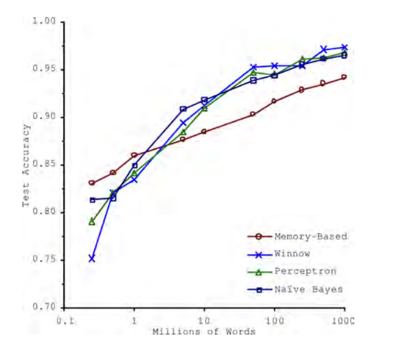

_Some notes from the book [Hands On Machine Learning - OReilly][1]_
_created on: 2022-11-06 11:01:20_
## Hands On Machine Learning Notes
### Chapter 1

#### how can we classify machine learning models:

1. how are they trained: supervised, unsupervised, semi-supervised, "self supervised", RL.
    
    1. **Supervised**: labeled data 
    
    1. **Unsupervised**: unlabeled data; clustering, anomaly detection, dimensonality reduction

    1. **Semi-supervised**: semi-labeled data (non random). 

    1. **Self-supervised**: non-labeled dataset and then is first classified with an unsupervised learning model and then we train a supervised model on top. 

1. can they be updated ? Batch Learning vs Online Learning
    
    1. **Batch learning**. Train once (offline), and predict online. This models can suffer from **data drift** or **model rot** that means don't update the model enough for fitting new datasets. 

    1. **Online learning or Incremental learning**. Instead of using a batch of data this model is trained with batches of data and then it has the capability to be re-trained with new batches but keeping the old weights from previous trainings. helpful for large datasets or fast-evolving problems. Learning rate: inertia of the model against new batches. 

1. How they generalize: Instance base vs Model based. 
    1. In a nutshell, **instance based** is an exact matching algorithm, i.e. we look for "closer" known instances and we "predict" based on that (ex `KNeighborRegressor`). 
    1. **Model based** is a learning algorithm that can interpolate or extrapolate based on the previous samples (it assumes a "model"). 

#### The Unreasonable effectiveness of Data 

>In a famous paper published in 2001, Microsoft researchers Michele Banko and Eric Brill showed that very different Machine Learning algorithms, including fairly simple ones, performed almost identically well on a complex problem of natural language disambiguation once they were given enough data.




#### Representativeness of data 

Is important that the data used for training is a well representation for the test data. If the data is subject to **sampling bias** we will encounter an issue afterwards. 
**Irrelevant features**: adding noise features can damage the performance of the model. 
**regularization**: punish the amount of features used by the model adding a cost on the objective function. 

#### Test and validation 
we use always an **out-of-sample validation** that means that we calculate the score on a test set, different to the dataset that we use for training. 

when doing hyperparameter optimization we usually split the dataset in three: **"train set", "validation set", "test set"**. we use the first one to train all the models and the second one to choose the best model (or the best hyperparameters). finally, we train the "best model" in the train-set+validation set and we evaluate it in the "test-set"

#### NFL theorem
The No-Free-Lunch (NFL) theorem is a concept in machine learning  that essentially states there is no universally superior algorithm for all tasks. It suggests that the performance of any optimization algorithm, including machine learning models, is averaged out across all possible problems, meaning that **no single algorithm can be considered the best for every problem**. This theorem highlights the importance of choosing an algorithm based on the specifics of the problem at hand rather than relying on a one-size-fits-all solution. The theorem implies that the effectiveness of an algorithm is highly dependent on the problem space, and improvements in performance on one set of problems often come at the expense of reduced performance on other sets of problems. In simpler terms, there's no free lunch; every algorithm has its strengths and weaknesses, and what works well in one scenario might not work as well in another.

### Chapter 2 

#### Performance Metrics 
to measure the performance of a model we have multiples metrics

$$  RMSE(X, h_0) =  \sqrt{\frac{1}{m} \sum_{i \in m}{(\theta^{T}X^{(i)}-y^{i})^{2}}}
$$

the RMSE is the $\ell_2$ norm (Also known as the euclidean norm), whereas the $MAE$ is equal to the norm $\ell_1$ (also known as the Manhattan distance)

$$  MAE(X, h_0) =  \frac{1}{m} \sum_{i \in m}{ \lVert{\theta^{T}X^{(i)}-y^{i}} \rVert}
$$

Given the nature of the norms, a higher value norm $\geq \ell_2$ will overweight larger distances higher, meaning it tends to be more sensitive to outliers. Whereas, lower norms tend to be less sensitive.


**STD deviation:** The standard deviation is generally denoted $\sigma$ (the Greek letter sigma), and it is the square root of the variance, which is the average of the squared deviation from the mean. When a feature has a bell-shaped normal distribution (also called a Gaussian distribution), which is very common, the “68-95-99.7” rule applies:about 68% of the values fall within $1\sigma$ of the mean, 95% within $2\sigma$, and 99.7% within $3\sigma$.

#### Stratified Sampling Split 
> do stratified sampling based on the income category. For this you can use Scikit-Learn’s `StratifiedShuffleSplit` class:

```python 
from sklearn.model_selection import StratifiedShuffleSplit 

split = StratifiedShuffleSplit(n_splits=1, test_size=0.2, random_state=42) #initialize splitter 

#stratified sample that keeps the proportion of the categorical
# variable "income_cat" -in this case-
split_datasets_indexes= split.split(housing, housing["income_cat"]) 

for train_index, test_index in split_datasets_indexes: 
    #n_splits (param on splitter)
    #it yield the indexes not the data
    strat_train_set = housing.loc[train_index] 
    strat_test_set = housing.loc[test_index]
``` 

there's another way using sklearn `train_test_split()` and the argument `stratify`

```python
strat_train_set, strat_test_set = train_test_split(housing_df, test_size=0.2, stratify=housing["income_cat"], random_state=42)
```
#### Correlation (Pearson's r)

The correlation coefficient only measures linear correlations (“as x goes up, y generally goes up/down”). It may completely miss out on nonlinear relationships (e.g., “as x approaches 0, y generally goes up”). Figure 2-16 shows a variety of datasets along with their corre‐ lation coefficient. Note how all the plots of the bottom row have a correlation coefficient equal to 0, despite the fact that their axes are clearly not independent: these are examples of nonlinear relation‐ ships. Also, the second row shows examples where the correlation coefficient is equal to 1 or –1; notice that this has nothing to do with the slope. For example, your height in inches has a correlation coefficient of 1 with your height in feet or in nanometers.


#### Data Imputation 
you will use a handy Scikit-Learn class: `SimpleImputer`. The benefit is that it will store the median value of each feature: this will make it possible to impute missing values not only on the training set, but also on the validation set, the test set, and any new data fed to the mode

```python
from sklearn.impute import SimpleImputer imputer = SimpleImputer(strategy="median")
housing_num = housing.select_dtypes(include=[np.number])
imputer.fit(housing_num)
# median per numeric feature 
>>> imputer.statistics_
array([-118.51 , 34.26 , 29. , 2125. , 434. , 1167. , 408. , 3.5385])
# add imputation
X = imputer.transform(housing_num)

```
some other imputers: 

1. `KNNImputer` replaces each missing value with the mean of the k-nearest neighbors’ values for that feature. The distance is based on all the available features.
1. `IterativeImputer` trains a regression model per feature to predict the missing values based on all the other available features. It then trains the model again on the updated data, and repeats the process several times, improving the models and the replacement values at each iteration.

#### Value Normalization 

Min-max scaling (many people call this normalization) is the simplest: for each attribute, the values are shifted and rescaled so that they end up ranging from 0 to 1. This is performed by subtracting the min value and dividing by the difference between the min and the max. Scikit-Learn provides a transformer called `MinMaxScaler` for this. It has a feature_range hyperparameter that lets you change the range if, for some reason, you don’t want 0–1 (e.g., neural networks work best with zero-mean inputs, so a range of –1 to 1 is preferable). It’s quite easy to use:

```python
from sklearn.preprocessing import MinMaxScaler min_max_scaler = MinMaxScaler(feature_range=(-1, 1))
    housing_num_min_max_scaled = min_max_scaler.fit_transform(housing_num)
```

Standardization is different: first it subtracts the mean value (so standardized values have a zero mean), then it divides the result by the standard deviation (so standardized values have a standard deviation equal to 1). Unlike min-max scaling, standardization does not restrict values to a specific range. However, standardization is much less affected by outliers. For example, suppose a district has a median income equal to 100 (by mistake), instead of the usual 0–15. Min-max scaling to the 0–1 range would map this outlier down to 1 and it would crush all the other values down to 0–0.15, whereas standardization would not be much affected. Scikit-Learn provides a transformer called `StandardScaler` for standardization:
```python
from sklearn.preprocessing import StandardScaler std_scaler = StandardScaler()
    housing_num_std_scaled = std_scaler.fit_transform(housing_num)
```


A way of Normalizing and transforming multimodal distributions is to add a feature for each of the modes (at least the main ones), using for example a similarity to the kernel value. The similarity measure is typically computed using a radial basis function (RBF)—any function that depends only on the distance between the input value and a fixed point. The most commonly used RBF is the `Gaussian RBF`, whose output value decays exponentially as the input value moves away from the fixed point. For example, the Gaussian RBF similarity between the housing age x and 35 is given by the equation $exp(–\gamma(x – 35)^2)$. The hyperparameter γ (gamma) determines how quickly the similarity measure decays as x moves away from 35. Using Scikit-Learn’s `rbf_kernel()` function, you can create a new Gaussian RBF feature measuring the similarity between the housing median age and 35:
```python
from sklearn.metrics.pairwise import rbf_kernel
age_simil_35 = rbf_kernel(housing[["housing_median_age"]], [[35]], gamma=0.1)
```
Figure 2-18 shows this new feature as a function of the housing median age (solid line). It also shows what the feature would look like if you used a smaller gamma value. As the chart shows, the new age similarity feature peaks at 35, right around the spike in the housing median age distribution: if this particular age group is well correlated with lower prices, there’s a good chance that this new feature will help.


#### Randomized Search

The grid search approach is fine when you are exploring relatively few combinations, like in the previous example, but when the hyperparameter search space is large, it is often preferable to use `RandomizedSearchCV` instead. This class can be used in much the same way as the `GridSearchCV` class, but instead of trying out all possible combinations, it evaluates a given number of random combinations by selecting a random value for each hyperparameter at every iteration. 

#### Comparing two errors samples from CV

In some examples using the mean error of a number of CVsamples might be missing some variance of the error, to compare more effectively use a `scioy.stats.t.interval()` test. (a t-test confidence interval)

```python 
from scipy import stats 
squared_errors =  (final_predictions -  y_test)**2
ic = np.sqrt(stats.t.interval(
        confidence=0.95, 
        len(squared_errors)-1, # sample size 
        loc=squared_errors.mean(), # mean distr
        scale=stats.sem(squared_errors) # SE of the mean 
    ))
```
### Chapter 3 

#### Classification Metrics - Confusion Matrix 

|predicted|values|
|----|----|
| TN | FP |
| FN | TP |

$$Precision = \frac{TP}{FP+TP}$$

$$Recall = \frac{TP}{FN+TP}$$

$F1$ is the harmonic mean. Whereas the regular mean treats all values equally, the harmonic mean gives much more weight to low values. As a result, the classifier will only get a high F1 score if both recall and precision are high.


$$F1 = \frac{2}{\frac{1}{Precision} + \frac{1}{Recall}} = \frac{Precision*Recall}{Precision +  Recall}$$


#### Precision Recall Trade-off 

Scikit-Learn does not let you set the threshold directly, but it does give you access to the decision scores that it uses to make predictions. Instead of calling the classifier’s `predict()` method, you can call its `decision_function()` method, which returns a score for each instance, and then use any threshold you want to make predictions based on those scores.

```python
y_scores = cross_val_predict(sgd_clf, X_train, y_train_5, cv=3,
                                 method="decision_function")
from sklearn.metrics import precision_recall_curve
precisions, recalls, thresholds = precision_recall_curve(y_train_5, y_scores)
                               
```


You may wonder why the precision curve is bumpier than the recall curve in Figure 3-5. The reason is that precision may sometimes go down when you raise the threshold (although in general it will go up). To understand why, notice what happens when you start from the central threshold and move it just one digit to the right: precision goes from 4/5 (80%) down to 3/4 (75%). On the other hand, recall can only go down when the threshold is increased, which explains why its curve looks smooth.

Another way to select a good precision/recall trade-off is to plot precision directly against recall, as shown in Figure 3-6 (the same threshold is shown)


#### ROC curve 

Is a plot with the `recall (TPR)` against the `false positive rate (FPR)` (this is equal to `1-TNR` also called `"specificity"`). We said than the ROC curve is the plot between `Recall/1-Specificity`. 

Once again there is a trade-off: the higher the recall (TPR), the more false positives (FPR) the classifier produces. The dotted line represents the ROC curve of a purely random classifier; a good classifier stays as far away from that line as possible (toward the top-left corner).


Since the ROC curve is so similar to the precision/recall (or PR) curve, you may wonder how to decide which one to use. As a rule of thumb, **you should prefer the PR curve whenever the positive class is rare** or when you care more about the false positives than the false negatives, and the ROC curve otherwise.

#### Multiclass Classificator 

#####  **one-versus-the-rest (OvR)**
One way to create a system that can classify the digit images into 10 classes (from 0 to 9) is to train 10 binary classifiers, one for each digit (a 0-detector, a 1-detector, a 2-detector, and so on). Then when you want to classify an image, you get the decision score from each classifier for that image and you select the class whose classifier outputs the highest score. This is called the **one-versus-the-rest (OvR)** strategy

##### **one-versus-one (OvO) strategy**
Another strategy is to train a binary classifier for every pair of digits: one to distinguish 0s and 1s, another to distinguish 0s and 2s, another for 1s and 2s, and so on. This is called the **one-versus-one (OvO) strategy**. If there are N classes, you need to train N × (N – 1) / 2 classifiers. For the MNIST problem, this means training 45 binary classifiers! When you want to classify an image, you have to run the image through all 45 classifiers and see which class wins the most duels.

##### **OvO vs OvA?**
Some algorithms (such as support vector machine classifiers) scale poorly with the size of the training set. For these algorithms OvO is preferred because it is faster to train many classifiers on small training sets than to train few classifiers on large training sets. For most binary classification algorithms, however, OvR is preferred.

#### MultiLabel/Multioutput Classification 
Some models in SKlearn provide the possibility to generate many labels for the same sample. Also you can create multioutput Models than generate from multiples samples multiples outputs (but one output per sample)

This might be useful for example to clean images in a `MultiOutput-Classification` problem 


each pixel will be one prediction with a number between `[0,255]` 

### Chapter 4 
fitting models 
#### Linear Regression 

$$ \min \quad MSE(X, h_0) =  \frac{1}{m} \sum_{i \in m}{(\theta^{T}X^{(i)}-y^{i})^{2}}
$$
$$
\text{solution: } \hat{\theta} = (X^{t}X)^{-1}X^{t}Y
$$

The complexity of this estimation (pseudo inversion), which consist on inverting $X^tX$, is between $O(n^{2.4})$ and $O(n^{3})$ depending on the matrix to invert $(X^{t}X)^{-1}$. There is a pseudo inversion using SVD that can lead to a reduction in complexity of $O(n^{2})$. Regardless, when the number of samples is too big, the approach is to use gradient descent. 

#### Gradient Descent 

Direction of descent: 

$$
\nabla_{\theta}MSE(\Theta) = \frac{2}{m}X^t(X\theta-y)
$$

Step calculation. Where $\eta$ is the learning rate.

$$
\theta^{(next step)} = \theta - \eta\nabla_{\theta}MSE(\Theta)
$$

We usually use a stopping criteria such as $\theta^{next} - \theta<\epsilon $. We call $\epsilon$ the `"tolerance"`

While the cost function has the shape of a bowl, it can be an elongated bowl if the features have very different scales.Figure 4-7 shows gradient descent on a training set where features 1 and 2 have the same scale (on the left), and on a training set where feature 1 has much smaller values than feature 2 (on the right)


**When using gradient descent, you should ensure that all features have a similar scale** (e.g., using Scikit-Learn’s StandardScaler class), or else it will take much longer to converge.

Each iteration over the training set is called an epoch. You may wonder how to set the number of epochs. If it is too low, you will still be far away from the optimal solution when the algorithm stops; but if it is too high, you will waste time while the model parameters do not change anymore. A simple solution is to set a very large number of epochs but to interrupt the algorithm when the gradient vector becomes tiny that is, when its norm becomes smaller than a tiny number $\epsilon$ (called the tolerance)

#### Stochastic Gradient Descent

we can perform the same Gradient Descent methodology but using just a sample from the entire dataset (to improve speed). It only uses one sample, therefore the convergence is very noisy. Because this algorithm is super noise it hardly converges to a minimum and stays there, therefore we could iteratively reduce the learning rate $\eta$ this is call **Simulated Annealing**. The reduction rate function is called _learning schedule_.


**MiniBatch Gradient Descent**: Minibatch Is the same as Stochastic Gradient Descent, but, instead of adding one sample at the time, it adds a batch of `n_samples` therefore making the computation harder, but increasing the stability of the convergence. 


#### Learning Curves 

Another way to tell is to look at the learning curves, which are plots of the model’s training error and validation error as a function of the training iteration: just evaluate the model at regular intervals during training on both the training set and the validation set, and plot the results. If the model cannot be trained incrementally (i.e., if it does not support `partial_fit()` or `warm_start`), then you must train it several times on gradually larger subsets of the training set.


if the two curves have a gap is a sign of overfitting, but if they both overlap and they have no gap it can mean that we are underfitting 

#### Bias Variance Trade-off 
An important theoretical result of statistics and Machine Learning is the fact that a model’s generalization error can be expressed as the sum of three very different errors:

$$ 
\text{Model Generalization Error} = \text{Bias} + \text{Variance} +  \text{Irreductible Error} 
$$

**Bias**: Wrong assumptions on the data $f(X)$ is not a good fit to the data (**underfit**)

**Variance**: Too much sensitivity to data variance (**overfit**)

**Irreductible Error**: Error in the data acquisition method/instrument, underlying noise. 

1. More Model Complexity => Less Bias, More Variance 
1. Less Model Complexity => More Bias, Less Variance 
1. Adding Regularization => More Bias, Less Variance 

#### Regularization

with regularization we basically add a penalty term to the objective function to punish based on the number of features used, there are two common [norms][2] to use here $|\theta|$ (Lasso) and $|\theta|_2$ (Ridge). Also known as L1 and L2 norms. $\theta$ is a vector with the coefficients, therefore we will try to make the $\beta$ coefficients `0` ( $\beta=\theta$  in this context). 

Note that the regularization terms use $\theta$ on the cost function, that means that **the cost is sensible to the scale of the parameters, always normalize before using regularization**.

$$
\text{Ridge Regression} = MSE(\theta)+\alpha\frac{1}{2}\sum_{i}{\theta_i^2}
$$
$$
\text{Lasso Regression} = MSE(\theta)+\alpha\sum_{i}|{\theta_i}|
$$

An important characteristic of lasso regression is that it tends to eliminate the weights of the least important features (i.e., set them to zero). 

There is a third way that is called **Elastic Net** that is basically a convex combination of the L1 and L2 Norms, using a mix ratio called $r \in [0,1]$

$$
\text{Elastic Net Regression} = MSE(\theta)+(r)\alpha\frac{1}{2}\sum_{i}{\theta_i^2}+(1-r)\alpha\sum_{i}|{\theta_i}|
$$

> So when should you use Linear Regression, Ridge, Lasso, or Elastic Net? It is almost always preferable to have at least a little bit of regularization, so generally you should avoid plain Linear Regression. Ridge is a good default, but if you suspect that only a few features are actually useful, you should prefer Lasso or Elastic Net since they tend
to reduce the useless features’ weights down to zero as we have discussed. In general, Elastic Net is preferred over Lasso since Lasso may behave erratically when the number of features is greater than the number of training instances or when several features are strongly correlated.

#### Early Stopping 
Another way to add regularization to a model (that uses gradient descent or other iterative optimization technique) is to stop the iterations whenever the test score reaches a minimum. To detect that you wait for a few iterations where the score haven't improve and you go back to the point were you have the highest score (or the lowest error).

#### Logistic Regression 
Is the same as a regular regression but the output is transformed before using the [sigmoid function][3] Therefore we have a better estimator for probabilities. 

$$
\hat{\mathbb{P}} = \sigma(X^t\theta)= \frac{1}{1+exp(X^t\theta)}
$$

The cost function for the Logit will be called `log-loss`. This is basically the average of the errors, the errors will depend if the sample is positive (`y=1`) or negative (`y=0`), then one of the log probabilities will be summed to the cost total

$$
J(\theta) = -\frac{1}{m}\sum_{i \in m}{[y^{(i)} log(\hat{p}^{(i)}) + (1-y^{(i)}) log(1-\hat{p}^{(i)})]}
$$

The bad news is that there is no known closed-form equation to compute the value of θ that minimizes this cost function (there is no equivalent of the Normal equation). But the good news is that this cost function is convex, so gradient descent (or any other optimization algorithm) is guaranteed to find the global minimum (if the learning rate is not too large and you wait long enough). 


The Softmax Regression is nothing more than the extension of the Logit function to be used in a multiclass setup. The importance is that is not necessary to train multiples models because we can just extend the logit. 


$$
\hat{\mathbb{P}_k} = \frac{exp(X^t\theta_k)}{\sum_{j \in k}{exp(X^t\theta_j)}}
$$

### Chapter 5

#### Support Vector Machine 

skipped

### Decision Trees - CART algorithm 
We first define `"Gini Impurity"`. Given a particular leaf of a tree $i$ we estimate the ratio of the $k$ class on that leaf $p_{i,k}$. Therefore we can estimate the "Impurity" of a leaf using the following formula:

$$
\text{Gini Impurity}: \quad G_i = 1 - \sum_{k = 1}^{n}{p_{i,k}^{2}}
$$

A Gini coefficient of 0 will represent a leaf with only one class, while a Gini of anything positive will have more than one class. The Gini coefficient is `1 - sum((ratios)**2)` the only clear scenario is when one ratio is 1 and the others are 0 (pure node), the other distances are weirder to explain, but probably a more impure node is when the ratios are equal (same number of samples of all classes). In the case of 2 classes, the Gini coefficient will have numbers between `0` to `0.5` (50%/50%) any other proportion e.g.: (70%/30%) will have something less than `<0.5`.

Finally, the CART algorithm will operate by iterating over this. Given a feature $k$ and a split-threshold $t_k$ we will choose those values minimizing the following cost function:

$$
\min_{k, t_k} J(k,t_k) = \frac{m_{left}}{m} G_{left} + \frac{m_{right}}{m}G_{right}
$$

This algorithm stops when a hyperparameter stopping criteria is reached, such as, `max_depth`, `max_leafs_nodes`, `min_samples_leaf` etc.

There is a second metric that we can use in CART called `entropy`. Entropy is similar to Gini Impurity, in the sense that is 0 when there's only one class in the node and positive otherwise. 

$$ 
\text{Entropy:} \quad H_i = \sum_{k \in n}{p_{i,k}log_2(p_{i,k})}
$$
Both Entropy and Gini can be used exchangeable on the CART algorithm, they produce similar results, Gini is faster to compute.
As you can observe the CART algorithm is a greedy algorithm and will not guarantee optimality, however the full problem is known to be NP-Complete $O(exp(n))$

We can regularize the Decision Trees using the hyperparameters but also using **Pruning**. Pruning is a technique that will reduce the amount of leafs using certain criteria, usually we use a chi-squared test $\chi^2$ to validate that certain leaf is statistical insignificant using a p-value criteria, such as 5%, if is higher, then remove that leaf and their children's. 

### Decision Trees - CART for Regression 
We can use CART for regression as well just changing the Gini or Entropy error for the MSE to use it in a regression context 

$$
\min_{k, t_k} J(k,t_k) = \frac{m_{left}}{m} MSE_{left} + \frac{m_{right}}{m}MSE_{right}
$$

### Ensemble Methods 
1. ***Hard Voting Classifier**: Ensemble a List of models a predict certain sample, **The Most Voted Class** will be the prediction of the ensemble. This method often gets a performance that is better than the best model in the ensemble. 

1. **Soft Voting Classifier**: Ensemble a List of models a predict certain sample, we average the probability of each class $k$: $\mathbb{P^i_k}$ where $i$ is the prediction of the $i$ model, then we choose the highest probability as the prediction of the ensemble. This method usually outperforms the Hard Voting One. 

1. **Bagging**: (or Bootstrap Aggregating) We split the training set `X` in `m` subsets **with replacement**. We train a model on every subset. Then we use a voting system like the ones described before. If we also sample features we call this method **Random Patches**, if we only sample features and not samples we call this **Random Subspaces**.

1. **Pasting**: same as bagging but we split the training set **without replacement**

Generarly, the **Bagging** and **Pasting** methods effectively reduced variance while keeping the bias similar to a simple model trained on the dataset. Usually **bagging** outperforms **pasting** with a slightly higher computational cost. 

### Random Forest
A random forest is a bagging of decision trees that also introduces randomness in the splits. This extra randomness is added choosing the best split within a random subset of the available features on each tree. This increases the tree diversity among the forest. This increase in randomness trades a slightly increase in bias to an expected higher reduction in variance. 
#### Feature Importance
Given a fitted random forest we can estimate the feature importance looking into how much each feature is used to split the dataset in all the trees. The importance will be given by the amount of samples $w_i$ that are in the node $i$ where the feature $f$ is being used to split (a proxy to the highness of a node).

$$\text{feature\_score}_f = \frac{\sum_{i \in nodes} w_i}{|nodes|}$$

The score then is normalized across all features $score_f = \frac{score_f}{\sum_j{score_j}}$

### Boosting
#### Ada Boosting (Adaptive Boosting)
The boosting methodology consists of consecutively updating the models training the samples that are more misclassified by the previous models. To do that we basically train and predict a dataset with a week-learner, using a weighted sample where all the weights are equal

1. $$w_i = \frac{1}{m}$$

Then we estimated the **error rate**  of the model $j$ : $r_j$ over the train set using the following formula:

2. $$r_{j} = \frac{\sum_{i \in m : \hat{y}_{j}^{(i)} \neq y_{j}^{(i)}}{w^{(i)}}}{\sum_{i \in m}w^{(i)}}$$

Then we estimate the **predictor weight** for the model $j$: $\alpha_j$ this number will be used to ensemble the predictions:

3. $$\alpha_{j} = \eta log(\frac{1-r_j}{r_j})$$

Finally, we update the weights for all the samples and iterate

$$
w^{(i)} \leftarrow 
\begin{cases}
w^{(i)}  & \text{if} \; \hat{y}_{j}^{(i)}=y^{(i)} \\

w^{(i)}exp(\alpha_{j})  & \text{if} \; \hat{y}_{j}^{(i)} \neq y^{(i)}
\end{cases}
$$

#### Gradient Boosting 
Gradient boosting on the other hand is different from ADABosst in the sense that it actually predicts the residuals from the previous models' ensemble. Each new tree will try to predict the error, Then the final prediction will be nothing more than the sum of all predictions. 

#### Stacking 

Stacking is an improved voting system, whereas instead of using a hard or soft voting system we train a meta-learner that will try to predict the train-set using the predictions of all models as features. **We usually train the meta-learner in a hold-out group** not used by the train of the other models. 


[//]: <> (References)
[1]: <https://github.com/yanshengjia/ml-road/blob/master/resources/Hands%20On%20Machine%20Learning%20with%20Scikit%20Learn%20and%20TensorFlow.pdf>
[2]: <https://en.wikipedia.org/wiki/Norm_(mathematics)>
[3]: <https://en.wikipedia.org/wiki/Sigmoid_function>


[//]: <> (Some snippets)
[//]: # (add an image )
