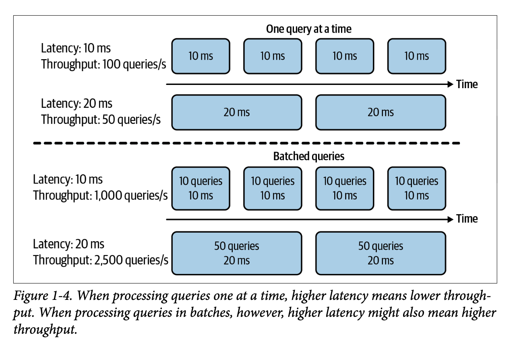

*based on [link][1]*
*created on: 2026-07-24 12:40:45*
## system-design-ml

## Chatper 1: Overview of ML systems.

**Throughput and latency**: we will define throughput as the number of requests that can be processed per second (300 query/sec), and latency as the time it takes to process a single request (10ms).

In real systems, we usually care a lot about latency on the predictions, because it can really hurt business metrics, but in general for training or research we care much more about throughput.

we usually take a look at the percentiles of the latency, mainly because it tends to be a skewed distribution to the long tail (bad cases). we usually look at the p80 or p95 latency, removing the 5 percentile of the worst cases.

## 

[//]: <> (References)
[1]: <https://google.com>

[//]: <> (Some snippets)
[//]: # (add an image )