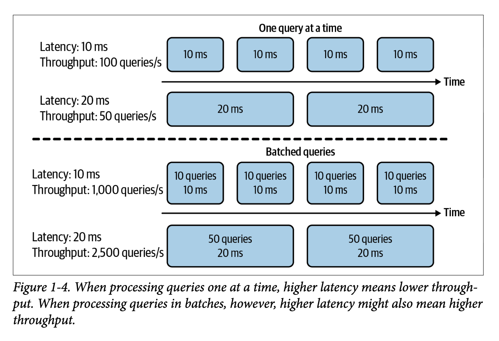
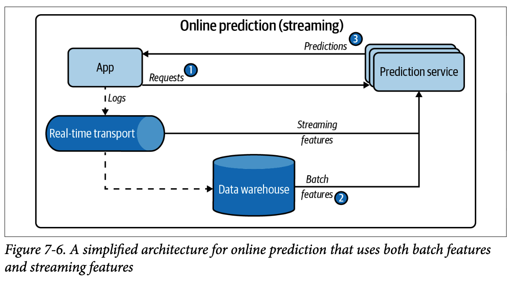

*based on [link][1]*
*created on: 2026-07-24 12:40:45*
## System Design for ML

### Chapter 1: Overview of ML systems.

**Throughput and latency**: we will define throughput as the number of requests that can be processed per second (300 query/sec), and latency as the time it takes to process a single request (10ms).

In real systems, we usually care a lot about latency on the predictions, because it can really hurt business metrics, but in general for training or research we care much more about throughput.

we usually take a look at the percentiles of the latency, mainly because it tends to be a skewed distribution to the long tail (bad cases). we usually look at the p80 or p95 latency, removing the 5 percentile of the worst cases.

### Chapter 2: Introduction to ML systems

Requirements that we need to define when designing a ML system:

1. **Business objective**: before jumping into the ML system design, we need to understand the business objective, and what is the problem we are trying to solve. This metric will then drive the entire design. For example in Netflix the business objective of the recommendation system was defined as take-rate which is the number of "quality watches" per number of recommendations a user sees. They linked causally this metric with user retention. 

2. **Reliability**: We need understand how reliable is our system to hardware failures and software bugs. This not only means that the system is providing predictions but that those predictions are correct (ML system can fail silently). We therefore, need to constantly monitor the system predictions against a ground truth.

3. **Scalability**: There are three ways on how ML systems scale: (1) more complexity - increase the model size and therefore the hardware requirements, (2) number of requests - increase the number of requests that the system can handle, and (3) Model count, add more models to cover more use cases for the same system. We can think about in two dimensions, resource scaling and artifact scaling. both 

4. **Maintainability**: we need to also think on who will maintain the system, language of knowledge, versioning, storing, and monitoring.

5. **Adaptability**: the system should be able to be easily adaptable to new requirements or new data without breaking production, this is particularly important given that ML system usually are exposed to a lot of data changes 

### Chapter 3: Data Engineering Fundamentals

Depending on the origin of the data (user generated, system generated, or third party) we will have to deal with different types of data quality issues. We will have to deal with missing data, duplicate data, and corrupted data.

Once we combine all this data we need to make it "persistent", we do this via serialization, we have many common types here like JSON, CSV, Avro, Protobuf, and Parquet.

Transactional data bases are usually optimized for low latency and high availability, they usually follow the ACID properties. 
1. **Atomicity**: either all the operations in a transaction are executed or none of them are.
2. **Consistency**: the database is always in a consistent state, meaning that all the data is valid according to the defined rules.
3. **Isolation**: concurrent transactions do not interfere with each other, if two transactions are accessing the same data they will have a strict order. 
4. **Durability**: once a transaction is committed, it will remain so, even in the case of a system failure.

However not all the transactional databases follow ACID, because it might be too restrictive and harder to scale. A less restrictive model, therefore more available and easier to scale, is the BASE model, which stands for Basically Available, Soft state, and Eventually consistent.

Most of the paradigms of data today are based on the separation between the storage and the compute, allowing multiple engines to process the same data but depending on how it is accessed we can optimize for different access patterns. For example column oriented queries (to calculate the average of a column) or row oriented queries (that are required for transactional queries).

Depending on the freshness/speed of the queries we classify the sources between, online, nearline, and offline. Online queries are the fastest but usually the most expensive, nearline queries are slower but cheaper, and offline queries are the slowest but cheapest.

#### Communication between services (Dataflow)

There are three main ways of sharing data between different services (includying ML services).
1. **Via Databases**: we persist the data (predictions or status, or features) in a database, and then other services then can read the data from there, this makes it universally available, but usually is very slow. (it takes time to store the data and time to read it)
2. **Via Services calls (REST, RPC)**: each service exposes an endpoint (REST or RPC) that other services can call to get the data, or push some data. REST is the most universal one based on a standard web protocol (meant to be agnostic to the client). RCP enables the client to call the service as if it was a local function (in the same programming language), usually faster and meant to communicate services within the same organization. 
3. **Via Broker (Queue, PubSub)**: One limitation of the service calls is that when you have many clients calling the same service it creates a huge overhead to get, for example, the weather prediction for 100 consumers, a way to deal with this is to push the data to a broker (queue or pubsub, kafka, rabitmq), hence the clients subscribe to the broker and get the data from there, without making independent calls to the service. (technically Databases are also brokers, but with a much higher latency).

Depending on the source of the data we can make two main groups of data pipelines, batch pipelines and streaming pipelines. Both will provide **streaming features** and **batch features**. Not all the streaming features will be slow to aggregate many things (like rolling average) can be calculated in an incremental way. 

### Chapter 4: Training Data

#### Sampling 
Random Sampling, Stratified Sampling, "Weighted Sampling". are well known techniques to sample data.

**Reservoir sampling** is a technique to sample data from a stream of data, where we don't know the total number of elements in advance. The idea is to keep a reservoir of size k, and for each new element in the stream, we decide whether to include it in the reservoir or not, based on a probability that depends on the number of elements seen so far. The more elements we have seen, the less likely we are to include a new element in the reservoir. This way, we ensure that each element has an equal probability of being included in the reservoir.

**Important Sampling**. Given we have a distribution $P(x)$ that is expensive to sample from, we can use a different distribution $Q(x)$ that is easier to sample from, and then we can reweight the samples from $Q(x)$ to estimate expectations under $P(x)$. The idea is to sample from $Q(x)$ and then weight each sample by the ratio of the probabilities under $P$ and $Q$, i.e., $w(x) = \frac{P(x)}{Q(x)}$. This way, we can estimate expectations under $P$ using samples from $Q$.

#### missing labels 

1. **Weak supervision**: We define an heuristic function called `LB` (labeling function), that is based on heuristics, it can be a combination of rules that might lead to contradictory labels, but there's an aggregation function at the end. we will use this to generate a large amount of weakly labeled data, and then we will use this data to train a model that will learn to predict the labels.

2. **Semi-supervision**: there are many flavors, "self training": we train a light model in a labeled data and we used the high confidence predictions to label the unlabeled data. "small perturbations method": this will use labeled datasets and do data augmentation adding a small noise on the features of those samples. 

3. **transfer learning**: we will use a pre-trained model on a large dataset (available), and then we will fine tune it in our target dataset with few or non labels. For example an LLM model trained on corpus of text and then fine tunned on a specific domain (medical, legal, etc).

4. **Active learning**: we will select the samples that are more informative to label (that will have a higher impact on the model performance), and we will label those samples. One heuristic is to do an ensemble of models and select the samples that have a higher disagreement between the models. Another heuristic is to select the samples that are closer to the decision boundary of the model.

#### Unbalance Classes 

##### Metrics
F1, Precision and recall and AUC are asymmetric metrics, which means that their value will change depending on what you consider as positive class. 

AUC will also take in consideration the effect of different score-thresholds, so for many thresholds it will calculate what is the performance of the model and then aggregate them.

When dealing with unbalanced classes, we can use AUCPR that will also consider the effect of the negative class. 

##### Cost Function 

We can modify, in some algorithms, the way the cost function considers different samples, for example we can give more weight to one class over another (defining a weight). We can define that weight using $\frac{N}{N_c}$, where $N$ is the total number of samples and $N_c$ is the number of samples in class $c$. and we can potentially also weight some samples based on how important they are for our prediction (regardless of the class they belong to).

### Chapter 7: Model deployment and prediction serving

We will disntinguish between two types of model serving, online and batch. Online serving is when we need to make predictions in real time, for example when a user makes a request to a web service. This model can still read batch features.

Batch serving is when we need to make predictions on a large dataset, for example when we need to make predictions on all the users of a social network. This model can still be used by an online service that reads from a pre-computed table. For example, a targeting model that depending on if the user does a session it will or will not receive an offer.

**Table 7-1. Some key differences between batch prediction and online prediction**

|  | Batch prediction (asynchronous) | Online prediction (synchronous) |
|---|---|---|
| **Frequency** | Periodical, such as every four hours | As soon as requests come |
| **Useful for** | Processing accumulated data when you don’t need immediate results (such as recommender systems) | When predictions are needed as soon as a data sample is generated (such as fraud detection) |
| **Optimized for** | High throughput | Low latency |

This table not entirely accurate, batch predictions can also have very low latency, for example in the case of a recommendation system, it can even be faster than an online prediction, because it can precompute the recommendations for all the users and store them in a table, and then when a user makes a request, it can just read the recommendations from the table. Useful as well for CDN.

however, sometimes the miss of contextual features can make the batch prediction model less accurate. Even if online predictions can be more expensive and somehow slower than querying a table, it can be compensated by the use of contextual features.

#### Model compression

making model smallers can make the prediction run faster. here we list a few techniques to make models smaller:

1. **Low rank factorization**: in a DL model we can have a weight matrix $W$ that is very large, we can approximate it by a low rank factorization $W \approx U V^T$, where $U$ and $V$ are smaller matrices. This will reduce the number of parameters and therefore the memory footprint and the computation time.

2. **Model Distillation**: we train a smaller model (student) to mimic the behavior of a larger model (teacher). The student model is trained to match the predictions of the teacher model, which allows it to achieve similar performance with fewer parameters and lower computational cost.

3. **pruning**: we can remove some of the weights of the model that are not important, for example those that are close to zero. This will reduce the number of parameters and therefore the memory footprint and the computation time.

4. **Quantization**: we can reduce the precision of the weights of the model, for example from 32 bits to 16 bits or even 8 bits. This will reduce the memory footprint and the computation time, but it can also reduce the accuracy of the model.

#### model allocation 

we can deploy the model as a service in the cloud (more costly but more scalable), or we can deploy the model in the edge (device or browser WASM). 

### Chapter 8: Data Distribution shifts and monitoring 

**Degenerate Feedback loop**: when the model is deployed in production, it can change the distribution of the data that it sees, for example if a model is deployed to recommend movies to users, it can change the distribution of the movies that users watch, which can change the distribution of the data that the model sees.

To correct the Degenerate Feedback we can use several techniques, in general the idea is to estimate the counterfactual distribution of the data without the model, one simple possibility is introduce randomness, have a holdout group, or enforce an exploration policy (like tiktok, where every new video is shown to a small group of users, and then based on their feedback it is shown to more users).

Another idea is to separate the ranking and the liking model, so one will be predicting solely based on the rank how likely is for the user to click on the video, and the other one will be to predict given that the video was shown what is the probability of liking it. somehow isolating the ranking bias. 

[//]: <> (References)
[1]: <https://google.com>

[//]: <> (Some snippets)
[//]: # (add an image )