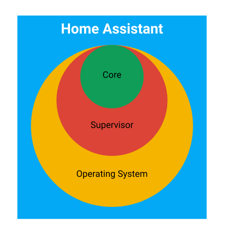

*based on this [article][1]*
*created on: 2023-01-12 14:01:33*
# Connect a DHT11 to Home Assistant(Container)

## Instructions 
1. Connect the DHT sensor to the RPI

    There is plenty of tutorials online: 
    - [This is the one I use][3] 
    - And here is a more [structured one][4] 

    

    Just follow one of the tutorials for the connection of the DHT11/22 and the reading from the RPI-GPIO. Once that everything is working properly you might be able to read the values from the sensor using a python script. This is a checkpoint to test for the status of: RPi, connection, sensor

2. Install Home Assistant on a container using [the docs][2]

   I use the container install because **I have other things and services running on my RPI**. HA is very focused on a non-technical user and therefore it forces you a lot to make a fresh install, and the entire app is designed to work on that environment. It has been a struggle to install extensions and other services when the installation is not running on the ["supervised environment"][9] but well, as far as I am, I've being able to live with it. 

   

3. There are a [few ways][5] that might work to directly do the connection with the DHT11 using [HACS][6] you can [install][7] manually [a repo][8]. But they didn't work (for me). So at the end, reading this [reddit-topic][10] and [this tutorial][1] that "the easiest" way was via an MQTT service. Let's diagram this mess. 

    As you will soon understand, running the Home Assistant on a Container [successfully isolate][11] the app with the RPI SO, (where your sensors are located). This was recently enforced by [removing GPIO + Sensors support][11]. I kind of understand why they do it, but is a PITA for the people that want to make use of their RPI. 

    The workaround its messy, but at the same time more "robust" -it is a more scalable and resilient solution- although, is very complex. 
    
    

The diagram illustrates the various services that are in place for this system. The first service is a data collector service [MQTT-IO][12], which is running on a Raspberry Pi (RPI). This service collects data and then sends it to an MQTT broker ([MosquitoMQTT][13] in this particular case) through a process known as "posting." The home assistant subsequently subscribes to the MQTT broker by utilizing the [MQTT integration service][14]. The messages that are received on each topic are then configured as sensors, allowing for the monitoring and tracking of various data points.

[//]: <> (References)
[1]: <https://tyzbit.blog/connecting-a-dht-22-sensor-to-home-assistant>
[2]: <https://www.home-assistant.io/installation/raspberrypi#install-home-assistant-container>
[3]: <https://www.freva.com/dht11-temperature-and-humidity-sensor-on-raspberry-pi/>
[4]: <https://docs.sunfounder.com/projects/davinci-kit/en/latest/2.2.3_dht-11.html>
[5]: <https://community.home-assistant.io/t/dht-sensor-custom-components/390428>
[6]: <https://hacs.xyz/>
[7]: <https://hacs.xyz/docs/faq/custom_repositories/>
[8]: <https://github.com/richardzone/homeassistant-dht>
[9]: <https://developers.home-assistant.io/docs/architecture_index>
[10]: <https://www.reddit.com/r/homeassistant/comments/w4iwka/integrate_dht22_temperature_and_humidity_sensor/>
[11]: <https://community.home-assistant.io/t/im-unhappy-with-the-removal-of-gpio/388578>
[12]: <https://github.com/flyte/mqtt-io>
[13]: <https://myhomethings.eu/en/mosquitto-mqtt-broker-installation-on-raspberry-pi/>
[14]: <https://www.home-assistant.io/integrations/mqtt/>

[//]: <> (Some snippets)
[//]: # (add an image )