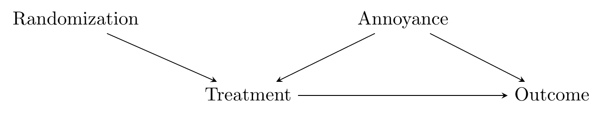
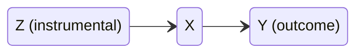
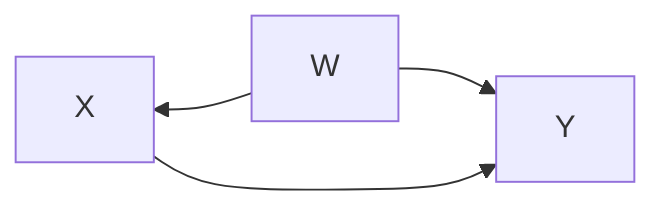
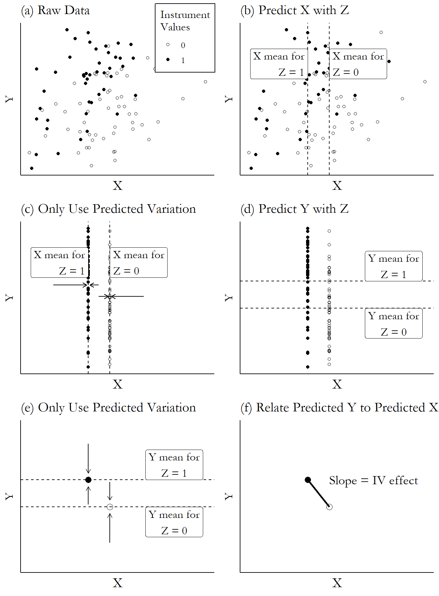

*based on [link][1]*
*created on: 2022-11-28 11:21:04*
## Instrumental Variables 

Instrumental variable design consist basically in using a variable that is a random confounder of the treatment as a proxy of a randomized experiment. Imagine that you have a confounder $Annoyance$ that is not measured and introducing some backdoor paths, imagine that is also another variable $Randomization$ that is **unrelated** with the backdoor variable $Annoyance$. Therefore, we could use the $Randomization$ variable as a source of a pseudo random treatment. 

This is like the opposite as controlling for confounders (a more classical approach in causal inference methodologies) but we "build" a pseudo-randomized experiment using a known source of random influence in the treatment ($Randomization$ variable). 

Finally, our goal will be to reconstruct a random experiment using the instrumental variable as the cause when this affects the treatment _statistically_. The steps are the following ones:

1. Use the instrument to explain the treatment
2. Remove any part of the treatment that is not explained by the instrument
3. Use the instrument to explain the outcome
4. Remove any part of the outcome that is not explained by the instrument
5. Look at the relationship between the remaining, instrument-explained part of the outcome and the remaining, instrument-explained part of the treatment

> This is, in effect, the opposite of controlling for a variable. When we get the effect of $X$ on $Y$ while controlling for $W$, we use $W$ to explain $X$ and $Y$ and remove the explained parts, since we want to close any path that goes through $W$. But when we get the effect of $X$ on $Y$ using $Z$ as an instrument, we use $Z$ to explain $X$ and $Y$ and remove the unexplained parts, to give us only the paths that come from $Z$. The part that’s explained by $Z$ is the part with no back doors, which is what we want.

Instrumental diagram approach 

Traditional conditional approach

The procedure can be read in the following illustration:

 1. **(a)** We have three variables $X$ and $Y$ 

[//]: <> (References)
[1]: <https://theeffectbook.net/ch-InstrumentalVariables.html>

[//]: <> (Some snippets)
[//]: # (add an image )