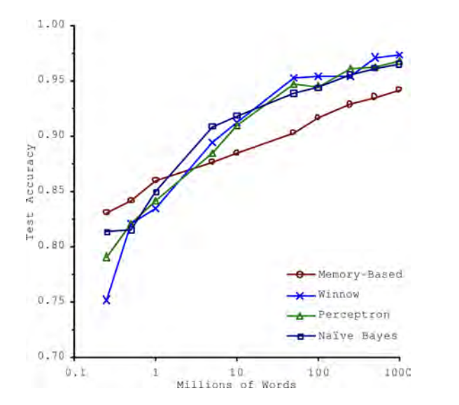
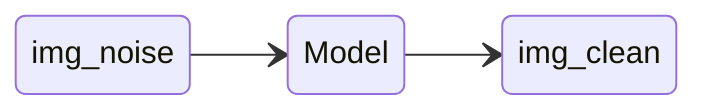

_Some notes from the book [Hands On Machine Learning - OReilly][1]_
_created on: 2022-11-06 11:01:20_
## Hands On Machine Learning Notes
### Chapter 1
#### The Unreasonable effectiveness of Data 

_In a famous paper published in 2001, Microsoft researchers Michele Banko and Eric Brill showed that very different Machine Learning algorithms, including fairly simple ones, performed almost identically well on a complex problem of natural language disambiguation once they were given enough data ._



### Chapter 2 
#### Stratified Sampling Split 
_do stratified sampling based on the income category. For this you can use Scikit-Learn’s StratifiedShuffleSplit class:_ 

```python 
from sklearn.model_selection import StratifiedShuffleSplit 

split = StratifiedShuffleSplit(n_splits=1, test_size=0.2, random_state=42)

for train_index, test_index in split.split(housing, housing["income_cat"]):
    strat_train_set = housing.loc[train_index]
    strat_test_set = housing.loc[test_index]
``` 

#### Randomized Search

The grid search approach is fine when you are exploring relatively few combinations, like in the previous example, but when the hyperparameter search space is large, it is often preferable to use `RandomizedSearchCV` instead. This class can be used in much the same way as the `GridSearchCV` class, but instead of trying out all possible combinations, it evaluates a given number of random combinations by selecting a random value for each hyperparameter at every iteration. 

#### Comparing two errors samples from CV

In some examples using the mean error of a number of CVsamples might be missing some variance of the error, to compare more effectively use a `scioy.stats.t.interval()` test. (a t-test confidence interval)

```python 
from scipy import stats 
squared_errors =  (final_predictions -  y_test)**2
ic = np.sqrt(stats.t.interval(
        confidence=0.95, 
        len(squared_errors)-1, # sample size 
        loc=squared_errors.mean(), # mean distr
        scale=stats.sem(squared_errors) # SE of the mean 
    ))
```
### Chapter 3 - Classification 
#### Metrics - Confusion Matrix 

|predicted|values|
|----|----|
| TN | FP |
| FN | TP |

$$Precision = \frac{TP}{FP+TP}$$
$$Recall = \frac{TP}{FN+TP}$$
$$F1 = \frac{2}{\frac{1}{Precision} + \frac{1}{Recall}} = \frac{Precision*Recall}{Precision +  Recall}$$

#### Precision Recall Trade-off 
you first get the scores from the model (this is the cross validate way to get the scores) `"decision_function"` returns the scores from the model. 

```python 
# the plain way to get the scores 
y_scores = sgd_clf.decision_function([some_digit])
# using cross validation (a more reliable way)
y_scores = cross_val_predict(sgd_clf, X_train, y_train_5, cv=3,method="decision_function")
```

#### ROC curve 
Is a plot with the `recall (TPR)` against the `false positive rate (FPR)` (this is equal to `1-TNR` also called `"specificity"`). We said than the ROC curve is the plot between `Recall/1-Specificity`. The trade-off is the higher the recall the higher false positives we will generate.

_Since the ROC curve is so similar to the precision/recall (or PR) curve, you may wonder how to decide which one to use. As a rule of thumb, **you should prefer the PR curve whenever the positive class is rare** or when you care more about the false positives than the false negatives, and the ROC curve otherwise._

#### Multiclass Classificator 

If you want to force Scikit Learn to use one-versus-one or one-versus-all, you can use the `OneVsOneClassifier` or `OneVsRestClassifier` classes. Simply create an instance and pass a binary classifier to its constructor. For example, this code creates a multiclass classifier using the OvO strategy, based on a `SGDClassifier`:

```python 
from sklearn.multiclass import OneVsOneClassifier
ovo_clf = OneVsOneClassifier(SGDClassifier(random_state=42))
ovo_clf.fit(X_train, y_train)
ovo_clf.predict([some_digit])
array([ 5.])
```

#### MultiLabel/Multioutput Classification 
Some models in SKlearn provide the possibility to generate many labels for the same sample. Also you can create multioutput Models than generate from multiples samples multiples outputs (but one output per sample)

This might be useful for example to clean images in a `MultiOutput-Classification` problem 


each pixel will be one prediction with a number between `[0,255]` 
### Chapter 4 
#### Linear Regression 

$$ \min \quad MSE(X, h_0) =  \frac{1}{m} \sum_{i \in m}{(\theta^{T}X^{(i)}-y^{i})^{2}}
$$
$$
\text{solution: } \hat{\theta} = (X^{t}X)^{-1}X^{t}Y
$$

The complexity of this estimation is between $O(n^{2.4})$ and $O(n^{3})$ depending on the matrix to invert $(X^{t}X)^{-1}$. There is a pseudo inversion using SVD that can lead to a reduction in complexity of $O(n^{2})$. Regardless, when the number of samples is too big, the approach is to use gradient descent. 

#### Gradient Descent 

Direction of descent: 
$$
\nabla_{\theta}MSE(\Theta) = \frac{2}{m}X^t(X\theta-y)
$$
Step calculation. Where $\eta$ is the learning rate.
$$
\theta^{(next step)} = \theta - \eta\nabla_{\theta}MSE(\Theta)
$$
We usually use a stopping criteria such as $\theta^{next} - \theta<\epsilon $. We call $\epsilon$ the `"tolerance"`

**Stochastic Gradient Descent**: we can perform the same Gradient Descent methodology but using just a sample from the entire dataset (to improve speed). It only uses one sample, therefore the convergence is very noisy. Because this algorithm is super noise it hardly converges to a minima and stays there, therefore we could iteratively reduce the learning rate $\eta$ this is call **Simulated Annealing**. The reduction rate function is called _learning schedule_.

**MiniBatch Gradient Descent**: Minibatch Is the same as Stochastic Gradient Descent, but, instead of adding one sample at the time, it adds a batch of `n_samples` therefore making the computation harder, but increasing the stability of the convergence. 


[//]: <> (References)
[1]: <https://github.com/yanshengjia/ml-road/blob/master/resources/Hands%20On%20Machine%20Learning%20with%20Scikit%20Learn%20and%20TensorFlow.pdf>

[//]: <> (Some snippets)
[//]: # (add an image )