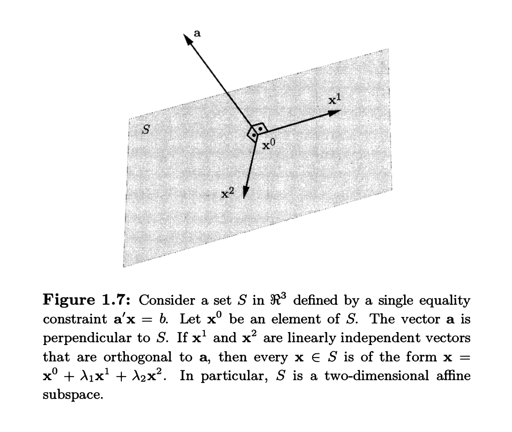

# Chapter 1: Linear Algebra and Linear Programming

### Span, Basis, and Rank

### 1. Span
- Given a collection of vectors, say $x_1, \dots, x_K$, in $\mathbb{R}^n$, their span is defined as the set of all vectors that can be formed by taking a linear combination of these vectors. A linear combination is expressed as $y = \sum_{k=1}^K a_k x_k$, where the $a_k$ are scalars (real numbers).
- The sources state that the span of a set of vectors is the subspace of $\mathbb{R}^n$ defined by these linear combinations.
- Think of the span as the entire geometric space (a line, a plane, a higher-dimensional subspace) that you can reach by starting from the origin and moving only in directions that are combinations of your original vectors.

### 2. Basis
- A basis of a subspace $S$ is a collection of vectors from $S$ that are linearly independent and whose span is equal to S.
- Linearly independent means that none of the vectors in the collection can be expressed as a linear combination of the others. This ensures there is no redundancy in the basis vectors; each vector contributes a unique direction to the span.
- Because a basis must be linearly independent and its span must be the entire subspace, a basis is a minimum set of vectors needed to generate the subspace through linear combinations. If you remove any vector from a basis, the remaining vectors will no longer span the entire subspace.
- All bases for a given subspace have the same number of vectors. This number is called the dimension of the subspace.

### 3. Difference between Span and Basis
- The span is the subspace itself – the complete set of vectors that can be generated.
- A basis is a specific, minimal set of vectors that generates that subspace. The span is the result, while a basis is an efficient set of building blocks for that result.

### 4. Rank
- The rank of an $m \times n$ matrix A is defined as the dimension of its column space.
- The column space of A is the subspace spanned by the columns of A.
- Equivalently, the rank is also the dimension of the row space (the subspace spanned by the rows).
- The rank tells you the maximum number of linearly independent columns (or rows) the matrix has. Since dimension is the number of vectors in a basis, the rank is the number of vectors in a basis for the column space or row space. The rank of A is always less than or equal to the smaller of the number of rows and columns, i.e., rank(A) $\leq \min{m, n}$.

### 5. Affine Subspaces
An affine subspace is a set of vectors in $\mathbb{R}^n$ that is formed by taking a subspace $S_0$ of $\mathbb{R}^n$ and translating it by adding a fixed vector $x_0$ to every element of $S_0$.

Formally, if $S_0$ is a subspace of $\mathbb{R}^n$ and $x_0$ is any vector in $\mathbb{R}^n$, the corresponding affine subspace $S$ is defined as: $S = S_0 + x_0 = {x + x_0 \mid x \in S_0}$

Think of a subspace as a flat surface (like a line or a plane) that always passes through the origin (the zero vector). An affine subspace is like that same flat surface, but potentially shifted away from the origin by the vector $x_0$. Because it doesn't necessarily contain the origin (unless $x_0$ is the zero vector or $x_0$ is already in $S_0$), an affine subspace is generally not a subspace itself.

The dimension of an affine subspace is defined as the dimension of the underlying subspace $S_0$. If $S_0$ has dimension $k$, the affine subspace $S$ also has dimension $k$.

The set of solutions to a system of linear equations $Ax = b$, assuming this set is nonempty, is an affine subspace. This is demonstrated by finding one specific solution, let's call it $x_0$, such that $Ax_0 = b$. If $x$ is any other solution to $Ax=b$, then $A(x - x_0) = Ax - Ax_0 = b - b = 0$. This means the vector $x - x_0$ belongs to the set of vectors $y$ satisfying $Ay=0$. 

This set is known as the **nullspace of matrix A**. Therefore, any solution $x$ can be written in the form $x = x_0 + y$, where $y$ is a vector from the nullspace of A. This structure, ${y + x_0 \mid Ay = 0}$, precisely matches the definition of an affine subspace: a subspace (the nullspace) translated by a fixed vector ($x_0$).

Now, let's break this down further and explain the related concepts:

#### What is the Nullspace?
- The nullspace of an $m \times n$ matrix A is defined as the set of all vectors $y$ in $\mathbb{R}^n$ such that $Ay = 0$. The equation $Ay=0$ is called the homogeneous linear system corresponding to $Ax=b$.

- The set ${y \mid Ay = 0}$ is a subspace of $\mathbb{R}^n$. Recall that a subspace is a set that is nonempty and closed under vector addition and scalar multiplication. The nullspace satisfies these properties: if $y_1$ and $y_2$ are in the nullspace (i.e., $Ay_1=0$ and $Ay_2=0$), then $A(y_1+y_2) = Ay_1 + Ay_2 = 0+0 = 0$, so $y_1+y_2$ is in the nullspace. Similarly, for any scalar $a$, $A(ay_1) = a(Ay_1) = a(0) = 0$, so $ay_1$ is in the nullspace. Also, the zero vector is always in the nullspace since $A \mathbf{0} = \mathbf{0}$. As required for any subspace, the nullspace contains the zero vector.

- The dimension of the nullspace of an $m \times n$ matrix A is $n - \text{rank}(A)$.

Intuitively, the dimension of the solution set of $Ax=b$ is tied to how many independent constraints the matrix A imposes. For an $m \times n$ matrix A, the nullspace has dimension $n - \text{rank}(A)$. Intuitively, starting with $n$ dimensions in $\mathbb{R}^n$, each linearly independent row in A (which corresponds to a linearly independent equation in the homogeneous system $Ax=0$) "removes one degree of freedom". 

The nullspace represents the remaining dimensions where vectors can exist without being constrained by the homogeneous equations. The non-homogeneous system $Ax=b$ imposes the same set of constraints on the relative positions of solutions, just anchored at $x_0$ instead of the origin. Thus, the solution set maintains the dimension of the nullspace, $n - \text{rank}(A)$ 

