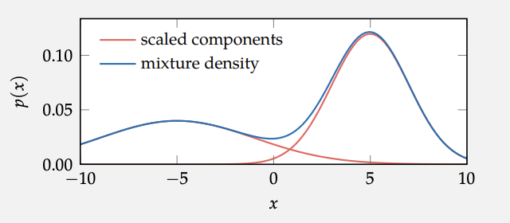
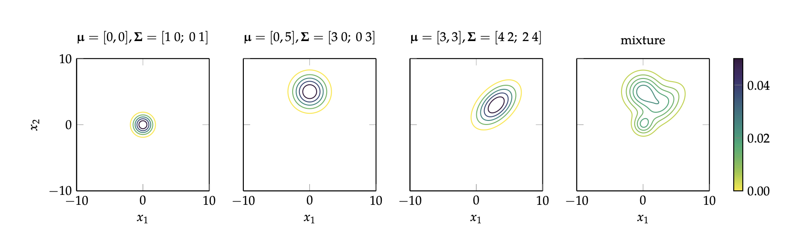
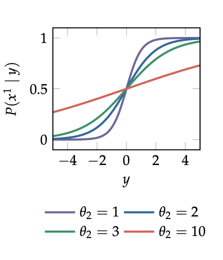

*Extracted from [Algorithms for Decision-Making][1]*
## 2. Representation
This chapter is mostly a Probability recap and some math and programming tools 
### 2.2.2 Continuous Probability Distributions
Gaussian mixture model is a mixture model that is simply a weighted average of various Gaussian distributions. The parameters of a Gaussian mixture model include the parameters of the Gaussian distribution components $\mu_{1:n},\sigma^{2}_{1:n}$, as well as their weights $\rho_{1:n}$. The density is given by:

$$p(x|\mu_{1:n},\sigma^{2}_{1:n},\rho_{1:n}) = \sum_{i=1..n}{\rho_i \mathscr{N}(x|\mu_i,\sigma_i)}$$

the weights $\rho_{1:n}$ are nothing more than a convex combination, therefore is just a weighted sum of normals, it looks like this:




### 2.3.1 Joint Distributions
A joint distribution is a probability distribution over multiple variables. A distribution over a single variable is called a _univariate distribution_, and a distribution over multiple variables is called a _multivariate distribution_. If we have a joint distribution over two discrete variables $X$ and $Y$, then $P(x, y)$ denotes the probability that both $X = x$ and $Y = y$.

We can represent joint distributions in terms of factors. A factor $\phi$ over a set of variables is a function from assignments of those variables to the real numbers. In order to represent a probability distribution, the real numbers in the factor must be nonnegative. A factor with nonnegative values can be **normalized** such that it represents a probability distribution.

```julia 
    struct Variable # whyyyyy ????
        name::Symbol # this will be the name of the variable (?)
        r::Int # number of possible values 
    end 
    
    # An Assignment will a mapping of variable names to discrete values, (that represents the possible values)
    # for example a = Assignment(X=1,Y=1,Z=1) that will be an assignment 
    const Assignment = Dict{Symbol,Int} 
    # given one Assignment this will be another mapping that contains the probability that certain assigment will occur, for example assignment a=(x=1, y=1, z=1) will be mapped to the probability 0.08 (you can see the end of this code)
    const FactorTable = Dict{Assignment,Float64}
    
    # Finally the working class for this mess is the class `Factor`, this class will receive a set of variables, and their cardinalities Variable.r. And also a Factor Table, that will contain all the possible assignment and their respective probability 
    struct Factor 
        vars::Vector{Variable}
        table::FactorTable
    end 
    # some other util functions (?)
    # this is a @property of a Factor Class (why not put it inside the class???)
    variablenames(φ::Factor) = [var.name for var in φ.vars] # extract a list of variable names from a Factor
    # this apparently is an overload from the select function in the base julia 
    select(a::Assignment, varnames::Vector{Symbol}) = Assignment(n=>a[n] for n in varnames) # https://juliadatascience.io/select 
    
    function assignments(vars::AbstractVector{Variable})
        # This function will list all the possibilities of assigments given a set of variables `vars`
        # given that we have the cardinality of all variables (var.r) we can simply make the product 
        # of all variables and then list them as assignments (all combinations of them) 
        names = [var.name for var in vars]
        return vec([Assignment(n=>v for (n,v) in zip(names, values))
                    for values in product((1:v.r for v in vars)...)]) # product will produce the cartesian product of a range of values
                    # not sure the use of the ellipsis ... in this context https://docs.julialang.org/en/v1/manual/functions/#Varargs-Functions
    end

    function normalize!(φ::Factor)
        # This function will normalize a Factor, particularly will normalize the Factor.table object 
        # this will normalize the probability so it sums 1, This will modify the object factor as the
        # name (normalize!) suggest (!) the conventions is to use (!) when we build a mutating function
        z = sum(p for (a,p) in φ.table) 
        for (a,p) in φ.table
            φ.table[a] = p/z
        end
        return φ
    end 
    # this are utility functions from an appendix G5 (really, why???)
    # This are @overloads of the base functions of Julia (why not, right? )
    
    # 1. this function allows you to define dictionaries using NamedTuples (a=1,b=2) rather than the 
    # ugly original Julia declaration format Dict(a=>1, b=>2)
    Base.Dict{Symbol,V}(a::NamedTuple) where V = Dict{Symbol,V}(n=>v for (n,v) in zip(keys(a), values(a)))
    # 2. This is a function to force convert(?) over a dictionary when called the constructor 
    # Dict{Symbol,Type}(NamedTuple)
    Base.convert(::Type{Dict{Symbol,V}}, a::NamedTuple) where V = Dict{Symbol,V}(a)
    # 3. This function will compare a dict with a NamedTuple (this doesn't overload 
    # the == comparator)
    Base.isequal(a::Dict{Symbol,<:Any}, nt::NamedTuple) = length(a) == length(nt) 
                && all(a[n] == v for (n,v) in zip(keys(nt), values(nt))
                )

    X = Variable(:x, 2)
    Y = Variable(:y, 2)
    Z = Variable(:z, 2)
    φ = Factor([X, Y, Z], FactorTable(
                (x=1, y=1, z=1) => 0.08, (x=1, y=1, z=2) => 0.31, 
                (x=1, y=2, z=1) => 0.09, (x=1, y=2, z=2) => 0.37, 
                (x=2, y=1, z=1) => 0.01, (x=2, y=1, z=2) => 0.05,
                (x=2, y=2, z=1) => 0.02, (x=2, y=2, z=2) => 0.07,
            )) 
```

In the non-discrete case we call this function a _continuous joint distribution_. This functions usually are multiplications of _univariate distributions_ such as, for example, the _multivariate uniform distribution_

$$ \mathcal{U}(\vec{x}|a,b) = \prod_i\mathcal{U}(x_i|a_i,b_i)$$

similarly we have the [_multivariate Gaussian distribution_][3] and the weighted combination of a set of _multivariate gaussian distributions_ known as a _multivariate Gaussian mixture model_

<p align="center">

</p>

### 2.4.2 Conditional Gaussian Model
A _conditional Gaussian model_ can be used to represent a distribution over a continuous variable given one or more discrete variables. For example, if we have a continuous variable $X$ and a discrete variable $Y$ with values `1:n`, we can define a conditional Gaussian model as follows

$$
p(x|y) =
    \begin{cases}
        \mathcal{N}(x|\mu_1, \sigma_{1}^{2}),  & \text{if $y^{1}$} \\
        ...\\
        \mathcal{N}(x|\mu_n, \sigma_{n}^{2}), & \text{if $y^{n}$} 
    \end{cases}
$$

with parameter vector $\theta = [\mu_{1:n}, \sigma_{1:n}^{2}]$. All $2n$ of those parameters can be varied independently. If we want to condition on multiple discrete variables, we just need to add more cases and associated parameters.
### 2.4.3 Linear Gaussian Models 
We can extend the conditional Gaussian model where the variable $Y$ is continuous, a useful simplification could be to assume a linear dependency of the mean of the normal distribution given the $Y$ value 

$$ p(x|y)= \mathcal{N}(x| my+b, \sigma^{2})$$

with parameter vector $\theta = [m,b,\sigma]$

### 2.4.5 Sigmoid Models 
Another case of _multivariate distibutions_ is when we have a discrete variable $X$ and we want to condition for a continuous variable $Y$ $p(x|y)$. One particular case of this is when $X$ is a binary variable, we can model this problem using a _sigmoid model_ 


$$ p(x^{1}|y)= \frac{1}{1+\exp{(-2\frac{y-\theta_1}{\theta_2})}}$$

The parameter $\theta_1$ governs the location of the threshold, and $\theta_2$ controls the "softness" or spread of the probabilities.

<p align="center">

</p>

## 2.5 Bayesian Networks

Bayesian Networks are a form of DAG that chain probabilities, usually based in a causation order, but is not required. A Bayesian Network can be used to represent a joint probability distribution. There is a way to "easily" estimate the conditional probabilities in a Bayesian network using the _chain rule_ 

$$P(x_{1:n}) = \prod_{i=1}^{n}P(x_i|pa(x_i)) $$

where $pa(x_i)$ are the parent nodes of the node $X_i$. It basically says that we can estimate the probability of a given node in a network if we condition for certain values of the parents (or their distributions) and multiply them to estimate the joint probability of the child node. 

## 2.6 Conditional Independence 
One of the most interesting properties of a bayesian network is that it proposed a structured independence between nodes. This structure will reduce the computational problem of calculating and nest random variables using the independence between nodes and particularly using the **conditional independence** property that it will be an extension of the common independence as we know. 

Variables $X$ and $Y$ are conditionally independent given $Z$ if and only if $P(X,Y | Z)$ = $P(X | Z)P(Y | Z)$. The assertion that $X$ and $Y$ are conditionally independent given $Z$ is written as $(X \bot Y | Z)$. It is possible to show from this definition that $(X \bot Y | Z)$ if and only if $P(X | Z) = P(X | Y, Z)$. Given $Z$, information about $Y$ provides no additional information about $X$, and vice versa.

If we have $X \rightarrow Y \rightarrow Z$ (chain) or $X \leftarrow Y \rightarrow Z$ (fork) with evidence at $Y$, then $X$ and $Z$ are conditionally independent, meaning that $P(X | Y, Z) = P(X | Y)$. Interestingly, if the directions of the arrows were slightly different, with $X \rightarrow  Y \leftarrow Z$ (inverted fork), then $X$ and $Z$ may no
longer be conditionally independent given $Y$. In other words, it may be the
case that $P(B | E) \neq P(B | S, E)$. The intuition behind this is that if we know that a dog barking $X$ and a thief $Z$ make sound the alarm $Y$, and the alarm its sounding knowing that the dog is or isn't barking will change the probability of a thief. 

We will denote _markov blanket_ to the minimum set of nodes $MB(X)$ that if we know their values therefore $X$ will be conditional independent from all the rest of nodes. A Markov blanket of a particular node turns out to consist of
its parents, its children, and the _other parents of its children_ (remember the inverted fork problem).


[Comment]: References 
[1]: <https://algorithmsbook.com/>
[2]: <https://juliaacademy.com/>
[3]: <https://en.wikipedia.org/wiki/Multivariate_normal_distribution>