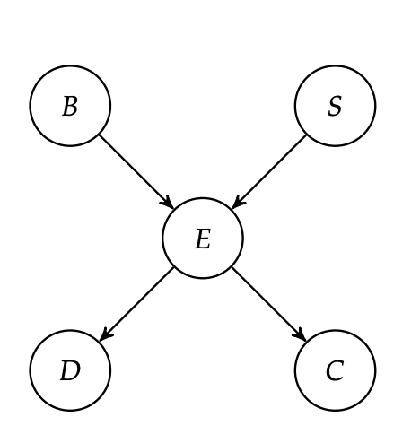

*Extracted from [Algorithms for Decision-Making][1]*

## 3. Inference 

Inference will be the procedure to determining the distribution over one or more unobserved variables given the values associated with a set of observed variables.

### 3.1 Exact Inference 

The basic algorithm to find out if a query node $B$ its equal to 1 (for example), given the evidence $D=1$, $C=1$ can be solved (depending on the network) following the standard procedure:

1. we use the conditional probability definition to split the function on their main components. 

$$P(x,y) = \frac{P(x,y)}{P(y)}$$

in our example this can be written as:

$$ 
P(b^{1}|d^{1},c^{1}) = \frac{P(b^{1},d^{1},c^{1})}{P(d^{1},c^{1})}
$$
2. We use _factor marginalization_  to sum out a particular variable from the entire factor table, removing it from the resulting scope. 

[Comment]: References 
[1]: <https://algorithmsbook.com/>
