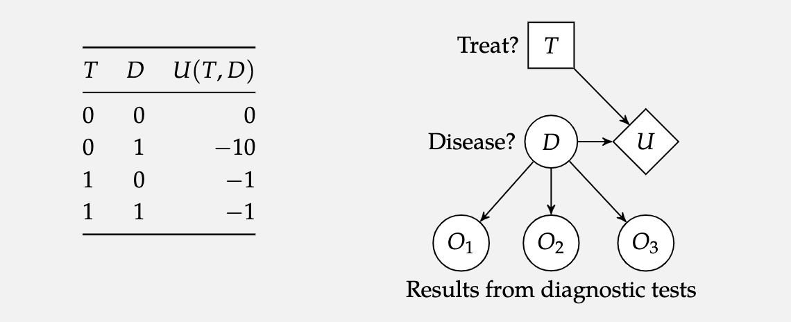

*based on [link][1]*
*created on: 2023-05-05 22:59:25*
## Algorithms For Decision Making -  Chapter 7 

before some notation:
1. An **Action variable**  will be denoted by a square node 
2. A **Chance variable** will be denoted by a circle node 
3. A **Utility variable** will be denoted by a diamond node 

In the image the T is a decision node (square) the Disease it's a random variable that it's independent (no upper dependency), the $O_i$ nodes are the test results that depend on the Disease, and the $U$ node will represent the utility, that depends on the Treatment and the Disease $D$. 

### Markov Decision Process (MDP)

More formally we will define a MDP as a set of States $S$, a set of actions can be a function of the states $A(s_{i})$ but its usually defined as a set $a_{i} \in A$. Also we could define a _state transition model_ $T(s^{\prime}| s,a)$ that means what it's the probability of ending in the state $s^{\prime}$ given that I was in the state $s$ and I took the action $a$. A reward function $R(s,a)$ which represents **the expected reward** of being in the state $s$ and executing the action a. 

We will define **a stationary MDP** as a MDP where:
$P(S_{t+1}|S_{t}, A_{t})$ and $P(R_{t}|S_{t}, A_{t})$ do not vary overtime. 

Notice that the reward function it's a deterministic function (because it's an **expected value**) therefore it does not rely on the dynamic outcome, but rather its calculated based on the **state transition model** $T$

$$R(s,a) = \sum_{s^{\prime}}{T(s^{\prime}|s,a)R(s,a,s^{\prime})}$$

Also notice that for a given state $s$ and action $a$, the sum of probabilities of all possible next states $s^{\prime}$ must add up to one. Therefore, **the following condition must hold true for any given state $s$ and action $a$**:

$$\sum_{s^{\prime} \in S} T(s^{\prime}|s,a) = 1$$

We will define the set of _"successors"_ states as:

$$ Successors: \{ s^{\prime} \in S| T(s^{\prime}|s,a)>0 \}$$

 
[//]: <> (References)
[1]: <https://algorithmsbook.com/files/dm.pdf>

[//]: <> (Some snippets)
[//]: # (add an image )
