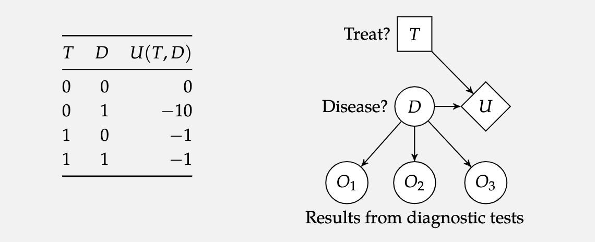

*based on [link][1]*
*created on: 2023-05-05 22:59:25*
## Algorithms For Decision Making -  Chapter 7 

before some notation:
1. An **Action variable**  will be denoted by a square node 
2. A **Chance variable** will be denoted by a circle node 
3. A **Utility variable** will be denoted by a diamond node 

In the image the T is a decision node (square) the Disease it's a random variable that it's independent (no upper dependency), the $O_i$ nodes are the test results that depend on the Disease, and the $U$ node will represent the utility, that depends on the Treatment and the Disease $D$. 

### Markov Decision Process (MDP)

[//]: <> (References)
[1]: <https://algorithmsbook.com/files/dm.pdf>

[//]: <> (Some snippets)
[//]: # (add an image )
