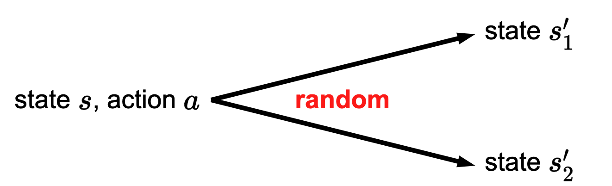
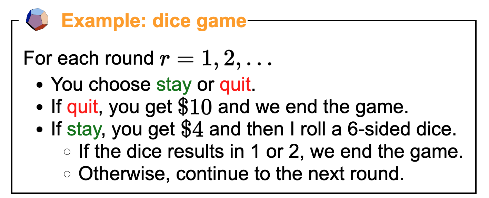
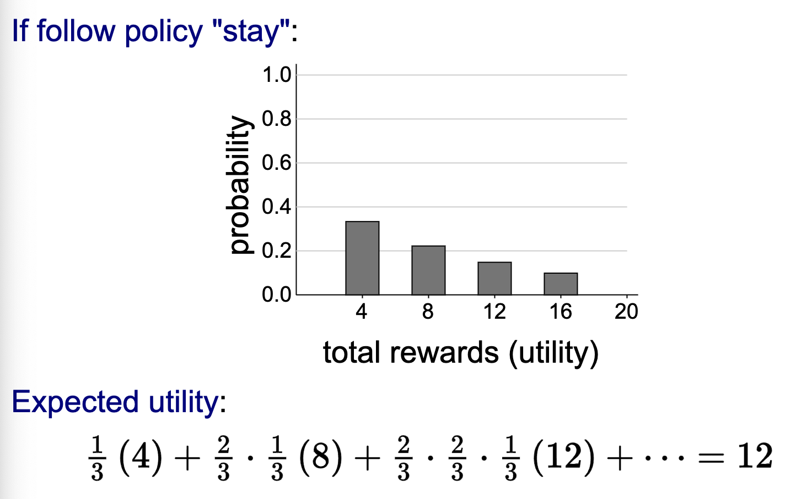
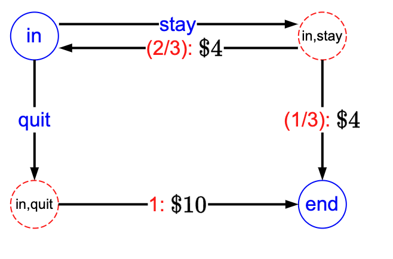
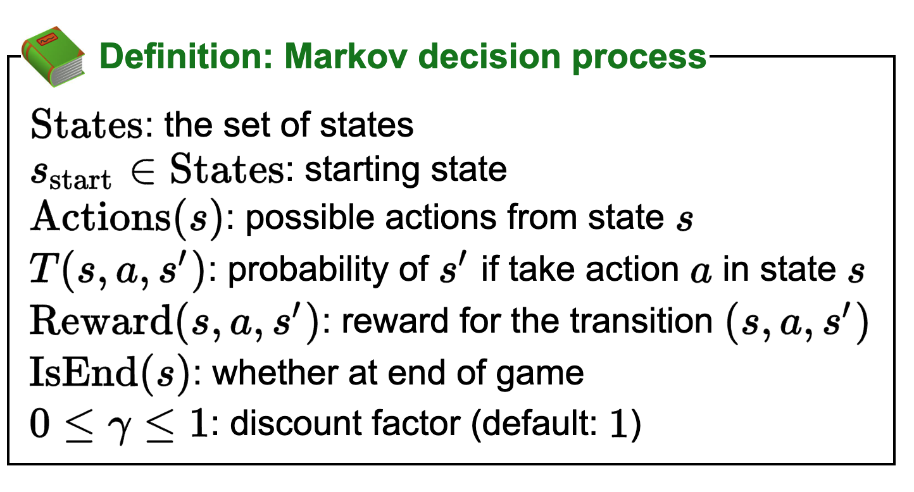
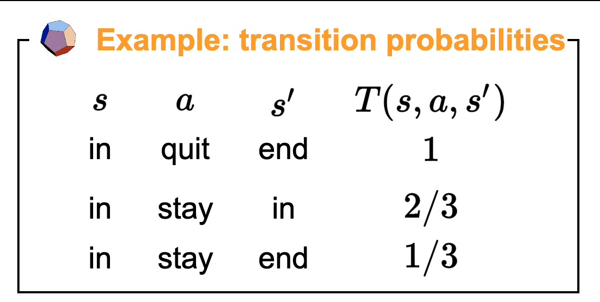
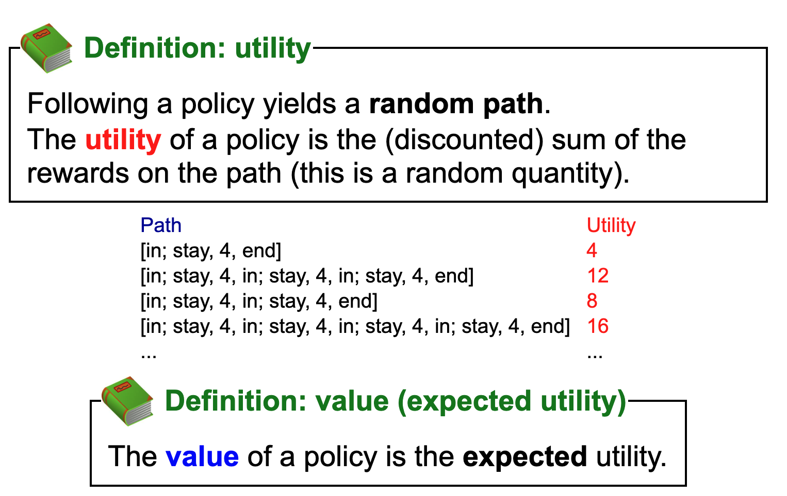
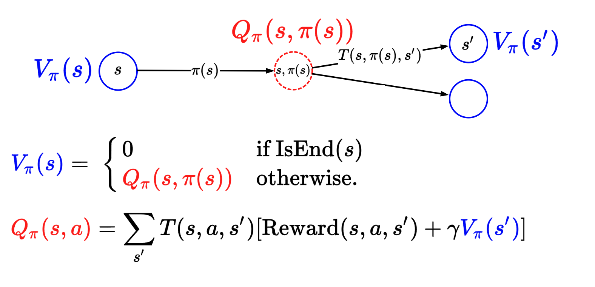
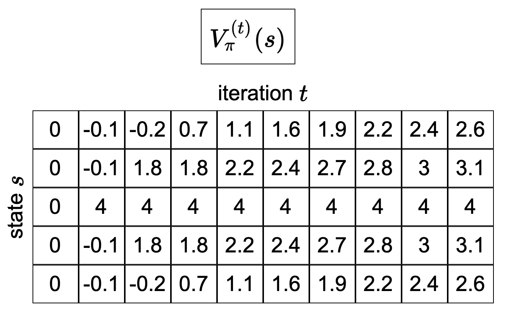
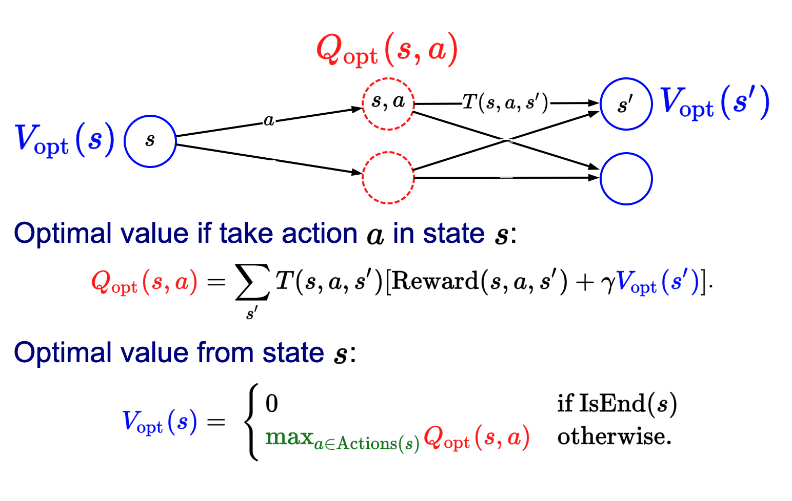

*based on [link][1]*
*created on: 2024-06-08 22:39:43*
## MDPs 

Similarly to a search problem, we are facing a problem where we should take action upon our current state, however, in this scenario, we are facing a non-deterministic set-up, meaning that the `nextState(s,a)` is unknown.

### Dice Game

A policy will be a function of the state and the possible actions, imagine our policy is "always stay" the expected value will be given by 

Whereas if you decided to quit, you will get $10 with a deterministic outcome.

To model this problem as an MDP we will first define the states, we only have two states on this set up. we are "in the game" ($IN$) or the "game is over" ($END$). So we only have two states on this graph. 

In the state $IN$ we have two possible actions `actions(IN)={stay, quit}` whereas on the end state I don't have more actions. Each one of this actions will lead us to a "chance node" (on red), a chance node will be a combination of the origin state and an action $(S_i, a_i)$. I'm not sure how standard is this notation. 

Each edge has two values, on red is the probability of following that path (1/3 for example), and the expected reward value. the bottom left corner node has a probability of 1 to go to quit (because is deterministic), and the reward is 10. 

More formally we will define an MDP as:

MDPs share many similarities with search problems, but there are differences (one main difference and one minor one).
$$Succ(s,a) \Rightarrow T(s,a,s')$$
$$Cost(s,a) \Rightarrow Reward(s,a,s')$$

The main difference is the move from a deterministic successor function $Succ(s,a)$ to a transition probability over $s'$. We can think of the successor function $Succ(s,a)$ as a special case of the transition probability
$$T(s, a, s') = \begin{cases} 1 & \text{if $s' = Succ(s, a)$} \\ 0 & \text{otherwise} \end{cases}$$

A minor difference is that we've gone from minimizing costs to maximizing rewards. The two are really equivalent: you can negate one to get the other.

The transition probabilities will be given by the initial state and the action being taken. In other notations, we draw a diamond shape in the plot to represent an action, and from there, we have the transition probabilities to other states.

as a property we have that all the transition probabilities over the possible next states sum up to one 
$$\sum_{s' \in States} T(s,a,s') = 1 $$
and we will define a `s' succesor(s)` such as:

$$T(s,a,s')>0$$

A **Solution** for an MDP will be defined with a policy $\pi(s) = a_s$, which is a mapping function over all the sates that will give us what is the optimum action $a_s$ to take if I'm in the state $s$.

## Policy Evaluation 

We will define utility as: 
> Following a policy yields a random path. The utility of a policy is the (discounted) sum of the rewards on the path (this is a random quantity).

We use the expected utility, given that each random path its just one realization of the random game + policy. 

$$\text{utility}: u = r_1 + \gamma*r_2 +\gamma^{2}*r_3  \dots$$
$$\text{value}: \mathbb{E}(u)$$

**Definition: Value of a policy**: we will define the value of a policy $\pi$ evaluated on the state s as $V_{\pi}(s)$. This will represent the expected utility received by following policy $\pi$ from state $s$.

**Definition: Q-Value of a policy**: Let $Q_{\pi}(s,a)$ be the expected utility of taking action $a$ from state $s$, and then following policy $\pi$.

In terms of the MDP graph, one can think of the value $V_{\pi}(s)$ as labeling the state nodes, and the Q-value $Q_{\pi}(s,a)$  as labeling the chance nodes.
This label refers to the expected utility if we were to start at that node and continue the dynamics of the game.

let's go back to the dice example and estimate the V-values of the policy $\pi(s) = \text{stay}$

by definition end state value is 0
$$V_{\pi}(end)=0$$ 
lets estimate the value of the state "in" :
$$V_{\pi}(in) = Q_{\pi}(s, \pi(s)) = Q_{\pi}(s, \text{stay}) $$
$$  = \sum_{s'} T(\text{in},\text{stay},s')*(reward(\text{in},\text{stay},s')+\gamma*V_{\pi}(s'))$$
replacing values
$$ V_{\pi}(in)= \frac{1}{3}(4+V_{\pi}(\text{end})) + \frac{2}{3}(4+V_{\pi}(\text{in}))$$
solving for $V_{\pi}(in)$ and replacing also $V_{\pi}(end)=0$ we have 

$$V_{\pi}(in)=12$$

### Algorithm: Policy Evaluation 
Evaluating all the states values can be a very complex task, particularly with a high dimensional MDP, so instead of building the real values there's an algorithm that via subsequently iteration approximate the values of the states to the real value. we do $t_{PE}$ iterations 
___
Initialize $V_{\pi}^{(0)}(s) \leftarrow 0$ for all states $s$

for iteration $t = 1, \dots ,t_{PE}$

$\qquad\text{for each state } s:$
   $$V^{t}_{\pi}(s) \leftarrow \sum_{s'}T(s, \pi(s), s') [reward(s,\pi(s),s') +\gamma V^{t-1}_{\pi}(s')]$$

___

Policy iteration starts with a vector of all zeros for the initial values . Each iteration, we loop over all the states and apply the two recurrences that we had before. The equations look hairier because of the superscript $(t)$, which simply denotes the value of at iteration $t$  of the algorithm.

As an example  on the image below we have this algorithm iterating and new iteration is added as a column on the matrix, we can see how the values converge looking into the differences between the last column and the one before.

we usually iterate until certain tolerance 

$$\max_{s \in States}|V^{t}_{\pi}(s) - V^{t-1}_{\pi}(s)|\leq \epsilon$$

The time complexity of this algorithm is $\sim O(t_{PE}SS')$

### Optimal Value and Policy
Goal: try to get directly at maximum expected utility

**Definition:** the optimal value $V_{opt}(s)$ is the maximum value attained by any policy

Finally the optimum policy, given that we know $Q_{opt}$ will be given by:

$$\pi_{opt}(s) = \argmax_{a \in Actions(s)} Q_{opt}(s, a)$$

### Algorithm: Value Iteration [Bellman, 1957]

Following the recipe, we simply iterate some number of iterations, go through each state  and then replace the equality in the recurrence with the assignment operator.
___
Initialize $V_{opt}^{(0)}(s) \leftarrow 0$ for all states $s$

for iteration $t = 1, \dots ,t_{VI}$

$\qquad\text{for each state } s:$
   $$V^{t}_{opt}(s) \leftarrow \max_{a \in Actions(s)}\sum_{s'}T(s, \pi(s), s') [reward(s,a,s') +\gamma V^{t-1}_{opt}(s')]$$

___
What about the optimal policy? We get it as a byproduct. The optimal value $V_{opt}(s)$ is computed by taking a max over actions. If we take the argmax, then we get the optimal policy $\pi_{opt}(s)$.

### Theorem: Convergence

Suppose either:
* discount $\gamma\leq 1$, or
* MDP graph is acyclic.

Then value iteration converges to the correct answer

[//]: <> (References)
[1]: <https://stanford-cs221.github.io/autumn2019/lectures/index.html#include=mdp1.js&mode=print1pp>

[//]: <> (Some snippets)
[//]: # (add an image )
