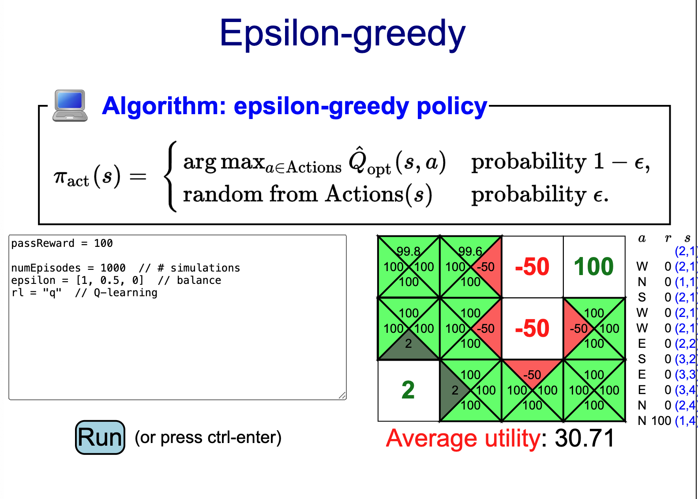

*based on [link][1]*
*created on: 2024-06-09 21:17:54*
## Markov Decision Processes 2 - Reinforcement Learning 

we will define an episode as one realization of a policy $\pi$. for example: 

$$s_0; a_1, r_1, s_1; a_2, r_2, s_2; a_3, r_3, s_3; \dots; a_n, r_n, s_n$$

that's one episode

we will define a reinforcement learning problem as an MDP where the transition probabilities and the rewards are unkowns. 

### Example: mystery game

**From MDPs to reinforcement learning**

1. Markov decision process (offline):

* Have mental model of how the world works.
* Find policy to collect maximum rewards.

2. Reinforcement learning (online):

* Don't know how the world works.
* Perform actions in the world to find out and collect rewards.

### Model-based Monte Carlo 

The first idea is called model-based Monte Carlo, where we try to estimate the model (transitions and rewards) using Monte Carlo simulation.

Monte Carlo is a standard way to estimate the expectation of a random variable by taking an average over samples of that random variable.

Here, the data used to estimate the model is the sequence of states, actions, and rewards in the episode. Note that the samples being averaged are not independent (because they come from the same episode), but they do come from a Markov chain, so it can be shown that these estimates converge to the expectations by the ergodic theorem (a generalization of the law of large numbers for Markov chains).

basically we can try a random policy $\pi(s) = rand(actions(s))$  or any other policy in order to generate "episodes". This concept is known as "exploration" in the context of RL. If I have a strict policy I will probably miss to estimate the MDP of the original world. 

$$e_1: s_0; a_1, r_1, s_1; a_2, r_2, s_2;\dots; a_{n1}, r_{n1}, s_{n1}$$
$$e_2: s_0; a_1, r_1, s_1; a_2, r_2, s_2;\dots; a_{n2}, r_{n2}, s_{n2}$$

This approach is "model based" because we are estimating and MDP. however, there's a "model free" version of this algorithm. 

### Model-Free Monte Carlo
The idea behind this approach is that we don't really need to know the MDP (T, R), but only to estimate $\hat{Q}_{opt}(s,a)$, given that with this estimation the optimum policy is defined (just chose the `argmax` of all the $Q_{opt}$ on each state)

$$\hat{Q}_{opt}(s, a) = \sum_{s'} \blue{\hat{T}(s, a, s')} [\blue{\widehat{Reward}(s, a, s')} + \gamma \hat{V}_{opt}(s')]$$

In a nutshell what we do to estimate $\hat{Q}_{\pi}(s, a)$ is to search in all episodes for the state,action node $(s,a)$. then we will sum all the rewards from that point on and that will give me a sample of $\hat{Q}_{\pi}(s, a)$, we gather all the samples, from the different episodes, and we build the estimator. 

If the node $(s,a)$ appears more than once in an episode we use only the first one and sum all from there, including what was after the second appearance of the node. 

**Note: that because we are not following the opt policy we are only estimating $\hat{Q}_{\pi}(s, a)$ no $\hat{Q}_{opt}(s, a)$**. Formalizing it:

$$\hat Q_\pi(s, a) = \text{average of } u_t \text{ where } s_{t-1} = s, a_t = a$$

There's an alternative formulation to do the same estimate but based on "incremental" approximations: 

$$\hat Q_\pi(s, a) \leftarrow (1 - \eta) \hat Q_\pi(s, a) + \eta \green{\underbrace{u}_\text{data}}
$$

This formulation is a little bit weird, but what is doing is to weight our previous estimation with $(1-\eta)$ that represents the weight of all the past episodes and the new $u$ utility from the new episode. for example if I have 10 episodes that estimate $\hat{Q}_{\pi,10}$ and we receive a new episode, then $(1-\eta)=\frac{10}{11}$ and $\eta = \frac{1}{10}$, and we add the new episode $\hat{Q}_{\pi}$ estimator.

### SARSA 
Using the iterative estimation of model-free montecarlo, we use that estimator but we do a small change.   

$$\hat Q_\pi(s, a) \leftarrow (1 - \eta) \hat Q_\pi(s, a) + \eta \green{u}$$

On the estimator we will replace the utility value $\green{u}$ (that in montecarlo was the sum of all the subsequent rewards to $s,a$) with just the immediate reward $r$ + our estimation of the next state Q-value. 

$$\hat Q_\pi(s,a) \leftarrow (1-\eta) \hat Q_\pi(s,a) + \eta \green{[\underbrace{r}_\text{data} + \gamma \underbrace{\hat Q_\pi(s', a')}_\text{estimate}]}$$

hence the name SARSA $(s, a, r, s', a')$. This estimator is better than the pure montecarlo one because $u$ estimate tends to be bias towards the episodes that were sampled (particularly the long ones with higher variance). In SARSA we use only the immediate reward from the episode and the estimator for the next states. this will "balance out" the variance from the sample. 

using $r + \hat Q_\pi(s', a')$ as estimator of $u$ instead of $u$ its called "bootstrap" in the context of reinforcement learning.  

So far, SARSA and Free-model MC only allow us to estimate $Q_\pi$ which is "policy evaluation" but not $Q_{opt}$. To estimate the optimum policy we need to find another algorithm. 

### Q-Learning 

Essentially what we do is to use Bellman equivalent on SARSA.

$$\text{SARSA estimator}: \hat Q_\pi(s,a) \leftarrow (1-\eta) \red{\hat Q_\pi(s,a)} + \eta \green{(r + \gamma \hat Q_\pi(s', a'))}$$

$$\text{Q-Learning estimator}: \hat Q_{opt}(s, a) \leftarrow (1-\eta) \red{\hat Q_{opt}(s, a)} + \eta \green{(r + \gamma \max_{a' \in Actions(s')} \hat Q_{opt}(s', a'))}$$

where in QLearning $\green{\max_{a' \in Actions(s')} \hat Q_{opt}(s', a')}$ is the estimator of $\green{\hat V_{opt}(s')}$

### Balance between exploration and exploitation  

to do the exploration $\pi_{act}$ what policy should we follow?

[//]: <> (References)
[1]: <https://www.youtube.com/watch?v=HpaHTfY52RQ&list=PLoROMvodv4rO1NB9TD4iUZ3qghGEGtqNX&index=8>
[//]: <> (Some snippets)
[//]: # (add an image )