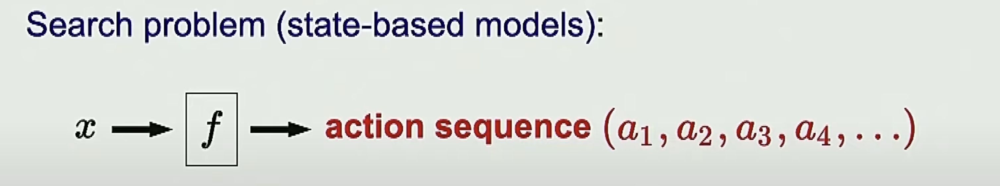
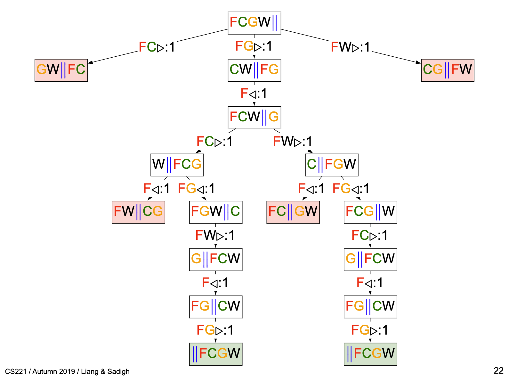
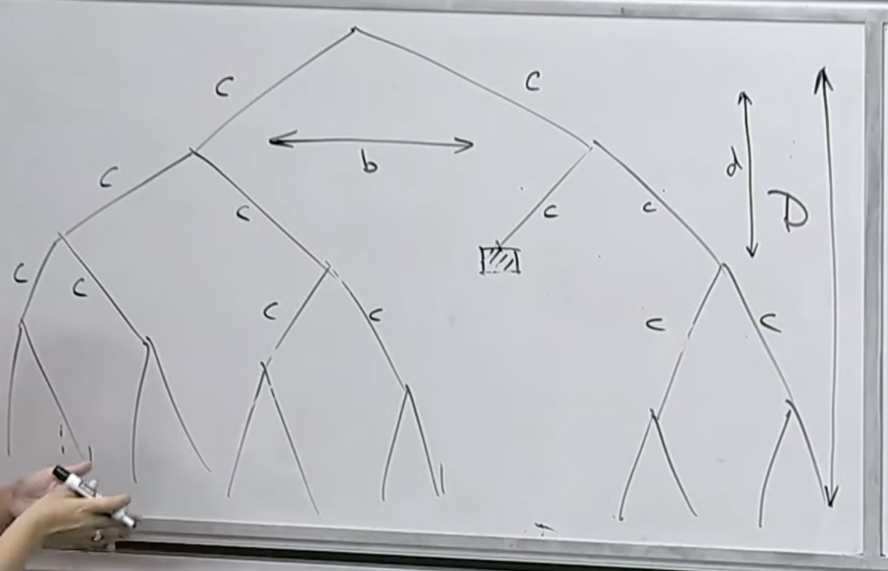
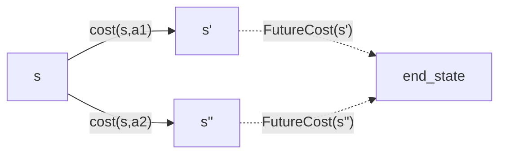

*created on: 2023-06-24 19:02:29*

*notes based on [cs221 AI class][1]*

*To find more about this course, take a look at the [syllabus][2]*

## CS221: Dynamic Programming - Search Problems


We define a search problem as: *"a series of actions aimed at achieving a specific objective"*. In deterministic problems, the solution can be determined by a sequence of actions. However, in dynamic problems, we must rely on a policy function (f) to guide our actions. All problems, deterministic and stochastic/dynamic, can be specified by a policy function $f$.



$x$ in this context will represent a state and $f$ will be the policy function. 

### Example: The Farmer 

Consider the following problem: a farmer (F) has a goat (G), a wolf (W) and a cabbage (C). The farmer has a boat that can only fit one of the three (plus the farmer). The farmer wants to transport all the assets from one side of the river to the other side. However, if the farmer leaves the goat and the cabbage alone on one side of the river, the goat will eat the cabbage. If the farmer leaves the wolf and the goat alone on one side of the river, the wolf will eat the goat. The goal is to find a sequence of actions that allows the farmer to transport all the assets safely to the other side of the river.

We will define a set of actions as $A =\{ F> , FC>, FW>, ..., F<\}$ that represents the elements that Im moving and a direction $>,<$. Each state $s \in S = \{FCG||W, ... \}$ will be represented as a node in the tree, and each action will be an edge. 


### Tree Search Algorithms (the concept)

We will represent our problem in a tree graph, where each node signifies a state, and each edge represents an action. Once this tree is computed, it will facilitate an "exhaustive" search of every possible course of actions (policy). Upon completion of the tree, we can find the best path based on a reward function $C(s,a)$

It is not always necessary to visit every node in the tree, as we can do a smarter search and ignore nodes that have higher cost than the incumbent, the idea is that in the worst case scenario, we have to visit the entire action space. 

In the following image, we have each node as a state (position of `FCGW`), an action `entities >`, and its cost `entity>:<cost>`. In this example, the cost is always 1 (because we are minimizing the total number of actions, therefore each action costs 1).



Let's formalize the definition of a search problem

### Formal Definition: Search Problem 

A search problem can be defined as:

1. Set of states $S$ with an origin node or state $s_{start}$.
2. Set of possible actions $A(s)$.
3. Cost or reward function $R(s,a)$.
4. Set of successor nodes $Succ(s,a)$ (which can be deterministic in a search problem).
5. Indicator of end state $IsEnd(s)$.

### Example: Transportation Problem


Additionally, if I'm in the state $s$ and $2s>N$ I can't take the "magic tram". 

## Tree Search Algorithms (search problem)

### 1. **Backtracking Search**

Exhaustively search for all possible action sequence and estimate their cost. Time $O(b^{D})$ where $b$ it's the amount of actions $|A(s)|$ (assuming that this is fixed, for the transportation example $b=2$), and D the tree depth (number of states $|S|$). Memory: $O(D)$ (because I only keep track of the incumbent)

We can implement this algorithm as a function that receives a `TransportationProblem` (see `tram_tree_search.py` )

```python
def backtracking_search(problem:TransportationProblem) -> Tuple[float,Any] :
    # Best solution found so far (dictionary because of python scoping technicality)
    best = {
        'cost': float('+inf'),
        'history': None
    }
    def recurse(state, history, totalCost):
        # At state, having undergone history, accumulated
        # totalCost.
        # Explore the rest of the subtree under state.
        if problem.isEnd(state):
            # Update the best solution so far
            if totalCost<best['cost']:
                best['cost'] = totalCost
                best['history'] = history
            return
        # Recurse on children
        for action, newState, cost in problem.succAndCost(state):
            recurse(newState, history + [(action, newState, cost)], totalCost+cost)
    # call the function from the starting state of the problem 
    recurse(problem.startState(), history=[], totalCost=0) 
    return (best['cost'], best['history'])
```

### 2. Depth-first Search (DFS)

Depth-first search (DFS) is a search algorithm that assumes the cost of all actions is zero, i.e., $C(s,a)=0$. Therefore, if the cost is not zero, this algorithm will only find a feasible solution, but not necessarily the optimal one. DFS explores as far as possible along each branch using backtracking, but it stops when it finds any solution. In cases where the cost condition its meet, this algorithm can be slightly faster than the Backtracking Search, but in worst case scenario both take the same time, so $O$ its the same. 

### 3. Breadth-first search (BFS)

This algorithm will assume that the cost of each action its constant and equal $C(s,a) = c$. Instead of searching for all possible solutions, we explore the tree level by level and stop whenever we find a solution. By exhaustively searching every single level, we know that we have found the shortest solution. Assuming that the solution its found at the level $d<D$ then our time will be $O(b^d) <O(b^D)$, which is a small improvement.  



### 4. DFS with iterative deepening (DFS-ID) 

This algorithm will assume that the cost of each action is constant and equal to $C(s,a) = c$. It combines DFS with BFS. The idea is to iteratively call DFS on the subtree of depth $d$. If we find a solution, we finish; otherwise, we add one more level. This algorithm is an improvement over BFS because we don't need to store all the tree levels until we find a solution. Instead, we simply call DFS ("low" memory) and stop if we find a solution. It's just an improvement on memory not in complexity level over BFS.

## Summary table 

| Algorithm                 | Cost function allowed | Time     | Space  | Notes                      |
|---------------------------|-----------------------|----------|--------|----------------------------|
| Backtracking Search       | Any                   | $O(b^D)$ | $O(D)$ |                            |
| Depth-first Search (DFS)  | $C(s,a)=0$            | $O(b^D)$ | $O(D)$ |                            |
| Breadth-first search (BFS)| $C(s,a) = c$          | $O(b^d)$ |$O(b^d)$|                            |
| DFS with iterative deepening (DFS-ID)| $C(s,a) = c$| $O(b^d)$ | $O(d)$ |                           |
| Dynamic Programming       | Any                   | $O(n)$   | $O(n)$ | only acyclic               |
| Uniform Cost Search       | $C(s,a)>0$            | $O(nlog(n))$| $O(nlog(n))$|only positive cost if cycles|


## Dynamic Programming (Search Problem)

In this model we will consider the following, we will assume that there it's an expectation cost function that will estimate the future cost of a $s'$ state. we will call this function "$FutureCost(s')$". The idea is that if we stand on the state $s$ we will choose the action $a$ that minimize the cost and the future costs of the deterministic next state. 


In the upper diagram we are in the state $s$ and we have two possible actions $a_{1}$ and $a_{2}$ we know their cost $cost(s,a_{i})$ and we, somehow, have the future cost of both next states $FutureCost(s'')$ we don't know the next curse of actions, and we don't know how we will ended up in the `end_state`, but we know that we will have some way to get there, and we have an estimation of the cost. 

We will define the $FutureCost(s)$ function as:

$$ FutureCost(s) = 
\begin{cases}
      0 & \text{if $isEnd(s)$} \\
      min_{a \in A(s)}{\{Cost(s,a) + FutureCost(succ(s,a))\}} & \text{otherwise} \\
\end{cases} 
$$

where $succ(s,a)$ its the next state $s'$ when taking action $a$ from node $s$.

This is similar to Dijkstra algorithm -but reverse-, start from end node and add the cost iteratively until you find the staring node. We basically instead of estimate the cost of each possible action that ended up in the state $s$ after we estimate the cost of that node (or the "$FutureCost(s)$") we don't need to re-estimate that cost like in the trees algorithms, we just store the value that cost us form the node $s$ to get into the `final_state` and every time that I need to use that cost I have it stored somewhere.  

In the following code we implement a general view of a dynamic programming algorithm. 

```python 
def dynamic_programming(problem:TransportationProblem) -> Tuple[float,Any] :
    cache = {} # state -> futureCost(state)
    def futureCost(state):
        # Base case
        if problem.isEnd(state):
            return 0
        if state in cache: # Exponential savings
            return cache[state]
        # Actually doing work
        result = min([cost+futureCost(newState) for action, newState, cost in problem.succAndCost(state)])
        cache[state] = result
        return result
    return (futureCost(problem.startState()), [])
```
In this implementation, we require that the search graph its acyclic, so both $A(s)$ and $Succ(s,a)$ are both acyclic (otherwise the recursion will fail). 

One key Idea of the dynamic programming its that the current **state** or moreover, **the definition of state** should contain a summary of all past actions **sufficient** to chose future actions **optimally**.

The essence of **our state definition**, for a particular problem, is to forget the past while still considering its impact on future actions. **The fewer states we have, the more efficient our algorithm**. The goal is to find the minimal set of states that allow us to solve the problem. 

### Example: Min routing with constraint

For example on the min routing problem; find the shortest path from city 1 -> N. Lets add a constraint: "Can't visit three odd cities in a row". In that case, using the state as the current city would not solve the problem because we will fail to identify feasible action space $A(s)$. Therefore, we will need to redefine the states so we can hold that constraint. 

In that example having the state as $S_1  =\{ prev\_city, current\_city\}$ or $S_2 = \{prev\_city\_is\_odd , current\_city\}$ both will solve the problem, however the dimensional space of the first one its way bigger than the second one $|S_{1}| = N^2$ vs $|S_{2}| = 2N$

Efficiently defining the states becomes a game changer on the Dynamic Programming implementation 

## Uniform Cost Search (UCS)

This search is very similar to Dijkstra's Algorithm (apparently it's a generalization). The idea is that this algorithm can be applied to graphs with cycles without having to enforce the non-cycle condition as in dynamic programming. The key concept is that in dynamic programming, you need some order to estimate the `futureCost(s)`. However, UCS makes use of a way of enumerating the states not based on their topology but rather on their increasing `pastCost(s)`. 

The only condition that we enforce is that the cost needs to be all positive (so we can sort them without non-ending cost reduction cycles). however this will not allow us to use this algorithm where there is rewards on actions, for those cases we need Bellman-Ford algorithm. This algorithm receives his cost based on the fact that the `pastCost(s)` is uniformly for all future state.  

In general, the algorithm works by having 3 different sets: `Explored`, `Frontier`, `Unexplored`. The pseudo algorithm works like this:

#### USC Pseudo Code 

1. all nodes start in the `Unexplored` set 
2. we move the starting node to the `Frontier` (we have a starting and an ending node)
3. we move the node with the lowest cost in the `Frontier` (Starting node with cost 0) to the `Explored` set. We are gonna call this node the `current_node`
4. we add to the `Frontier` all the nodes from the `Unexplored` set that are one degree away from our `current_node`". For all the nodes in the `frontier` we estimate the cost from our `current_node` and update if its lower than the previously estimated or add it in case that it was empty.  
5. we repeat (3) and (4) until we reach the `end_node`

In general, there are three sets:
- `Explored`: states that we have visited and know the minimum cost from the start state 
- `Frontier`: states that we know how to reach and have an estimation of the cost, but we don't know for sure if the path we found is the minimum 
- `Unexplored`: states that we don't know anything about yet


```python
# similar to Dijkstra, but we only explore nodes until a solution is reach 
# whereas in Dijkstra you explore them all
def uniformCostSearch(problem):
    frontier = util.PriorityQueue() # its a stack that also store the cost per element (to remove min)
    frontier.update(problem.startState(), 0)
    while True:
        # Move from frontier to explored
        state, pastCost = frontier.removeMin()
        if problem.isEnd(state):
            return (pastCost, [])
        # Push out on the frontier
        for action, newState, cost in problem.succAndCost(state):
            frontier.update(newState, pastCost+cost)
```
**Theorem: correctness:** When a state $s$ is popped from the frontier and moved to explored, its priority is `pastCost(s)` , the minimum cost to $s$.


[//]: <> (References)
[1]: <https://www.youtube.com/watch?v=aIsgJJYrlXk&list=PLoROMvodv4rO1NB9TD4iUZ3qghGEGtqNX>
[2]: <https://stanford-cs221.github.io/autumn2019/#schedule>
[3]: <"">
[//]: <> (Some snippets)
[//]: # (add an image )
