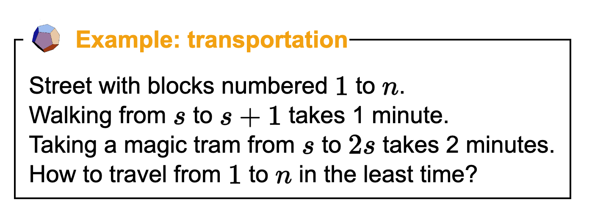

*notes based on [cs221 AI class][1]*
*created on: 2023-06-24 19:02:29*

## CS221: Search 2 - A*

Definition of Search Problem:

1. $S_{start}$ :  Starting State
2. $Actions(s)$: Possible Actions on state $s$
3. $Cost(s,a)$: action cost 
4. $Succ(s,a)$: successor state 
5. $IsEnd(s)$: reached end state ?

Objective: find the minimum cost path from $s_{start}$ to any $s$ satisfying $IsEnd(s)$

## Learning Costs

### Example: Transportation Problem

Additionally, if I'm in the state $s$ and $2s>N$ I can't take the "magic tram". Now imagine that I don't know the cost, but I only know the optimum path, now this will be a "learning problem" 

In this "inverse" problem, we have an optimum path, and we try to infer the cost of the graph. For example, we have some people's path, and we try to identify their cost function. 

|Problem| Formulation|
|-----------------------|----------------------------------------|
|Forward Problem (search)| $Cost(s,a) \rightarrow (a_1, ..., a_k)$|
|Invert Problem (learning)| $(a_1, ..., a_k) \rightarrow Cost(s,a)$|

Given a "initial guess" of costs (for example `walk=3 , tram=2`) we run the search algorithm to get the optimum path

The idea is that we update the "weights" (costs) based on the difference between the "predicted" path, and the "optimum" path. For example, imagine that our predicted path $y'=\{w,t\}$ and the real path is $y=\{w,w,w\}$. 

The learning algorithm is very simple. We substract -1 unit to the cost for every time that the action is present on the optimum solution, and increased in 1 for every time that the action is present on the prediction. 

In the case $y'=\{w,t\}$,  $y=\{w,w,w\}$. And with the initial guess $w[w]_0 = 3$, $w[t]_0 = 2$ we have the following: 

$$w[w]_1 = w[w]_0 - 3 + 1 = 3-3+1=1$$
$$w[t]_1 = w[t]_0 - 0 + 1 = 2-0+1=3$$

This algorithm is known as **"Structured Perceptron"**

## A* search

In UCS (Uniform Cost Search), we conduct an exhaustive search of all possible paths. In an iterative 'backward' manner, we find the optimum path. However, this approach might seem like a lot of wasted calculation, especially from paths that are far apart from our `finalState`. Imagine that we are moving from the center to the top-right corner, but we also explore all possible paths that lead in the opposite direction, simply because we iterate over the 'frontier' of states. Seems like we might like to include some additional "knowledge" on that solution. 

A* is an algorithm that uses "the direction" of the `FinalState` to its advantage, prioritizing the exploration of paths that go in that direction. We achieve this by estimating, via a heuristic, a predicted `futureCost(s)` of the state `S`, also known as the "heuristic function" `h(s) ~ futureCost(s)`. Of course, we can't estimate the `futureCost(s)` exactly, because that would mean we've already solved the search problem, but we create a cheap approximation `h(s)` that might lead to a faster search.

A* will then be the same algorithm as UCS but using `h(s)` instead of `futureCost(s)`. This will represent a new way of estimate the cost function. With this new updated cost function we run UCS like always:

 
[//]: <> (References)
[1]: <https://www.youtube.com/watch?v=aIsgJJYrlXk&list=PLoROMvodv4rO1NB9TD4iUZ3qghGEGtqNX>

[//]: <> (Some snippets)
[//]: # (add an image )