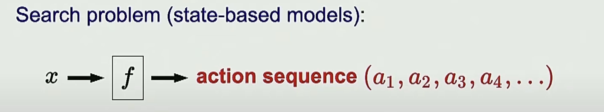
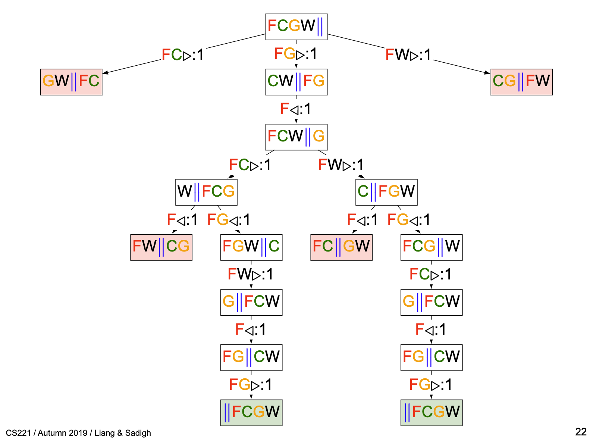
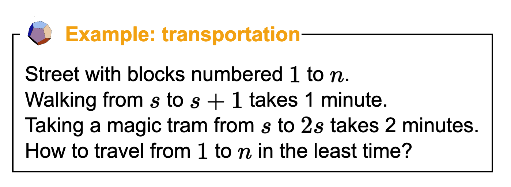
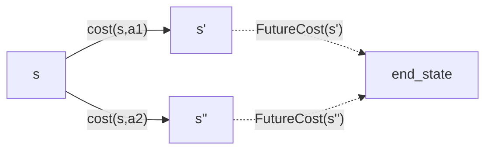

*notes based on [cs221 AI class][1]*
*created on: 2023-06-24 19:02:29*

## CS221: Dynamic Programming - Search Problems

For more class material look into the [course syllabus][2]. 

In general, a search problem (and its "model solution") can be defined as a sequential set of actions. When the problem is deterministic, the search solution is simply a set of sequential actions. However, when the problem is dynamic, we rely on a policy function (f).



### Search Problems: The Farmer Example

Consider the following problem: a farmer (F) has a goat (G), a wolf (W) and a cabbage (C). The farmer has a boat that can only fit one of the three (plus the farmer). The farmer wants to transport all the assets from one side of the river to the other side. However, if the farmer leaves the goat and the cabbage alone on one side of the river, the goat will eat the cabbage. If the farmer leaves the wolf and the goat alone on one side of the river, the wolf will eat the goat. The goal is to find a sequence of actions that allows the farmer to transport all the assets safely to the other side of the river.

We will define a set of actions as $A =\{ F> , FC>, FW>, ..., F<\}$ that represents the elements that Im moving and a direction $>,<$. Each state $s \in S = \{FCG||W, ... \}$ will be represented as a node in the tree, and each action will be an edge. 


### Tree Search Algorithms (the concept)

A search tree is an "exhaustive" search of every possible action from the starting node. Each pair of state and action $(s,a)$ is assigned a cost or reward value based on a cost function $C(s,a)$. Although it is not always necessary to visit every node in the tree, as we can do a smarter search and ignore nodes that have higher cost than the incumbent, the idea is that in the worst case scenario, we have to visit the entire action space. This is similar to doing a branch and bound search. 



To formalize a search problem we will have the following 

### Formal Definition: Search Problem 

We will have a set of states $S$ with  origin node or state $s_{start}$. A set of possible actions $A(s)$, a cost or reward function $R(s,a)$, a set of successor nodes $Successor(s,a)$ which will be deterministic in a search problem, and a indicator of end state $IsEnd(s)$

### Search Problem: The Transportation Example 



Aditionally, if I'm in the state $s$ and $2s>N$ I can't take the "magic tram". 

## Tree Search Algorithms (search problem)

### 1. **Backtracking Search**

Exhaustively search for all possible action sequence and estimate their cost. Time $O(b^{D})$ where $b$ it's the amount of actions $|A(s)|$ (assuming that this is fixed, for the transportation example $b=2$), and D the tree depth (number of states $|S|$). Memory: $O(D)$

We can implement this algorithm as a function that receives a `TransportationProblem` (see `tram_tree_search.py` )

```python
def backtracking_search(problem:TransportationProblem) -> Tuple[float,Any] :
    # Best solution found so far (dictionary because of python scoping technicality)
    best = {
        'cost': float('+inf'),
        'history': None
    }
    def recurse(state, history, totalCost):
        # At state, having undergone history, accumulated
        # totalCost.
        # Explore the rest of the subtree under state.
        if problem.isEnd(state):
            # Update the best solution so far
            if totalCost<best['cost']:
                best['cost'] = totalCost
                best['history'] = history
            return
        # Recurse on children
        for action, newState, cost in problem.succAndCost(state):
            recurse(newState, history+[(action, newState, cost)], totalCost+cost)
    # call the function from the starting state of the problem 
    recurse(problem.startState(), history=[], totalCost=0) 
    return (best['cost'], best['history'])
```

### 2. Depth-first Search (DFS)

Depth-first search (DFS) is a search algorithm that assumes the cost of all actions is zero, i.e., $C(s,a)=0$. Therefore, if the cost is not zero, this algorithm will only find a feasible solution, but not necessarily the optimal one. DFS explores as far as possible along each branch using backtracking, but it stops when it finds any solution. In cases where the cost condition its meet, this algorithm can be slightly faster than the Backtracking Search, but in worst case scenario both take the same time, so $O$ its the same. 

### 3. Breadth-first search (BFS)

This algorithm will assume that the cost of each action its constant and equal $C(s,a) = c$. Instead of searching for all possible solutions, we explore the tree level by level and stop whenever we find a solution. By exhaustively searching every single level, we know that we have found the shortest solution.

### 4. DFS with iterative deeping (DFS-ID) 

This algorithm will assume that the cost of each action is constant and equal to $C(s,a) = c$. It combines DFS with BFS. The idea is to iteratively call DFS on the subtree of depth $d$. If we find a solution, we finish; otherwise, we add one more level. This algorithm is an improvement over BFS because we don't need to store all the tree levels until we find a solution. Instead, we simply call DFS ("low" memory) and stop if we find a solution. It's just an improvement on memory not in complexity level over BFS.

## Dynamic Programming (Search Problem)

In this model we will consider the following, we will assume that there it's an expectation cost function that will estimate the future cost of a $s'$ state. we will call this function "$FutureCost(s')$". The idea is that if we stand on the state $s$ we will choose the action $a$ that minimize the cost and the future costs of the deterministic next state. 


In the upper diagram we are in the state $s$ and we have two possible actions $a_{1}$ and $a_{2}$ we know their cost $cost(s,a_{i})$ and we, somehow, have the future cost of both next states $FutureCost(s'')$ we don't know the next curse of actions, and we don't know how we will ended up in the end_state, but we know that we will have some way to get there, and we have an estimation of the cost. 

We will define the $FutureCost(s)$ function as:

$$ FutureCost(s) = 
\begin{cases}
      0 & \text{if $isEnd(s)$} \\
      min_{a \in A(s)}{Cost(s,a) + FutureCost(succ(s,a))} & \text{if condition2} \\
\end{cases} 
$$

where $succ(s,a)$ its the next state $s'$ when taking action $a$ from node $s$.

This is basically Dijkstra algorithm, start from end node and add the cost iteratively until you find the staring node. We basically instead of estimate the cost of each possible action that ended up in the state $s$ after we estimate the cost of that node (or the "$FutureCost(s)$") we don't need to re-estimate that cost like in the trees algorithms, we just store the value that cost us form the node $s$ to get into the `final_state` and every time that I need to use that cost I have it stored somewhere.  

In the following code we implement a general view of a dynamic programming algorithm. 

```python 
def dynamic_programming(problem:TransportationProblem) -> Tuple[float,Any] :
    cache = {} # state -> futureCost(state)
    def futureCost(state):
        # Base case
        if problem.isEnd(state):
            return 0
        if state in cache: # Exponential savings
            return cache[state]
        # Actually doing work
        result = min(cost+futureCost(newState) \
                for action, newState, cost in problem.succAndCost(state))
        cache[state] = result
        return result
    return (futureCost(problem.startState()), [])
```
In this implementation, we require that the search graph its acyclic, so both $A(s)$ and $Succ(s,a)$ are both acyclic (otherwise the recursion will fail). 

One key Idea of the dynamic programming its that the current **state** or moreover, **the definition of state** should contain a summary of all past actions **sufficient** to chose future actions **optimally**.

The essence of **our state definition**, for a particular problem, is to forget the past while still considering its impact on future actions. **The fewer states we have, the more efficient our algorithm**. The goal is to find the minimal set of states that allow us to solve the problem. 

For example on the min routing problem, lets add a constraint: "Can't visit three odd cities in a row", in that case, using the state as the current city would not solve the problem because we will fail to identify feasible action space $A(s)$. therefore we will need to redefine the states so we can hold that constraint. 

In that example having the state as $S=\{ prev\_city, current\_city\}$ or $S \{prev\_city\_is\_odd , current\_city\}$ both will solve the problem, however the dimensional space of the first one its way bigger than the second one $|S_{1}| = N^2$ vs $|S_{2}| = 2N$

## Uniform Cost Search 

[//]: <> (References)
[1]: <https://www.youtube.com/watch?v=aIsgJJYrlXk&list=PLoROMvodv4rO1NB9TD4iUZ3qghGEGtqNX>
[2]: <https://stanford-cs221.github.io/autumn2019/#schedule>
[3]: <"">
[//]: <> (Some snippets)
[//]: # (add an image )