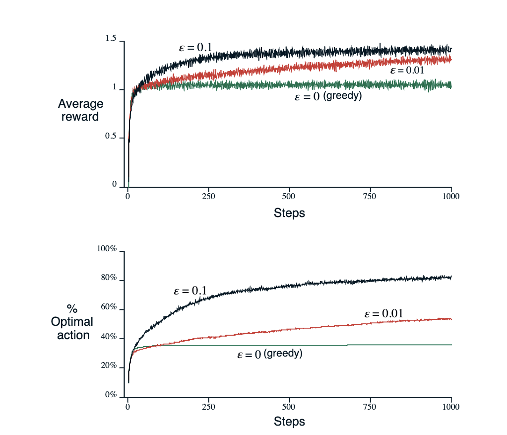
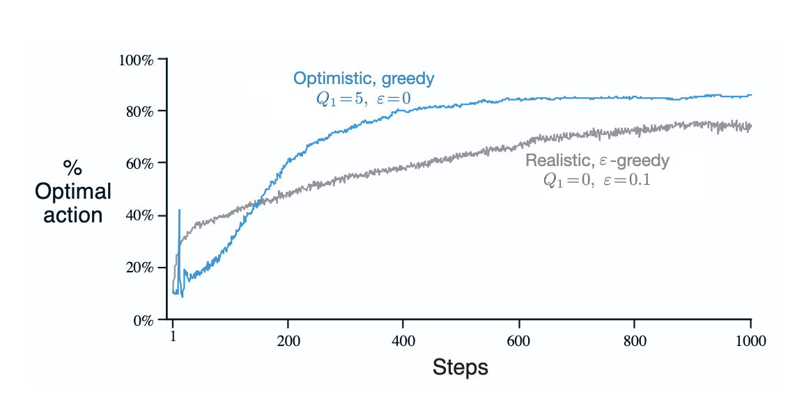

*based on [link][1]*
*created on: 2026-07-01 22:15:16*
## Chapter 2: Multi-armed Bandits

we will define an k.armed bandit problem as a set of k actions, where each action $A_t$ is associated with a reward $R_t$ drawn from a stationary probability distribution.The expected value of an action $a$ will be denoted by $q_*(a)$

$$ q_*(a) = E[R_t | A_t = a] $$

given the expected value  $ q_*(a) $, we will denote it as $Q_t(a)$,that will be the estimated value of action $a$ at time $t$. 

$$ Q_t(a) =  \hat{q}_*(a)  $$

Considering that in every point in time we can choose between the action with the maxium expected value ( $\argmax_a Q_t(a)$ ) we will call this "exploitation". However, if we choose an action that is not the best one, we will call this "exploration".

### 2.2 Action-value methods

a very simple method to estimate the value of an action is to use the sample-average method, which is defined as follows:

$$ Q_t(a) = \frac{\sum_{i=1}^{t} R_i * \mathbb{1}_{\{A_i = a\}}}{\sum_{i=1}^{t} \mathbb{1}_{\{A_i = a\}}} $$

A greedy method will be to always take the action with the maximum estimated value 

$$ A_t = \argmax_a Q_t(a) $$

However, always choosing the action with the highest estimated value can lead to suboptimal behavior if the estimates are not accurate. To address this, we can use an $\epsilon$-greedy method, where in every turn, with probability $\epsilon$, we choose uniformly among all the actions.

higher values of $\epsilon$ will lead to more exploration, while lower values will lead to more exploitation. in the short term lower values of $\epsilon$ will lead to higher rewards, but in the long term, higher values of $\epsilon$ will lead to better estimates of the action values and thus higher rewards. mainly because the more greedy methods will get stuck in local optima.

how determinate epsilon?. It will depend on the case, for example if the variance of the bandit distributions rewards is high, a higher epsilon will land a better result, while if the variance is low, a lower epsilon will be better. 

even when the variance is low sometimes we are exposed to non-stationary problems, where the expected value of the actions change over time, in this case a higher epsilon will be better. 

### 2.4 Incremental Implementation

given our expected reward estimate $Q_t(a)$:

$$ Q_t(a) = \frac{\sum_{i=1}^{t} R_i * \mathbb{1}_{\{A_i = a\}}}{\sum_{i=1}^{t} \mathbb{1}_{\{A_i = a\}}} $$

we can reduce the amount of memory of that estimation, just keeping in memory the latest estimate and update it using the following formula:

$$ Q_{n+1}(a) = Q_n(a) + \frac{1}{n} * (R_n - Q_n(a)) $$

abstracting it, we can define a general update rule as follows:

$$ \text{New Estimate} \leftarrow \text{Old Estimate} + \text{Step Size} * (\text{Target} - \text{Old Estimate}) $$

where Target- Old Estimate is some sort of update direction, for example if the Target (new incoming reward) is higher that my current estimate my new estimate will "move up", and the otherway around. 
The step size is $\frac{1}{n}$. In general we will denote the step size as $\alpha_t(a)$,

Simple Bandit Algorithm 

Initialize for all $a \in A$:
$$Q(a) \leftarrow 0$$
$$N(a) \leftarrow 0$$

loop forever:
$$
A_t \leftarrow \begin{cases}
\text{random action} & \text{with probability } \epsilon \\
\argmax_a Q_t(a) & \text{with probability } 1 - \epsilon
\end{cases}
$$
$$ R \leftarrow bandit(A)$$
$$N(A) \leftarrow N(A) + 1$$
$$Q(A) \leftarrow Q(A) + \frac{1}{N(A)} * (R - Q(A)) $$

### 2.5 Nonstationary Problems

To solve for non-stationary problems we can reduce the weight that we give to old rewards, so our estimate will be closer to the new rewards. 

Instead of using $\frac{1}{n}$ as step size, we can use a constant step size $\alpha \in (0, 1]$, which will give more weight to the new rewards.

$$ Q_{n+1} = Q_n + \alpha * (R_n - Q_n) $$

This decay is something called "exponential recency-weighted average". Assuming that we can pick any functional step size $\alpha_t(a)$ we will need to have some conditions to guarantee covergence. 

1. $\sum_{t=1}^{\infty} \alpha_t(a) = \infty$ (the sum of the step sizes must diverge)
2. $\sum_{t=1}^{\infty} \alpha_t^2(a) < \infty$ (the sum of the squares of the step sizes must converge)

the first condition guarantees that the steps are large enough to overcome any initial bias, while the second condition guarantees that the steps are small enough to converge.

in the case of $\alpha_t(a) = \frac{1}{n}$, both conditions are satisfied. but in the case of $\alpha_t(a) = \alpha$, only the first condition is satisfied, but for non-stationary problems, is exactly what we want, because the optimum action change over time, and we want to be able to adapt to that change.

### 2.6 Optimistic Initial Values

Another way to encourage exploration is to use **optimistic initial values**. Instead of initializing $Q(a)$ to zero, we can initialize it to a high value. In the case of our n-armed badit problem where distribution were normal with mean 0 and variance 1, we can initialize $Q(a)$ to 5. When using a $\epsilon$-greedy method, the high initial value will force the model to sample more at the beginning, outperforming a model that started with all values in 0 in the short term, converging to the solution faster. 

  

This method however is not very useful in non-stationary problems, because the initial values will be quickly forgotten, and the model will have to explore again. hence, its practically is limited to certain type of problems.

### 2.7 Upper-Confidence-Bound Action Selection

Upper confidence bound (UCB) is an algorithm that, instead of randomly choosing an explore action like in $\epsilon$-greedy algorithms, it will choose the action based on how uncertain we are about the action value. Similar to TS. The algorithm is described as follows:

$$ A_t = \argmax_a \left[ Q_t(a) + c * \sqrt{\frac{\ln t}{N_t(a)}} \right] $$

where $c > 0$ is a constant that controls the degree of exploration. The second term is the uncertainty term, which is high for actions that have been selected less frequently. As time $t$ goes on the uncertatinty term will increase if the action has not been selected (because $\ln t$ increases but $N_t(a)$ does not). While if the action has been selected, the uncertainty term will decrease (because $N_t(a)$ increases, and the numerator $\ln t$ increases slower than the denominator $N_t(a)$).

While UCB tends to outperforme $\epsilon$-greedy methods, is not used in practice, because it still not perform well in non-stationary problems. 

### 2.8 Gradient Bandit Algorithms

Gradient bandit algorithms, will balance out the probability of selecting an action based on the relative weight that action has compared to the other actions. It uses a softmax distribution to select the action, where the probability of selecting an action is given by a term that we will call "preference" $H_t(a)$, 

$$\pi_t(a) = \frac{e^{H_t(a)}}{\sum_{b=1}^{k} e^{H_t(b)}}$$

where $k$ is the number of actions. The preference $H_t(a)$ is updated based on the received reward and the average reward $\bar{R}_t$:

$$ H_{t+1}(A_t) = H_t(A_t) + \alpha * (R_t - \bar{R}_t) * (1 - \pi_t(A_t)) \text{ for the selected action in time  }t, A_t $$
$$ H_{t+1}(a) = H_t(a) + \alpha * (R_t - \bar{R}_t) * (0 - \pi_t(a)) \text{ for all } a \neq A_t $$

We call $\bar{R}_t$ the average reward up to time $t$ for all actions taken. It serves as a baseline: if the reward exceeds the average, the preference for that action increases; if below, it decreases.

### 2.9 Contextual Bandits

If I have more information about the state of the environment, I can potentially use that information to make better decisions. For example, if I have a bandit problem where the actions are different ads to show to a user, I can use the user's information (age, gender, location, etc.) to make better decisions. This is called a contextual bandit problem, where the context is the information about the state of the environment.

If also the action taken will affect the next state of the environment, then we have a reinforcement learning problem, where the goal is to learn a policy that maximizes the expected reward over time.

[//]:rl_sutton_2.md> (References)   
[1]: <https://www.google.com/url?sa=t&source=web&rct=j&opi=89978449&url=https://web.stanford.edu/class/psych209/Readings/SuttonBartoIPRLBook2ndEd.pdf&ved=2ahUKEwi6xJ7YpbKVAxUfhf0HHTyjEKwQFnoECBYQAQ&usg=AOvVaw3bKK-Y_1kf6XQVwR-UYrBY>

[//]:rl_sutton_2.md> (Some snippets)
[//]: # (add an image )