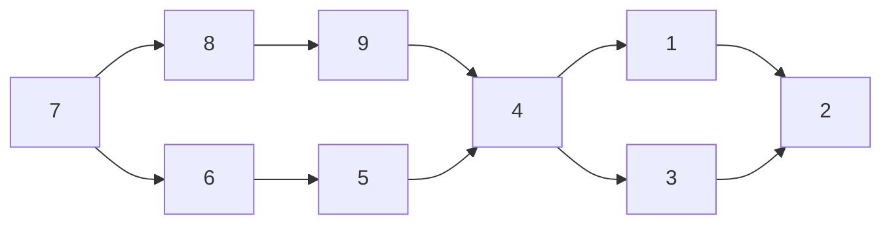

*based on [link][1]*
*created on: 2026-08-15 12:59:17*

## Markov Chains

A markov chain is an integer time process $X_n, n \ge 0$ for which the sample values for each $X_n$ lie in a countable set $S$ and depend on the past only through the most recent rv $X_{n-1}$. More specifically, for all $n \ge 1$ and all $i_0, i_1, \ldots, i_n \in S$ we have

$$\Pr(X_n = i_n | X_{n-1} = i_{n-1}, \ldots, X_0 = i_0) = \Pr(X_n = i_n | X_{n-1} = i_{n-1})$$

Furthermore $\Pr(X_n = j | X_{n-1} = i)$ is independent of $n$ and we denote it by $p_{ij}$, which is the transition probability from state $i$ to state $j$. 

### Some definitions

#### Accesibility

If there's a walk from state $i$ to state $j$, we say that $j$ is **accessible** from $i$ and denote it as $i \rightarrow j$.

Important note: $P_{ij}=0$ doesn't mean that $i$ is not accessible from $j$; potentially there's an $n$ such that $P_{ij}^{(n)} > 0$ and we can reach $j$ from $i$ in $n$ steps.

Accesibility is a transitive property, meaning if $i \rightarrow j$ and $j \rightarrow k$, then $i \rightarrow k$.

#### Communication

we will say that two states communicate if $i \rightarrow j$ and $j \rightarrow i$. We denote this as $i \leftrightarrow j$. 

#### Class
A class is a non-empty set of states such that every pair of **different states** $i \neq j$ in the class communicates, and they don't communicate with any state outside the class (they can be **accessible** from outside the class, but not **communicate**). 

Any state in the class can be used as "representative" of the class, since all states in the class communicate with each other.

For any finite markov chain, you can partition it into classes.

### Recurrent and transient states

A state $i$ is **recurrent** if $j \rightarrow i$ implies $i \rightarrow j$ for all $j \in S$. In other words, if I can access a state $j$ from $i$, then I can return to $i$ from $j$.
A **transient state** is a state that is not recurrent. This means that if I'm in a transient state there's a non-zero probability that I will leave to a state $j$ that doesn't have a way to return to $i$.

**Theorem**: For a **finite-state markov chain**, all states in a class are either **all recurrent** or **all transient**.

### Periodic States

Assuming that state $i$ is accessible from $i$. We can define the period of a state $d(i)$ as the greatest common divisor of $n$ for which $p_{ii}^{(n)} > 0$. A state is aperiodic if $d(i) = 1$ and periodic if $d(i) > 1$.

For example, consider the following markov chain:

For state 4, $P_{44}^{(n)} > 0$ for $n = 4, 6, 8, 10$, so $d(4) = 2$.
For state 7, $P_{77}^{(n)} > 0$ for $n = 6, 10, 12, 14$, so $d(7) = 2$.

In general for any state, if there's a walk that is connected to a loop (a state that is connected to itself), then the period is 1 hence $i$ is  **aperiodic**.

**Theorem**: All the states in a class have the same period.

If I have a class that is periodic, with period $d$ that means that I can sub-partition that class into $d$ sub-classes, where each sub-class only communicates with the next sub-class in a circular manner. (transient sets of states)

Think that I would always need at least $d$ steps to return to the same state, and given that all states in a class have the same period, I can assume that I can split the class into d

you can define this subclasses using a similar approach than to define classes, picking up one state $i$ and defining the sub-class $S_i$ as 

$$S_i = \{j \in S: P_{ij}^{(n)} > 0 \text{ for some } n \equiv 0 \ (\text{mod } d)\}$$

### Ergodic Markov Chains

An **ergodic class** is a class that is both recurrent and aperiodic. A Markov chain consisting entirely of one ergodic class is called an **ergodic chain**.

An interesting property about ergodic chains is that $P_{ij}^{n}$ becomes independent of the the starting state $i$ as $n \to \infty$, which means that we lose track of the starting distribution $P_{x_{0}}$.

In the limit $P_{ij}^{n}$ goes to a limit $\pi_j$ that is independent of the starting state $i$.

**Theorem**: For an ergodic M state Markov chain, $P_{ij}^{n} \ge 0$ for all i,j and all $n \ge (M-1)^2+1$

**Definition** A **unichain** is a finite state Markov chain that contains a single recurrent class plus perhaps some transient states. An **ergodic unichain** is a unichain for which the recurrent class is ergodic. 

### Steady-state and $[P^n]$ for large $n$

we will define a probability vector as $\vec{\pi} = (\pi_1, \dots, \pi_M)$ for which each $\pi_i$ is non-negative and $\sum_{i}{\pi_i} = 1$.

A probability vector $\vec{\pi}$ is a **steady-state vector**  if $\vec{\pi}  = \vec{\pi}[P]$.

$\pi$ might not be a unqique solution for the upper equation, and the fact that a solution exists doesn't guarantee that the limit $\lim_{n \to \infty} P_{ij}^{(n)}$ exists.

**Theorem**: If we have an ergodic Markov chain then for a transition matrix $[P]$, then for each state $j$ (column) $max_i P_{ij}^{(n)}$ is nonincreasing and $min_i P_{ij}^{(n)}$ is nondecreasing in $n$ and

$$\lim_{n \to \infty} \min_i P_{ij}^{(n)} = \lim_{n \to \infty} \max_i P_{ij}^{(n)} = \pi_j$$

nonincreasing means $P_{ij}^{(n+1)} \leq P_{ij}^{(n)}$ and nondecreasing $P_{ij}^{(n+1)} \geq P_{ij}^{(n)}$ respectively.

This means that, given that for a column $j$ all the elements will converge to the same value $\pi_j$, the min and max of the elements of that column will not decrease or not increase respectively, and they will converge to the same value $\pi_j$.

$\pi_j$ will give us, when $n \to \infty$, the fraction of time that the chain spends in state $j$.

We can extend the results of the previous theorem to the ergodic unichains, an ergodic unichain is similar to an ergodic chain but we add a finite number of transient states. It is easy to see that the transient states will eventually be left and the chain will converge to the ergodic class, hence the limit $\lim_{n \to \infty} P_{ij}^{(n)}$ exists and is independent of the starting state $i$.

In the case of unichains, the steady-state vector $\pi$  has positive entries for the recurrent states and zero entries for the transient states.

In the case of a markov chain that is formed by multiple ergodic classes (hence **not a ergodic chain**), the steady vector will have m-solutions where m is the number of ergodic classes, and each solution will have positive entries for the recurrent states in one of the ergodic classes and zero entries for all other states. Then it is true that $[P]$ will converge but the rows will not necessarily converge to the same values.

In the case of a recurrent chain with period $d$ we can split the chain into $d$ sub-classes. If we take $[P^d]$ then each one of the sub-classes will be ergodic and hence $[P^{dn}]$ will converge to a limit $\pi$.

## Markov Eigenvalues and Eigenvectors

For an ergodic markov chain we know that we have $\pi$ vector that holds 

$$\pi = \pi [P]$$

for ergodic unichains (ergodic class plus transient states) we have something slightly different. 

$$[P] = \begin{bmatrix} [P_{T}] & [P_{TR}] \\ 0 & [P_{R}] \end{bmatrix}$$

where $[P_{R}]$ is the transition matrix for the recurrent states and $[P_{T}]$ is the transition matrix for the transient states. The idea is that each transient state can go to a recurrent class will hold the same steady state vector as before. 

If you only have one ergodic class, then to calculate the steady state you can ignore all the rest of the chain and just calculate the steady state for the ergodic class, that $\pi_R$ will be your steady state vector. 

#### Linear Algebra recap

A vector $\vec{v}$ is an eigenvector of $[A]$ if there exists a scalar $\lambda$ such that $[A]\vec{v} = \lambda \vec{v}$. The scalar $\lambda$ is called the eigenvalue associated with the eigenvector $\vec{v}$.

for every stocastic matrix $[P]$ we have that $\lambda = 1$ is an eigenvalue with the eigenvector $\vec{v} = \vec{1} = (1, 1, \dots, 1)^T$.

A square matrix $[A]$ is singular if there is a vector $\vec{v} \neq 0$ such that $[A]\vec{v} = 0$. 

Therefore $\lambda$ is an eigenvalue of $[P]$ if and only if $[P - \lambda I]$ is singular for some eigenvector $\vec{v} \neq 0$. (which means there's a solution for $[P - \lambda I]\vec{v} = 0$ different than zero)

Let be $a_1, \dots, a_n$ the columns of $[A]$, then $[A]$ is singular if and only if the columns are linearly dependent. 

The square matrix $[A]$ is singular if and only if $\det([A]) = 0$.

**Summary**: 
$\lambda$ is an eigenvalue of $[P]$ if and only if:
1. $[P - \lambda I]$ is singular. 
1. $\det([P - \lambda I]) = 0$ 
1. exists a vector $\vec{v} \neq 0$ such that $[P]\vec{v} = \lambda \vec{v}$.
1. $\vec{u}[P] = \lambda \vec{u}$ for some vector $\vec{u} \neq 0$.

but we know that for a stocastic matrix $[P]$ we have that $\lambda = 1$ is an eigenvalue with the eigenvector $\vec{e} = \vec{1} = (1, 1, \dots, 1)^T$. This means that $[P - I]$ is singular. 

this means that there's a row vector $\pi \neq 0$ such that $\pi [P] = \pi$. (given by the implications of the point 3 above). This only guarantees that there is a solution $\pi$ not that is a probability vector.

The determinant of a square matrix $[A]$ of size M is given by:

$$\det([A]) = \sum_{\mu \in S_M} \text{sgn}(\mu) \prod_{i=1}^{M} A_{i, \mu(i)}$$

This equation will tell us that $\det([P-\lambda I])$ is a polynomial in $\lambda$ of degree $M$. This means there are at most $M$ roots of the equation $\det([P-\lambda I]) = 0$ and hence at most $M$ eigenvalues. 

some eigen values might be the same, and if $k$ of these roots are equal to $\lambda$ then we say that $\lambda$ has multiplicity $k$.

We can guarantee then that for all finite markov chains we will have one $\pi$ vector that is a probability vector. but that does't imply that the limit $\lim_{n \to \infty} P_{ij}^{(n)}$ exists. Because it can have multiple $pi$ vectors. 

[//]:2_mc.md> (References)
[1]: <https://www.youtube.com/watch?v=cE6OD7DkCSU>

[//]:2_mc.md> (Some snippets)
[//]: # (add an image )