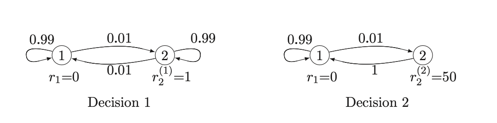

*based on [link][1]*
*created on: 2026-08-16 07:29:38*
## Markov Rewards and  Dynamic Programming 

Lets suppose we have a markov chain described by $X_n$ (a random variable that will indicate us the state). And a reward function $R(X_n) = r_{1}, \dots, r_{m}$ that will give us a reward for each state.

The expected reward  at time $n$ (not the cumulative but **the reward at $n$**) given that $X_0 = i$ is given by:

$$\mathbb{E}[R(X_n)|X_0 = i] = \sum_{j} r_j P_{ij}^n \tag{1}$$

The expected **aggregated reward** over the $n$ steps from $m$ to $m+n-1$ conditional on $X_m = i$ is given by

$$
\begin{aligned}
v_i(n) &= \mathbb{E}[\sum_{k=m}^{m+n-1} R(X_k)|X_m = i] \\
&= \mathbb{E}[R(X_m)|X_m = i] +  \dots + \mathbb{E}[R(X_{m+n-1})|X_m = i] \\
&= r_i + \sum_{j} P_{ij} r_j + \dots + \sum_j P_{ij}^{n-1} r_j
\end{aligned}
\tag{2}
$$

Which is the sum of the expected rewards at each step using (1).

If the markov chain is an ergodic unichain then the successive terms of $(2)$ tend to a steady state gain per step, 

$$g= \sum_j \pi_j r_j$$

Which is independent of the starting state. Thus $v_i(n)$ can be viewed as a transient in $i$ plus $n g$.

## Expected first-passage-time 

Suppose, for some arbitrary unichain we want to find the expected number of steps (first passage time) to reach a state $j=1$ let's assume that $ i \neq j$. 

To model that problem as a reward problem you can assign one unit of reward to each successive state until state 1 is entered. Then modify the markov chain by changing the transitions probabilities $P_{11} = 0$. we set $r_1 = 0$ and $r_i = 1$ for $i \neq 1$. 

This modified markov chain is an ergodic unichain with a single recurrent state. 1 is a trapping state.

The expected first passage of time, starting from the state $i$ is given by 
$$v_i = \lim_{n \to \infty} v_i(n)$$

however there's another way to compute the reward function $v_i$ without calculating the limit. We can use the fact that the reward in a state i is the reward in that state plus the expected reward in the next state.

$$v_i = 1 + \sum_{j} P_{ij} v_j \quad \text{for all } i \neq 1, \quad v_1=0$$

which can be expresed in vector form as:

$$\vec{v} = \vec{r} + P \vec{v} \quad \text{where } \vec{r} = (0, 1, \dots, 1), \quad v_1=0, \quad P_{11}=1$$

## Dynamic Programming

There's some situations where we would like to add, to the final state of a chain a large reward $u_j$

Consider a discrete-time situation with a finite set of states $1, \dots, M$ where at each time $l$, a decision maker can observe the state, say $X_l =j$ and choose one of a finite set of alternatives. Each alternative $k$ consists of a current reward $r_j^{(k)}$ and a set of transition probabilities $\{P_{jl}^{(k)}; 1\leq l \leq M \}$. for going to the next state. 

Let's pick an example Imagine you have two possible options when you are in the state 2. Each decision will lead to a new markov chain $[P^{(k)}]$

we will define a "policy" as the sequence of decisions $\{k_i\}$ if for each possible state $i$ I will have a decision $k_i$. 

The objective of dynamic programming is both to determine the optimal decision at each time and to determine the expected reward for each starting state for each number of $n$ steps. 

The algortihm works as follows. We start at an arbitrary time $m$ in a given state i, we make a decision $k$ at the time $m$ ( $k_m$ ).

This provides a reward $r_i^{(k)}$ at the time $m$. Then the selected transition probabilities $P_{ij}^{(k)}$ lead to a final expected reward $\sum_j u_j P_{ij}^{(k)}$. at time m+1

In particular, for a 1 state chain our optimal policy expected reward will be given by

$$ v^*_i(1) = \max_k \left\{ r_i^{(k)} + \sum_j P_{ij}^{(k)} u_j \right\} $$

where $u_j$ is the final reward of the state $j$. In general, for an $n$ state chain I can get the optimal expected reward will be given by

$$ v^*_i(n) = \max_k \left\{ r_i^{(k)} + \sum_j P_{ij}^{(k)} v^*_j(n-1) \right\} $$

which can be solved recursively starting from the final state and working backwards.

[//]:3_mc_rewards_dp.md> (References)
[1]: <https://google.com>

[//]:3_mc_rewards_dp.md> (Some snippets)
[//]: # (add an image )