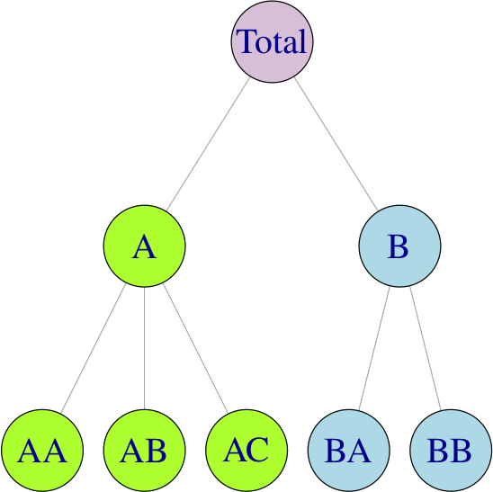

*based on [Chapter 11 Forecasting hierarchical and grouped time series][1]*
*created on: 2024-11-25 18:29:37*

# 11 Hierarchical and grouped time series

Time series can often be naturally disaggregated by various attributes of interest. For example, the total number of bicycles sold by a cycling manufacturer can be disaggregated by product type such as road bikes, mountain bikes and hybrids. Each of these can be disaggregated into finer categories. For example hybrid bikes can be divided into city, commuting, comfort, and trekking bikes; and so on. These categories are nested within the larger group categories, and so the collection of time series follows a hierarchical aggregation structure. Therefore we refer to these as “hierarchical time series”.

Hierarchical time series often arise due to geographic divisions. For example, the total bicycle sales can be disaggregated by country, then within each country by state, within each state by region, and so on down to the outlet level.

## 11.1  Hierarchical and grouped time series

Figure 11.1 shows a simple hierarchical structure. At the top of the hierarchy is the “Total”, the most aggregate level of the data. The  t th observation of the Total series is denoted by $y_t$  for  $t=1,…,T$ . The Total is disaggregated into two series, which in turn are divided into three and two series respectively at the bottom level of the hierarchy. Below the top level, we use  $y_{j,t}$  to denote the  t th observation of the series corresponding to node  j . For example, $y_{A,t}$ denotes the  t th observation of the series corresponding to node A, $y_{AB,t}$  denotes the  t th observation of the series corresponding to node AB, and so on.

For any time t, the observations at the bottom level of the hierarchy will sum to the observations of the series above. For example,

$$
\begin{equation}
  y_{t}=y_{AA,t}+y_{AB,t}+y_{AC,t}+y_{BA,t}+y_{BB,t},
  \tag{11.1}
\end{equation}
$$
$$
\begin{equation}
  y_{t}=y_{AA,t}+y_{AB,t}+y_{AC,t}+y_{BA,t}+y_{BB,t},
  \tag{11.1}
\end{equation}
$$

## 11.2 Single level approaches

### The bottom-up approach
A simple method for generating coherent forecasts is the “bottom-up” approach. This approach involves first generating forecasts for each series at the bottom level, and then summing these to produce forecasts for all the series in the structure.

1. we first generate forecasts for each of the series at the bottom level of the hierarchy.

1. we forecast the upper levels aggregating the forecasts of the lower levels.

### Top-down approaches
Top-down approaches involve first generating forecasts for the Total series $y_t$, and then disaggregating these down the hierarchy.

Let $p_1,…,p_m$ denote a set of disaggregation proportions which determine how the forecasts of the Total series are to be distributed to obtain forecasts for each series at the bottom level of the structure. For example, for the hierarchy of Figure 11.1, using proportions $p_1,…,p_5$  we get

$$
\bar{y}_{AA,t}=p_1\hat{y}_t,~~~\bar{y}_{AB,t}=p_2\hat{y}_t,~~~\bar{y}_{AC,t}=p_3\hat{y}_t,~~~\bar{y}_{BA,t}=p_4\hat{y}_t~~~\text{and}~~~~~~\bar{y}_{BB,t}=p_5\hat{y}_t.
$$
There are several possible top-down methods that can be specified.
#### Average historical proportions

$$p_j=\frac{1}{T}\sum_{t=1}^{T}\frac{y_{j,t}}{{y_t}}
$$

#### Proportions of the historical averages
$$
p_j={\sum_{t=1}^{T}\frac{y_{j,t}}{T}}\Big/{\sum_{t=1}^{T}\frac{y_t}{T}}
$$
#### Forecast of proportions 
Because historical proportions used for disaggregation do not take account of how those proportions may change over time, top-down approaches based on historical proportions tend to produce less accurate forecasts at lower levels of the hierarchy than bottom-up approaches. To address this issue, proportions based on forecasts rather than historical data can be used (G. Athanasopoulos et al., 2009).

[//]: <> (References)
[1]: <https://otexts.com/fpp3/hierarchical.html>

[//]: <> (Some snippets)
[//]: # (add an image )