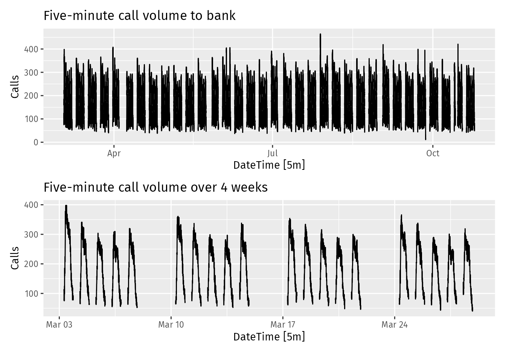
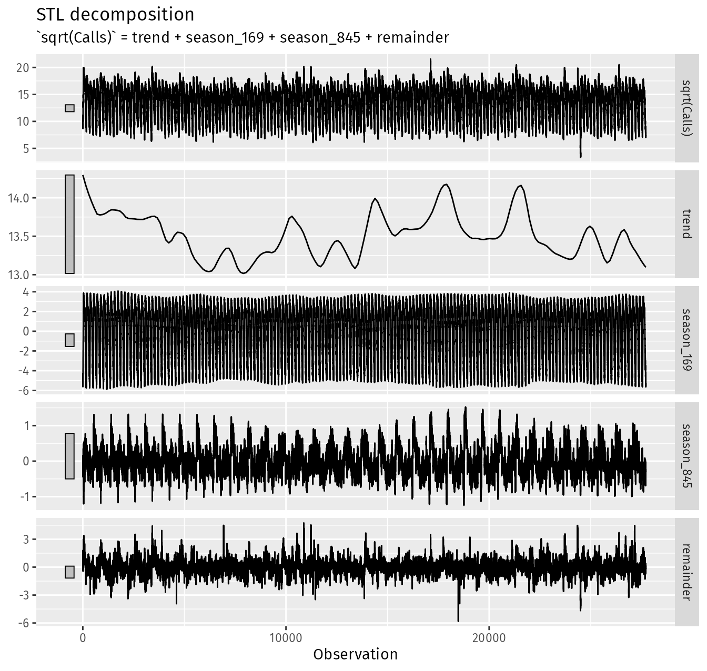

*based on [link][1]*
*created on: 2024-11-25 18:52:45*
## 12_advanced_forecasting_methods


### 12.1 Complex seasonality 

However, higher frequency time series often exhibit more complicated seasonal patterns. For example, daily data may have a weekly pattern as well as an annual pattern. Hourly data usually has three types of seasonality: a daily pattern, a weekly pattern, and an annual pattern. Even weekly data can be challenging to forecast as there are not a whole number of weeks in a year, so the annual pattern has a seasonal period of  $365.25/7≈52.179$  on average. Most of the methods we have considered so far are unable to deal with these seasonal complexities.

Figure 12.1 shows the number of calls to a North American commercial bank per 5-minute interval between 7:00am and 9:05pm each weekday over a 33 week period. The lower panel shows the first four weeks of the same time series. There is a strong daily seasonal pattern with period 169 (there are 169 5-minute intervals per day), and a weak weekly seasonal pattern with period  169×5=845 . (Call volumes on Mondays tend to be higher than the rest of the week.) If a longer series of data were available, we may also have observed an annual seasonal pattern.



The STL() function is designed to deal with multiple seasonality. It will return multiple seasonal components, as well as a trend and remainder component. In this case, we need to re-index the tsibble to avoid the missing values, and then explicitly give the seasonal periods.

```r
calls <- bank_calls |>
  mutate(t = row_number()) |>
  update_tsibble(index = t, regular = TRUE)

calls |>
  model(
    STL(sqrt(Calls) ~ season(period = 169) +
                      season(period = 5*169),
        robust = TRUE)
  ) |>
  components() |>
  autoplot() + labs(x = "Observation")
```


There are two seasonal patterns shown, one for the time of day (the third panel), and one for the time of week (the fourth panel). To properly interpret this graph, it is important to notice the vertical scales. In this case, the trend and the weekly seasonality have wider bars (and therefore relatively narrower ranges) compared to the other components, because there is little trend seen in the data, and the weekly seasonality is weak.

#### Dynamic harmonic regression with multiple seasonal periods

With multiple seasonalities, we can use Fourier terms as we did in earlier chapters (see Sections 7.4 and 10.5). Because there are multiple seasonalities, we need to add Fourier terms for each seasonal period. In this case, the seasonal periods are 169 and 845, so the Fourier terms are of the form

$$
\sin\left(\frac{2\pi kt}{169}\right), \quad
  \cos\left(\frac{2\pi kt}{169}\right), \quad
  \sin\left(\frac{2\pi kt}{845}\right), \quad  \text{and} \quad
  \cos\left(\frac{2\pi kt}{845}\right),

$$

We will fit a dynamic harmonic regression model with an ARIMA error structure. 

The total number of Fourier terms for each seasonal period could be selected to minimise the AICc. However, for high seasonal periods, this tends to over-estimate the number of terms required, so we will use a more subjective choice with 10 terms for the daily seasonality and 5 for the weekly seasonality. Again, we will use a square root transformation to ensure the forecasts and prediction intervals remain positive. We set  $D=d=0$ in order to handle the non-stationarity through the regression terms, and $P=Q=0$ in order to handle the seasonality through the regression terms.

```R
fit <- calls |>
  model(
    dhr = ARIMA(sqrt(Calls) ~ PDQ(0, 0, 0) + pdq(d = 0) +
                  fourier(period = 169, K = 10) +
                  fourier(period = 5*169, K = 5)))

fc <- fit |> forecast(h = 5 * 169)

# Add correct time stamps to fable
fc_with_times <- bank_calls |>
  new_data(n = 7 * 24 * 60 / 5) |>
  mutate(time = format(DateTime, format = "%H:%M:%S")) |>
  filter(
    time %in% format(bank_calls$DateTime, format = "%H:%M:%S"),
    wday(DateTime, week_start = 1) <= 5
  ) |>
  mutate(t = row_number() + max(calls$t)) |>
  left_join(fc, by = "t") |>
  as_fable(response = "Calls", distribution = Calls)
```

[//]: <> (References)
[1]: <https://google.com>

[//]: <> (Some snippets)
[//]: # (add an image )