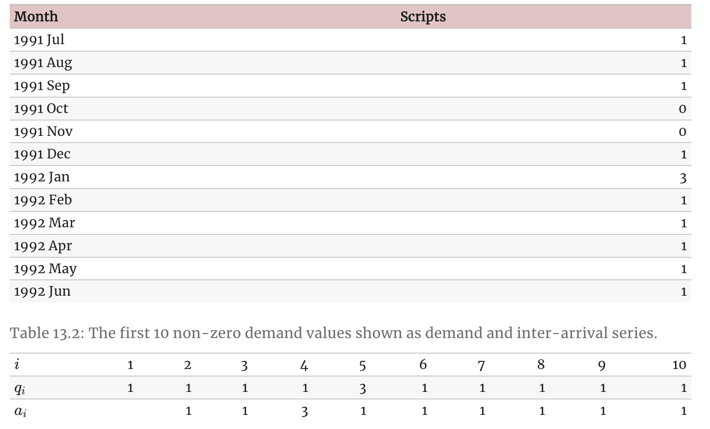

*based on [link][1]*
*created on: 2024-11-25 18:34:52*
## 13_forecasting_issues

### 13.1 Weekly, daily and sub-daily data
#### Weekly data
Weekly data is difficult to work with because the seasonal period (the number of weeks in a year) is both large and non-integer. The average number of weeks in a year is 52.18. Most of the methods we have considered require the seasonal period to be an integer. Even if we approximate it by 52, most of the methods will not handle such a large seasonal period efficiently.

The simplest approach is to use an STL decomposition along with a non-seasonal method applied to the seasonally adjusted data (as discussed in Chapter 3). 

#### Daily and sub-daily data
Daily and sub-daily (such as hourly) data are challenging for a different reason — they often involve multiple seasonal patterns, and so we need to use a method that handles such complex seasonality.

Of course, if the time series is relatively short so that only one type of seasonality is present, then it will be possible to use one of the single-seasonal methods we have discussed in previous chapters (e.g., ETS or a seasonal ARIMA model). But when the time series is long enough so that some of the longer seasonal periods become apparent, it will be necessary to use STL, dynamic harmonic regression or Prophet, as discussed in Section 12.1.

However, these methods only allow for regular seasonality. Capturing seasonality associated with moving events such as Easter, Eid, or the Chinese New Year is more difficult. Even with monthly data, this can be tricky as the festivals can fall in either March or April (for Easter), in January or February (for the Chinese New Year), or at any time of the year (for Eid).

The best way to deal with moving holiday effects is to include dummy variables in the model. This can be done within the ARIMA() or prophet() functions, for example, but not within ETS(). In fact, prophet() has a holiday() special to easily incorporate holiday effects.

### 13.2 Forecasting with discrete data

All of the methods discussed in this book assume that the data have a continuous sample space. But often data comes in the form of counts. For example, we may wish to forecast the number of customers who enter a store each day. We could have  0,1,2,… , customers, but we cannot have 3.45693 customers.

In practice, this rarely matters provided our counts are sufficiently large. If the minimum number of customers is at least 100, then the difference between a continuous sample space  [100,∞)  and the discrete sample space  {100,101,102,…}  has no perceivable effect on our forecasts. However, if our data contains small counts  (0,1,2,…) , then we need to use forecasting methods that are more appropriate for a sample space of non-negative integers.

Such models are beyond the scope of this book. However, there is one simple method which gets used in this context, that we would like to mention. It is “Croston’s method”, named after its British inventor, John Croston, and first described in Croston (1972). Actually, this method does not properly deal with the count nature of the data either, but it is used so often, that it is worth knowing about it.

With Croston’s method, we construct two new series from our original time series by noting which time periods contain zero values, and which periods contain non-zero values. Let  $q_i$  be the  $i$ th non-zero quantity, and let $a_i$  be the time between $q_{i−1}$  and $q_i$. Croston’s method involves separate simple exponential smoothing forecasts on the two new series $a$  and $q$ . Because the method is usually applied to time series of demand for items, $q$  is often called the “demand” and $a$  the “inter-arrival time”.

$$
\begin{align}
  \hat{q}_{i+1|i} & = (1-\alpha_q)\hat{q}_{i|i-1} + \alpha_q q_i, \tag{13.1}\\
  \hat{a}_{i+1|i} & = (1-\alpha_a)\hat{a}_{i|i-1} + \alpha_a a_i. \tag{13.2}
\end{align}

$$
The smoothing parameters $\alpha_a$  and $\alpha_q$  take values between 0 and 1. Let $j$  be the time for the last observed positive observation. Then the $h$ -step ahead forecast for the demand at time $T+h$ , is given by the ratio:

$$\hat{y}_{T+h|T} = \hat{q}_{j+1|j}/\hat{a}_{j+1|j}.
$$

In this example, the smoothing parameters are estimated to be $\alpha_a=0.08$ ,  $\alpha_q=0.71$ ,  $\hat{q}_{1|0}=4.17$ , and  $\hat{a}_{1|0}=3.52$. The final forecasts for the two series are  $\hat{q}_{T+1|T}=2.419$  and $\hat{a}_{T+1|T}=2.484$ . So the forecasts are all equal to $\hat{y}_{T+h|T}=2.419/2.484=0.974$.

Another alternative is to use GLM Posisson regression or zero-inflated poisson regression, or a bayesian model with a defined prior for the count data.

[//]: <> (References)
[1]: <https://google.com>

[//]: <> (Some snippets)
[//]: # (add an image )