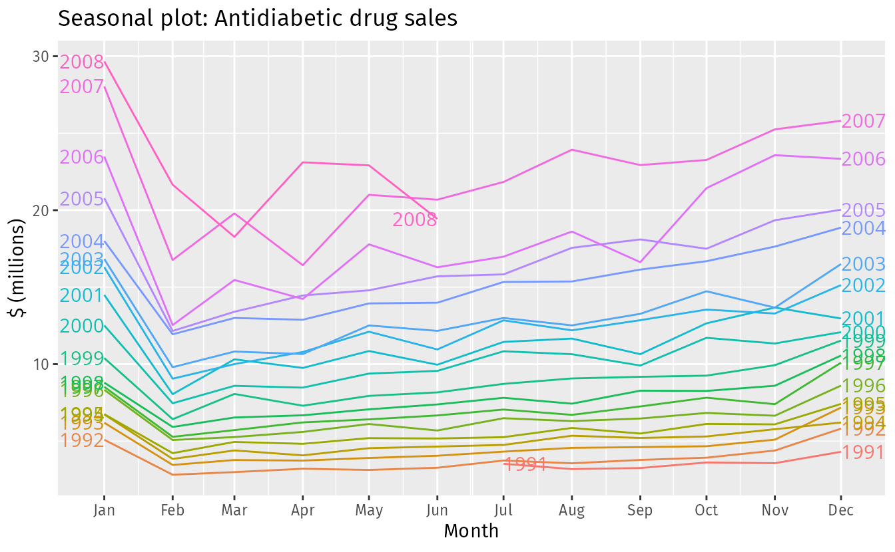
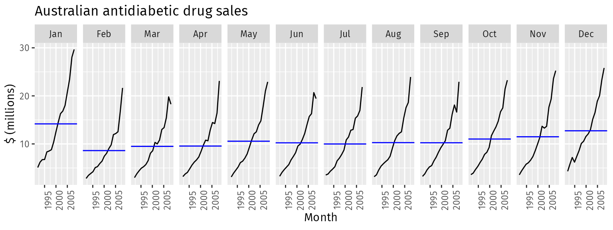
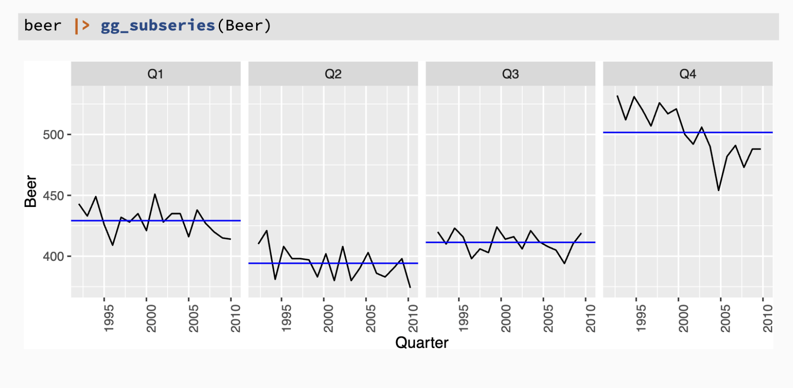
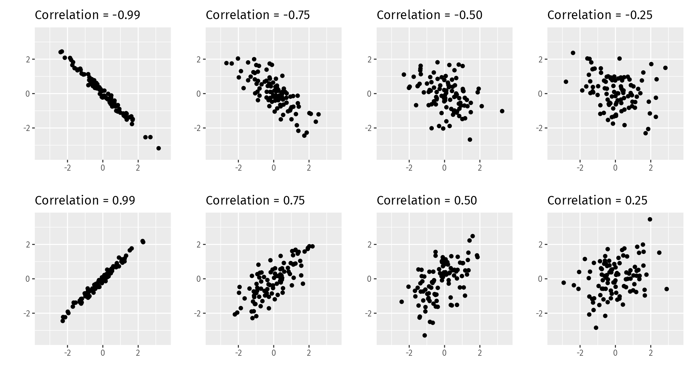
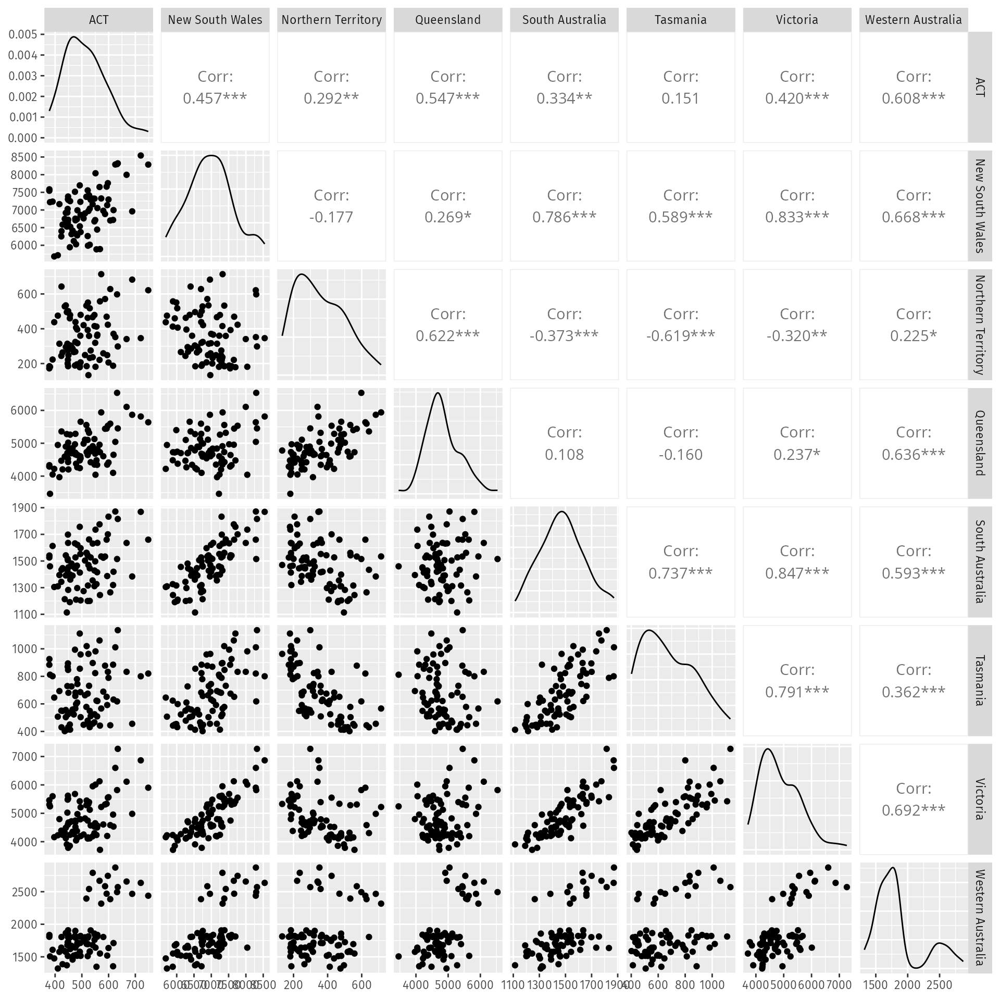
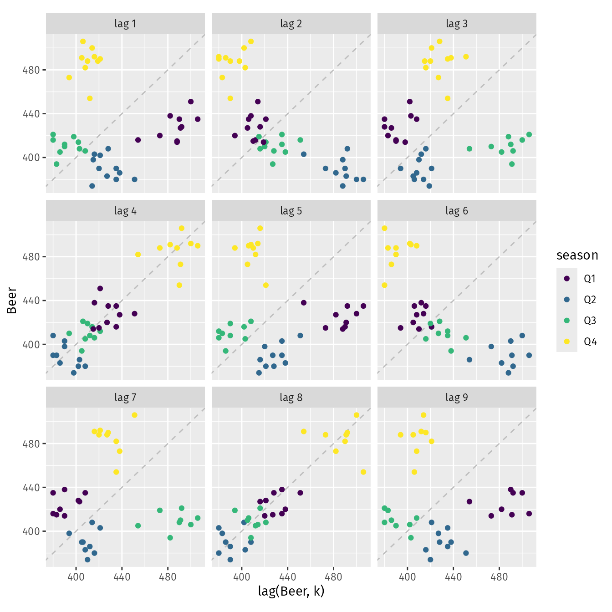
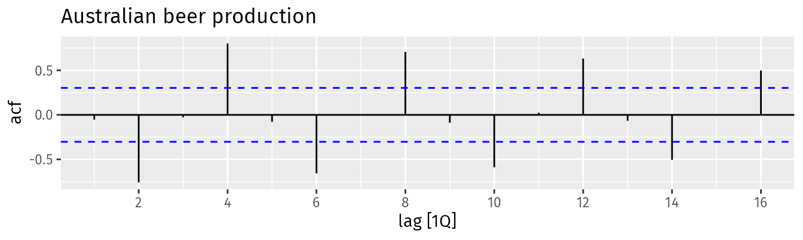
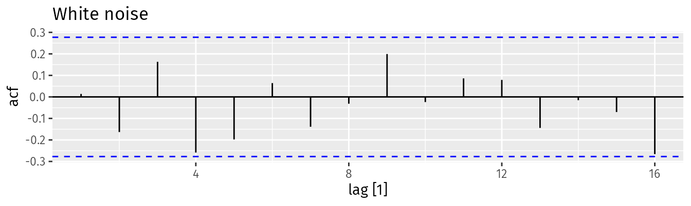

*based on [Forecast Principles and Practices][1]*

*created on: 2024-11-22 20:30:36*

## 1. forecast, goals, planning 

- **Forecasting**: predicting future based on historical data and known future events
- **Goals**: desired outcomes that should align with forecasts and plans
- **Planning**: actions needed to align forecasts with goals

## What to forecast ?
1. level of agregation? : product, fineline, store, department, etc.
1. level of time aggregation? : daily, weekly, monthly, etc.
1. horizon? : 1 week, 1 month, 1 year, etc.
1. how frequent should we update it? : daily, weekly, monthly, etc.

## Forecasting data and methods


**Explanatory Model**

Predictor variables are often useful in time series forecasting. For example, suppose we wish to forecast the hourly electricity demand (ED) of a hot region during the summer period. A model with predictor variables might be of the form
$$
\begin{align*}
  \text{ED} = & f(\text{current temperature, strength of economy, population,}\\
&  \qquad\text{time of day, day of week, error}).
\end{align*}
$$
We call this an explanatory model because it helps explain what causes the variation in electricity demand.

**Time Series Model**

This type of models focused on how the past values of a time series can be used to predict its future values. For example, a time series model for the hourly electricity demand might be of the form:
$$
\text{ED}_{t+1} = f(\text{ED}_{t}, \text{ED}_{t-1}, \text{ED}_{t-2}, \text{ED}_{t-3},\dots, \text{error}),
$$

**Mixed Model**

Its a combination, of previous two models. it mixes the explanatory variables with the time series data. For example, a mixed model for the hourly electricity demand might be of the form:

$$\text{ED}_{t+1} = f(\text{ED}_{t}, \text{current temperature, time of day, day of week, error}).
$$

### Definitions 

1. $Y_i$ : Radom variable to forecast 
1. $\mathcal{I}$ :  we denote all the information we have observed. we can denote $y_i|\mathcal{I}$ as the conditional distribution of $Y_i$ given that I know $\mathcal{I}$.
1. $y_i|\mathcal{I}$ : will be known as the "forecast distribution" of $Y_i$ given that I know $\mathcal{I}$.
1. $\hat{y_i} = E(y_i|\mathcal{I})$  is the "point forecast" or the the mean of the distribution of $y_i|\mathcal{I}$.
4. $\text{var}(y_i|\mathcal{I})$ is the "forecast variance".
5. $\hat{y}_{T+h|T} = E(Y_{T+h}|Y_1,...,Y_t)$: an h-step ahead forecast of $Y_{T+h}$ based on the information available at time T.

## 2. Time Series Patterns 

**Trend**

A trend exists when there is a long-term increase or decrease in the data. It does not have to be linear. Sometimes we will refer to a trend as “changing direction”, when it might go from an increasing trend to a decreasing trend. 

**Seasonal**

A seasonal pattern occurs when a time series is affected by seasonal factors such as the time of the year or the day of the week. Seasonality is always of a fixed and **known period**.

**Cyclic**

A cycle occurs when the data exhibit rises and falls that are not of a fixed frequency. These fluctuations are usually due to economic conditions, and are often related to the “business cycle”. The duration of these fluctuations is usually at least 2 years.

**Seasonal Plots**

a plot that represents the same TS spitted on the same seasonal period. (e.g. monthly, weekly, etc.) 

```R
a10 |>
  gg_season(Cost, labels = "both") +
  labs(y = "$ (millions)",
       title = "Seasonal plot: Antidiabetic drug sales")
```




note that in this plot the years are going up, which means that probably there's a positive trend over the years 


An alternative plot that emphasises the seasonal patterns is where the data for each season are collected together in separate mini time plots. This is called a **subseasonal plot**.

```R
a10 |>
  gg_subseries(Cost) +
  labs(
    y = "$ (millions)",
    title = "Australian antidiabetic drug sales"
  )
```



the blue line on the plot represents the mean value for the period, while the black line shows all the years accumulated, as you can see each year has an incerasing trend compared to the previous year. and this repeats for all months. 

Another conclusion that you can draw from this plot is that jan and dec have higer values on average than the other months. 



On the upper example another thing that we can see is that the Q4 trend is the one that is driving the most change on the yearly trend. (downward trend). while the rest of the weeks are seems to be more stable.

### Scatterplots 

It is common to compute correlation coefficients to measure the strength of the linear relationship between two variables. The correlation between variables $x$ and $y$ is given by:

$$
r = \frac{\sum (x_{t} - \bar{x})(y_{t}-\bar{y})}{\sqrt{\sum(x_{t}-\bar{x})^2}\sqrt{\sum(y_{t}-\bar{y})^2}}.
$$



Another alternative is the pairplot

```R
visitors |>
  pivot_wider(values_from=Trips, names_from=State) |>
  GGally::ggpairs(columns = 2:9)
```



### Lag Plots 

A lag plot is a scatter plot of a time series against a lag of itself. If the points cluster around a diagonal line from the bottom-left to the top-right of the plot, it suggests a positive autocorrelation. 

Each plot has $y_t$ against $y_{t-k}$ for different values of $k$; $y_{t-1}$, $y_{t-2}$, $y_{t-3}$, etc. 

```R
recent_production <- aus_production |>
  filter(year(Quarter) >= 2000)
recent_production |>
  gg_lag(Beer, geom = "point") +
  labs(x = "lag(Beer, k)")
```
the result for the beer dataset is the following: 



on the upper plot we con observe that there's a positive correlation on the plots o lag 4 and 8, given that this is quarterly data there's a strong year seasonality therefore, one quarter is directly related to the same quarter of the previous year (4 lags apart). Lag 2 and Lag 6 are strongly negative correlated, given that Q4 is the peak, and Q2 tends to be the lowest.

### Autocorrelation

we will define $r_k$ as the correlation between $y_t$ and $y_{t-k}$. So $r_1$ will be $\text{corr}(y_t, y_{t-1})$ and $r_2$ will be $\text{corr}(y_t, y_{t-2})$. hence the name "autocorrelation" ($y$ against $y_{lag}$). the autocorrelation $r_k$ function is defined as:

$$
r_{k} = \frac{\sum\limits_{t=k+1}^T (y_{t}-\bar{y})(y_{t-k}-\bar{y})}
{\sum\limits_{t=1}^T (y_{t}-\bar{y})^2},
$$

where $T$ is the length of the time series. The autocorrelation coefficients make up the autocorrelation function or ACF.

an alternative formulation is to use the "autocovariance" function, which is defined as:

$$
c_{k} = \frac{1}{T}*{\sum\limits_{t=k+1}^T (y_{t}-\bar{y})(y_{t-k}-\bar{y})}.
$$
then the autocorrelation function is defined as:
$$r_{k}=c_k/c_0$$

for example if we plot the ACF function for the beer dataset we will get the following plot, **known as the "correlogram"**:

```R
recent_production |>
  ACF(Beer) |>
  autoplot() + labs(title="Australian beer production")
```



where we can clearly see that there's a strong correlation with the lag 4. and there are negative correlations on the lags 2 and 6. This is a good indicator that the data has a strong seasonality of 4 lags.

#### Autocorrelogram insights 

1. When **data have a trend**, the autocorrelations for **small lags tend to be large and positive** because observations nearby in time are also nearby in value. So the ACF of a trended time series tends to have positive values that slowly decrease as the lags increase.

1. When **data are seasonal**, the autocorrelations will be **larger for the seasonal lags** (at multiples of the seasonal period) than for other lags.

1. When data are both trended and seasonal, you see a combination of these effects

**White Noise**

For white noise series, we expect each autocorrelation to be close to zero. Of course, they will not be exactly equal to zero as there is some random variation. For a white noise series, we expect 95% of the spikes in the ACF to lie within  $±1.96/√T$ where  $T$ is the length of the time series. It is common to plot these bounds on a graph of the ACF (the blue dashed lines above). If one or more large spikes are outside these bounds, or if substantially more than 5% of spikes are outside these bounds, then the series is probably not white noise.

In this example, $T=50$ so the bounds are at $±1.96/√50=±0.28$. All of the autocorrelation coefficients lie within these limits, confirming that the data are white noise.




[//]: <> (References)
[1]: <https://otexts.com/fpp3/wn.html>

[//]: <> (Some snippets)
[//]: # (add an image )