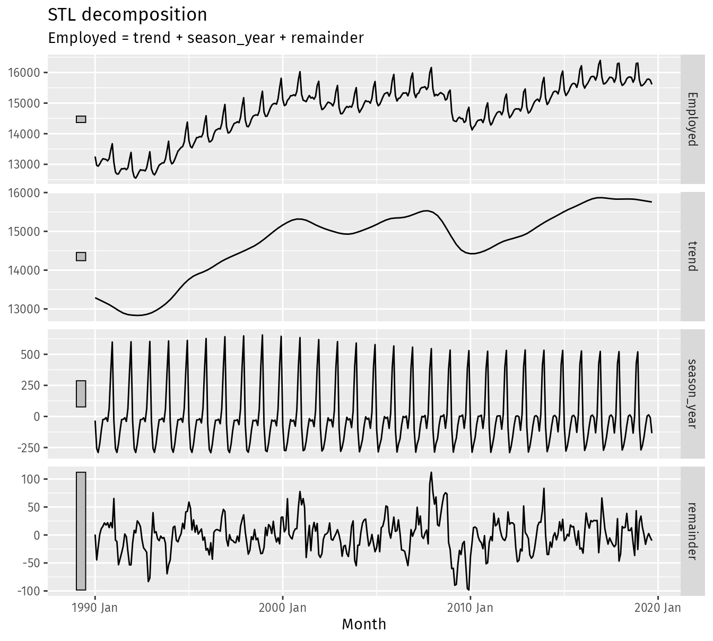
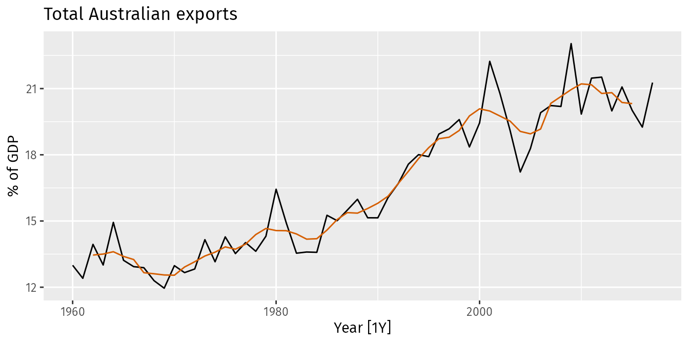
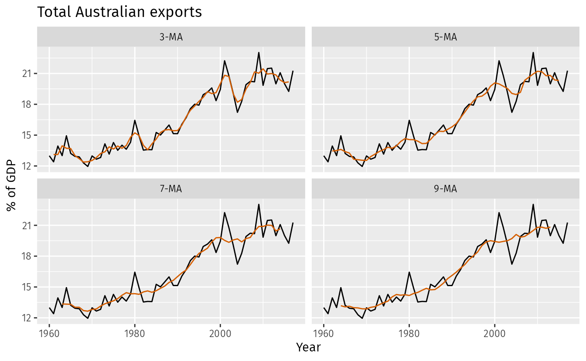

*based on  [Forecast Principles and Practices][1]*
*created on: 2024-11-23 12:30:31*
## 3.1. Time Series Transformations 

we will first present some useful transformations that can help clean up the data and make it more suitable for forecasting.

1. **Population Transformations**

    Data affected by population changes should be normalized to per-capita values (per person, per thousand, or per million) to remove population growth effects and make data comparable over time.
    
    Example: Hospital beds analysis the total beds might increase while per-capita beds decrease

1. **Calendar Adjustments**
    
    Data affected by calendar events should be adjusted to remove these effects (for example working days in a month); Holidays, weekends, and special events can distort data. Adjustments can be made by:

    - Adjusting for the number of workdays in a month
    - Adjusting for the number of days in a month
    - etc
1. **Inflation Adjustments**

    Data affected by inflation should be adjusted to remove these effects. Inflation can distort data
    
    To make these adjustments, a price index is used. If  $z_t$ denotes the price index and  $y_t$ denotes the original house price in year $t$, then $x_t =y_t/z_t*z_{2000}$ gives the adjusted house price at year 2000 dollar values. Price indexes are often constructed by government agencies. For consumer goods, a common price index is the Consumer Price Index (or CPI).

1. **Mathematical Transformations**
    
    Logarithms are useful because they are interpretable: changes in a log value are relative (or percentage) changes on the original scale. 
    $$w_t = \log(y_t)$$
    
    power transformations correspond to square roots, cubes, and other powers. 
    $$w_t = y_t^{p}$$

    A useful family of transformations, that includes both logarithms and power transformations, is the family of Box-Cox transformations. The Box-Cox transformation is defined as:
    $$
    \begin{equation}
      w_t  =
        \begin{cases}
          \log(y_t) & \text{if $\lambda=0$};  \\
          (\text{sign}(y_t)|y_t|^\lambda-1)/\lambda & \text{otherwise}.
        \end{cases}
    \end{equation}
    $$

    A good value of $\lambda$ **is one which makes the size of the seasonal variation about the same across the whole series**, as that makes the forecasting model simpler.

    $\lambda=1$: no substantive transformation

    $\lambda=\frac{1}{2}$: square root

    $\lambda=0$: natural logarithm

    $\lambda=-1$: inverse +1

    The guerrero feature (Guerrero, 1993) can be used to choose a value of lambda for you. 

    1. Often no transformation needed.
    1. Simple transformations are easier to explain and work well enough
    1. Transformations can have very large effect on PI.
    1. If some data are zero or negative, then use $\lambda$ > 0. log1p () can also be useful for data with zeros.
    1. Choosing logs is a simple way to force forecasts to be positive

## 3.2 Time series components

In general we can decompose a time series into three components 
$$ y_t = f(S_t, T_t, R_t)
$$
where: 
1. $y_t$ is the data, 
2. $S_t$ is the seasonal component
3. $T_t$ is the trend-cycle component
4. $R_t$ is the remainder component

Additive decomposition:

$$y_{t} = S_{t} + T_{t} + R_t
$$

Multiplicative decomposition: 

$$y_{t} = S_{t} \times T_{t} \times R_t.
$$
1. Additive model appropriate if magnitude of seasonal fluctuations does not vary with level.
1. If seasonal are proportional to level of series, then multiplicative model appropriate.
1. Multiplicative decomposition more prevalent with economic series
1. Alternative: use a Box-Cox transformation, and then use additive decomposition.
1. Logs turn multiplicative relationship into an additive relationship:
    $$\log(y_{t}) = \log(S_{t}) + \log(T_{t}) + \log(R_t)$$

To get the additive decomposition on STR components we can use the STL function decomposition 

```R
dcmp <- us_retail_employment |>
  model(stl = STL(Employed))
components(dcmp)
```
The first row shows $Y_t$ the second is the trend $T_t$, the third is the seasonal $S_t$ and the last is the remainder $R_t$.



The gray bar on the left of each time series is a comparison of magnitude between the 4 components. All the gray bars have the same height on $y_t$ units, this allows us to understand how relevant each component is on the time series.

### Seasonally adjusted data

The seasonally adjusted data is the data with the seasonal component removed. This is useful for understanding the underlying trend in the data. 

**additive model**:
de-seasonalized data
$$y_t - S_t = T_t + R_t$$ 


**multiplicative model** de-seasonalized data
$$y_t / S_t = T_t \times R_t$$ 

## 3.3 Moving averages (MA)

Moving averages are a good way to estimate our trend-cycle component $T_t$. We will define a moving average (MA) of order $m$ (m-MA) as:
$$
\begin{equation}
  \hat{T}_{t} = \frac{1}{m} \sum_{j=-k}^k y_{t+j}, \tag{3.2}
\end{equation}
$$

where $k = (m-1)/2$.

For example, using a 5-MA on the australian exports dataset we get the following plot:




In general, higher values of $m$ will give a smoother trend-cycle estimate, but will be less responsive to changes in the series. 

Simple moving averages such as these are usually of an odd order (e.g., 3, 5, 7, etc.). This is so they are symmetric: in a moving average of order $m=2k+1$, the middle observation, and $k$ observations on either side, are averaged



Is it possible to use pair numbers moving average (such as 2MA or 4MA) but instead of choosing one period to be forward or backward deviated, we calculate both (forward and backward) and average them.  this is known as $2 \times m$ MA). for example, here is the formula for 2x4MA:

$$
\begin{align*}
  \hat{T}_{t} &= \frac{1}{2}\Big[
    \frac{1}{4} (y_{t-2}+y_{t-1}+y_{t}+y_{t+1}) +
    \frac{1}{4} (y_{t-1}+y_{t}+y_{t+1}+y_{t+2})\Big] \\
             &= \frac{1}{8}y_{t-2}+\frac14y_{t-1} +
             \frac14y_{t}+\frac14y_{t+1}+\frac18y_{t+2}.
\end{align*}
$$


## 3.4 Classical Decomposition

the classical decomposition method is a way to get the 3 components of the additive or multiplicative decomposition. 

$$ y_t = f(S_t, T_t, R_t)$$

We already have a way to get the trend $T_t$ component using the moving average method (mMA if m is even and 2xmMA if m is odd). so to get the seasonal component ($S_t$) we first "de-trend" the data by subtracting the trend component from the original data. Depending if we are fitting an additive model or a multiplicative model we will divide or subtract the trend component from the original data.

additive model:
$$ y_t - T_t = S_t + R_t$$
multiplicative model:
$$ \frac{y_t}{T_t} = S_t \times R_t$$


To estimate the seasonal component for each season, simply average the detrended values for that season. For example, with monthly data, the seasonal component for March is the average of all the detrended March values in the data. 

These seasonal component values are then adjusted to ensure that they add to zero (in the additive decomposition) or multiply to m (in the multiplicative decomposition).

$$s^{(1)} + ...+ s^{(k)} =0 $$

$$s^{(1)} + ... + s^{(k)} =m $$

The seasonal component is obtained by stringing together these monthly values, and then replicating the sequence for each year of data. This gives  $\hat{S}_t$ the estimated seasonal component.

Finally the remainder component is the difference between the original data and the sum of the trend and seasonal components.

additive model:
$$\hat{R}_t = y_t - \hat{S}_t - \hat{T}_t$$
multiplicative model:
$$\hat{R}_{t} = y_t /( \hat{T}_t \hat{S}_t)$$

## 3.6  STL decomposition

STL is a versatile and robust method for decomposing time series. STL is an acronym for “Seasonal and Trend decomposition using Loess”. STL has several advantages over classical decomposition, and the SEATS and X-11 methods:

1. Unlike SEATS and X-11, STL will handle any type of seasonality, not only monthly and quarterly data.
1. The seasonal component is allowed to change over time, and the rate of change can be controlled by the user.
1. The smoothness of the trend-cycle can also be controlled by the user.
1. It can be robust to outliers (i.e., the user can specify a robust decomposition), so that occasional unusual observations will not affect the estimates of the trend-cycle and seasonal components. They will, however, affect the remainder component.

Is only an addivite decomposition model, for a multiplicative it uses log transformation. also It uses Box-Cox transformation under the hood to get the decompositions.

STL has three main parameters:
1. `trend (window = ?)` controls wiggliness of trend component, the larger the window the smoother the trend.
1. `season (window = ?)` controls variation on seasonal component. the larger the window the regular the seasonal component. (less room to change the season trend overtime)
1. `season (window = 'periodic')` is equivalent to an infinite window.


[//]:2_decomposition.md> (References)
[1]: <https://otexts.com/fpp3/transformations.html>

[//]:2_decomposition.md> (Some snippets)
[//]: # (add an image )