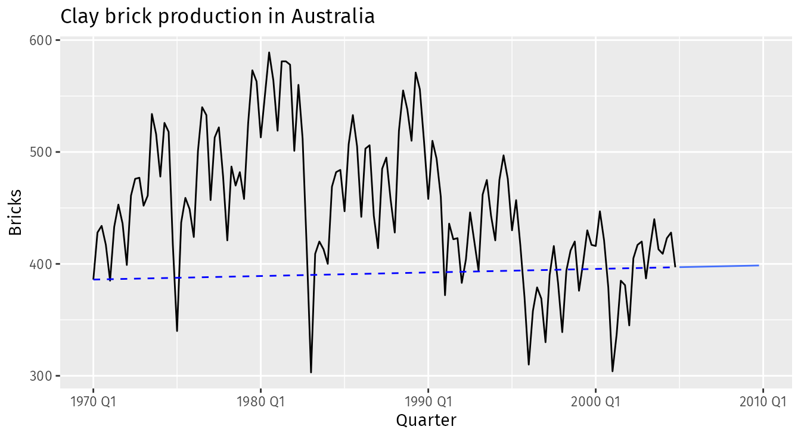
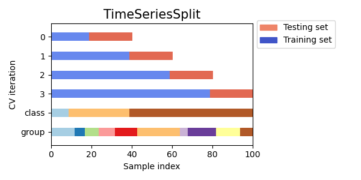

*based on  [Forecast Principles and Practices][1]*
*created on: 2024-11-23 18:50:34*
## 5.1 The Tidy Process 
The process of producing forecasts can be split up into a few fundamental steps.
1. Preparing data
1. Data visualisation
1. Specifying a model
1. Model estimation
1. Accuracy & performance evaluation
1. Producing forecasts

## 5.2 Simple Forecasting Methods

### 1. Simple Mean 
Here, the forecasts of all future values are equal to the average (or “mean”) of the historical data.
$$\hat{y}_{T+h|T} = \bar{y} = (y_{1}+\dots+y_{T})/T.
$$
### 2. Naïve Method
Here, the forecasts of all future values are equal to the last observed value.
$$\hat{y}_{T+h|T} = y_{T}$$
### 3. Seasonal Naïve Method
In this case, we set each forecast to be equal to the last observed value from the same season (e.g., the same month of the previous year). Formally, the forecast for time $T+h$ is written as:

$$\hat{y}_{T+h|T} = y_{T+h-m(k+1)}
$$
where  $m$ is the seasonal period, and  $k$ is the integer part of $(h−1)/m$ (i.e., the number of complete years in the forecast period prior to time  $T+h$)

### 4. Drift Method
A variation on the naïve method is to allow the forecasts to increase or decrease over time, where the amount of change over time (called the drift) is set to be the average change seen in the historical data. Thus the forecast for time $T+h$ is given by

$$\hat{y}_{T+h|T} = y_{T} + \frac{h}{T-1}\sum_{t=2}^T (y_{t}-y_{t-1}) = y_{T} + h \left( \frac{y_{T} -y_{1}}{T-1}\right).
$$

This is equivalent to drawing a line between **the first and last observations** (not the OLS!), and extrapolating it into the future.

## 5.3 Fitted Values and residuals.

Let's define $\hat{y}_{t|t-1}$ as the forecast of $y_t$ based on the observations until $t-1$. Sometimes, for convenience we will use the notation $\hat{y}_{t}$. 

We then calculate the residuals as:
$$e_{t} = y_{t}-\hat{y}_{t}$$

for inference we need to assume that:
1. The residuals are uncorrelated. 
1. The residuals have zero mean.
other useful assumptions:
1. the residuals are normally distributed.
1. the residuals have constant variance. (homoscedasticity)

## 5.4 Residual Diagnostics 

Usually the models output the residuals `.resid` and the "innovation residuals" `.innov`, for many models this two numbers are the same but for some types of models, or if the time series had a transformation, the `.innov` will be different. In general we should use `.innov` as the "residual column"

To test the normality, we use "Box-Pierce test" or the "Ljung-Box test". Both tests will check how "similar" or indistinguishable the residuals are to white noise.

Box-Pierce Statisic:
$$Q = T \sum_{k=1}^\ell r_k^2$$
where $r_k$ is the autocorrelation of the errors 

Ljung-Box test Statistic:
$$Q^* = T(T+2) \sum_{k=1}^\ell (T-k)^{-1}r_k^2$$
is more accurate than the Box-Pierce test for small samples.

## 5.5 Distributional Forecasts and predictions intervals

We usually model the the variable $y_t$ as a random variable, that's why we assume, for example, than the errors are in fact a sub-product of this generation process. Given this assumption we can always estimate a distribution over the prediction. A few examples for our naive methods:

| Method | Distribution | Mean | Variance |
|--------|--------------|------|-----------|
| Simple Mean | Normal | $\bar{y}$ | $\hat{\sigma}^2(1+1)/T$ |
| Naive | Normal | $y_{T}$ | $h\hat{\sigma}^2$ |
| Seasonal Naive | Normal | $y_{T+h-m(k+1)}$ | $(k+1)\hat{\sigma}^2$ |
| Drift | Normal | $y_T + h(\frac{y_T - y_1}{T-1})$ | $\hat{\sigma}^2(h \frac{t+h}{T})$ |

One important thing to notice here is that when the prediction horizon is 1 $h=1$ the variance of the prediction will be equal to the variance of the residuals $\hat{\sigma}^2$ and this is true for almost all models given that we assume homoscedasticity on the errors. 

Another thing is that the variance tends to increase with $h$, this also makes sense because the prediction errors start to accumulate over time.

for all the normal distributions we can calculate the prediction intervals as:
$$\hat{y}_{T+h|T} \pm 1.96* \hat{\sigma_h}$$

## 5.6 Prediction using transformations 

When we transform our time series $y'_t = g(y_t)$ we can't directly use the distribution from the errors directly, because they are normal on the transformed space, not in the original space. Hence, we need to transform the means and the predictions to the original space.

to do that we do the following:
1. assuming that $X$ has a mean $\mu$ and a variance $\sigma^2$ 
1. let be $f()$ a back-transformation function of ($y'_t=g(y_t)$), and $Y=f(X)$
1. let's use taylor of second degree 
    $$ Y = f(x) \approx f(\mu) + f'(\mu)(x-\mu) + \frac{1}{2}f''(\mu)(x-\mu)^2
    $$
1. Getting the expected value of $E(Y)$:
    $$E(Y) = E(f(X)) \approx f(\mu) + \frac{1}{2}f''(\mu)\sigma^2
    $$

In particular, for the box-cox transformation, we have:

$$
\begin{equation}
  y_{t} =
    \begin{cases}
      \exp(w_{t}) & \text{if $\lambda=0$};\\
      \text{sign}(\lambda w_t+1)|\lambda w_t+1|^{1/\lambda} & \text{otherwise}.
    \end{cases}
\end{equation}
$$

and the back-transformation is:

$$
\begin{equation}
\hat{y}_{T+h|T} =
  \begin{cases}
     \exp(\hat{w}_{T+h|T})\left[1 + \frac{\sigma_h^2}{2}\right] & \text{if $\lambda=0$;}\\
     (\lambda \hat{w}_{T+h|T}+1)^{1/\lambda}\left[1 + \frac{\sigma_h^2(1-\lambda)}{2(\lambda \hat{w}_{T+h|T}+1)^{2}}\right] & \text{otherwise;}
  \end{cases}
\end{equation}
$$

## 5.7 Forecasting with STL

As we already review, we can decompose the time series into three components:

$$y_t = T_t+ S_t + R_t$$

where $T_t$ is the trend, $S_t$ is the seasonal component, and $R_t$ is the remainder component. we will define $A_t$ to the seasonal adjusted component, if additive, as :

$$A_t = T_t + R_t$$

or, if multiplicative: 

$$A_t = T_t \times R_t$$

having the following model, we do this because we assume that the seasonal component is not changing or or changing extremely slowly. 

$$y_t = S_t+ A_t$$

To make a forecast we will:
1. forecast $S_t$ using SNAIVE (assuming seasonal component is constant, hence "naive")
1. then we will forecast $A_t$ using non-seasonal trend methods (drift, Holt's method, non-seasonal ARIMA, etc)
1. finally we will combine both to make the forecast

## 5.8 Evaluating Forecast Accuracy

A forecast “error” is the difference between an observed value and its forecast. It can be written as:

$$
e_{T+h} = y_{T+h} - \hat{y}_{T+h|T},
$$

let's list some of the metrics that we can use to evaluate the forecast accuracy:

1. **Mean Absolute Error (MAE) and root mean sqared error (RMSE)**:

    This two errors are sensitive to scale 

    $$
    \begin{align*}
      \text{Mean absolute error: MAE} & = \text{mean}(|e_{t}|),\\
      \text{Root mean squared error: RMSE} & = \sqrt{\text{mean}(e_{t}^2)}.
    \end{align*}
    $$
2. **MAPE Mean absolute percentage error**
    
    we can normalize the error by the actual value of the time series, this will give us a percentage error.

    $$
    \text{Mean absolute percentage error: MAPE} = \text{mean}(|100*e_{t}/y_t|).
    $$

    Measures based on percentage errors have the disadvantage of being infinite or undefined if $y_t=0$ for any $t$ in the period of interest, and having extreme values if any $y_t$ is close to zero. (Ex 0 degrees in temperature)
    
    Another problem is that they put a heavier penalty on negative errors than on positive errors. This observation led to the use of the so-called “symmetric” MAPE (sMAPE)
    
    $$
    \text{sMAPE} = \text{mean}\left(200|y_{t} - \hat{y}_{t}|/(y_{t}+\hat{y}_{t})\right).
    $$

3. **Scaled Errors**
    
    Hyndman & Koehler (2006) propose a scaled version of the MAE that will normalize the errors by the MAE of another simple forecast model, in this case they use the naive forecast as the normalizer factor. 

    $$
    q_{j} = \frac{\displaystyle e_{j}}
        {\displaystyle\frac{1}{T-1}\sum_{t=2}^T |y_{t}-y_{t-1}|}.
    $$
    
    Because the numerator and denominator both involve values on the scale of the original data, $q_j$ is independent of the scale of the data. A value lower than one means that our forecast is better than the naive forecast and a value higher than one means that our forecast is worse than the naive forecast. 
    
    For seasonal time series we can change the denominator to the seasonal naive forecast. keep in mind that both errors are the same if $m=1$, so this is just a generalization of the naive forecast

    $$
    q_{j} = \frac{\displaystyle e_{j}}
    {\displaystyle\frac{1}{T-m}\sum_{t=m+1}^T |y_{t}-y_{t-m}|}.
    \tag{5.1}
    $$

    finally we will define mean absolute scaled error (MASE) as:
    
    $$
    \text{MASE} = \text{mean}(|q_{j}|).
    $$

    and the root mean squared scaled error as:
    $$
    \text{RMSSE} = \sqrt{\text{mean}(q_{j}^2)},
    $$

    and we will use $(5.1)$ as the definition for $q_j$ only defining $m=1$ when we have a non-seasonal time series.

## 5.9 Evaluating Distributional Forecasts

### Quantile Scores

Suppose we are interested in the quantile forecast with probability $p$ at future time  $t$, and let this be denoted by $f_{p,t}$.

That is, **we expect the observation $y_t$ to be less than $f_{p,t}$ with probability $p$**. Or in other words, that we fall "p percent" of the time within the $p$ confidence interval width (or quantile "p-width").

$$\text{Expect Probability}(y_t < f_{p,t}) = p$$

For example, the 10th percentile would be $f_{0.10,t}$. If $y_t$  denotes the observation at time $t$, then the Quantile Score is
$$
Q_{p,t} = \begin{cases}
  2(1 - p) \big(f_{p,t} - y_{t}\big), & \text{if $y_{t} < f_{p,t}$}\\
  2p \big(y_{t} - f_{p,t}\big), & \text{if $y_{t} \ge f_{p,t}$} \end{cases}
$$
The quantile score can be interpreted like an absolute error. In fact, when $p=0.5$ , the quantile score $Q_{0.5,t}$ is the same as the absolute error. 

For other values of $p$, the “error” $(y_t−f_{p,t})$ is weighted to take account of how likely it is to be positive or negative. If  $p>0.5$ , $Q_{p,t}$
gives a heavier penalty when the observation is greater than the estimated quantile than when the observation is less than the estimated quantile. The reverse is true for $p<0.5$.

### Winkle Score
If the $100(1−\alpha)%$ prediction interval at time $t$ is given by $[\ell_{\alpha,t}, u_{\alpha,t}]$, then the Winkler score is defined as the length of the interval plus a penalty if the observation is outside the interval:

$$
W_{\alpha,t} = \begin{cases}
  (u_{\alpha,t} - \ell_{\alpha,t}) + \frac{2}{\alpha} (\ell_{\alpha,t} - y_t) & \text{if } y_t < \ell_{\alpha,t} \\
  (u_{\alpha,t} - \ell_{\alpha,t})   & \text{if }  \ell_{\alpha,t} \le y_t \le u_{\alpha,t} \\
  (u_{\alpha,t} - \ell_{\alpha,t}) + \frac{2}{\alpha} (y_t - u_{\alpha,t}) & \text{if } y_t > u_{\alpha,t}.
  \end{cases}
$$

For observations that fall within the interval, the Winkler score is simply the length of the interval. Thus, low scores are associated with narrow intervals, hence it should prefer smaller intervals (lower score). However, if the observation falls outside the interval, the penalty applies, with the penalty proportional to how far the observation is outside the interval.

Winkle scores balances the wide of the interval and the prediction errors outside the interval.

### Continuous Ranked Probability Score (CRPS)

If we average all the Quantile scores, for all possible values of $p$, we will get the CRPS. This will evaluate the entire "distributional forecast", not just a single quantile. 

$$ \text{CPRS} = \frac{\sum_{p \in P}Q_{p,t}}{||{P}||} $$

This score is in the dimension of the original data $y_t$. If we want to normalize it we can use a similar method than the MASE, we can use the naive forecast as the normalizer factor. This is know as the **skill score**

$$CPRS\_SS_{method} = \frac{CPRS_{Naive} - CPRS_{method}}{CPRS_{Naive}}$$

## 5.10 Cross Validation

we use cross time validation to evaluate the forecast accuracy. 

we need to define here, `h` which is the forecast horizon, the number of splits `n_splits` and the `gap` which is the number of observations to discard from the evaluation between the train set and the test set. you might also want to define a minimum number of observations to keep in the train set, this is the `min_train_size`. and maybe a maximum too.

[//]: <> (References)
[1]: <https://otexts.com/fpp3/features.html>

[//]: <> (Some snippets)
[//]: # (add an image )