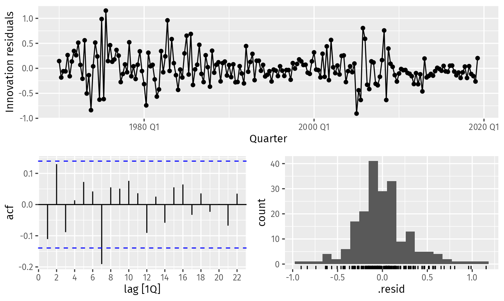

*based on  [Forecast Principles and Practices][1]*
*created on: 2024-11-23 18:50:34*

## 7.1 Linear Models

we will define a linear regression model as

$$y_t = \beta_0 + \beta_1 x_t + \varepsilon_t$$

In this context we will focus mainly on using linear models for forecasting. 
To test the assumptions behind the linear model we proceed similarly to other models (given that we have pretty much the same assumptions).

```R
fit_consMR |> gg_tsresiduals()
```




The residuals should also be uncorrelated with other predictors (covariates). so we can plot the scatter plot to check that.

## 7.4 some useful predictors.

### Linear Trend

adding $t$ as a regressor will clean up the trend component of the time series. 

### Dummy Variables

seasonal dummy variables or other variables that can be used to capture the effect of those variables: for example weekday, monthly, holidays, etc.
be careful that adding too many dummy variables can lead to undetermination given the lack of rows of data. 

### Distributed Lags 

Lags variables that might have sustained time effect on the current value of the time series.

$$
\begin{align*}
  x_{1} &= \text{advertising for previous month;} \\
  x_{2} &= \text{advertising for two months previously;} \\
        & \vdots \\
  x_{m} &= \text{advertising for $m$ months previously.}
\end{align*}
$$
### Intervention variables

variables that can be used to capture the effect of an intervention in the time series. they can be turn on and keep on for multiples periods (different from the classical dummies).

### Fourier terms

An alternative to using seasonal dummy variables, especially for long seasonal periods, is to use Fourier terms. Jean-Baptiste Fourier was a French mathematician, born in the 1700s, who showed that a series of sine and cosine terms of the right frequencies can approximate any periodic function. We can use them for seasonal patterns.

$$
S_k(t) = \sin\left(\frac{2\pi kt}{m}\right), \quad C_k(t) = \cos\left(\frac{2\pi kt}{m}\right)
$$
    
**where $m$ is the number of periods in a season** (it doesn't have to be integer), and $k$ is the frequency of the sine and cosine terms. The number of Fourier terms to include in the model is a hyperparameter that needs to be tuned.

$$
y_t = \beta_0 + \beta_1 t + \sum_{k=1}^{K}{\alpha_k S_k(t) + \beta_k C_k(t)} + \varepsilon_t
$$

This regressions are usually called "harmonic regression". Every seasonal wave form can be represented if $k$ is high enough. we usually choose $k$ that minimizes the AIC. also we usually define $K \le m/2$. 

## 7.5 Feature Selection 

### Adjusted R-squared
Adjusted R-squared is a good metric to use for feature selection. 

$$
\bar{R}^2 = 1-(1-R^2)\frac{T-1}{T-k-1},
$$

Maximising R-squared works quite well as a method of selecting predictors, although it does tend to err on the side of selecting too many predictors.

### Akaike Information Criterion (AIC)
A closely-related method is Akaike’s Information Criterion, which we define:

$$
\text{AIC} = T\log\left(\frac{\text{SSE}}{T}\right) + 2(k+2),
$$

where $T$ is the number of observations used for estimation and $k$ is the number of predictors in the model. AIC is an estimate of the "information lost" so we want to minimize it. lower AIC is a better predictive model.

For small number of observations $T$ AIC tends to select too many predictors, hence we present the corrected AIC (AICc):

$$
\text{AIC}_{\text{c}} = \text{AIC} + \frac{2(k+2)(k+3)}{T-k-3}.
$$

AIC tends to be a good proxy of the **leave-one-out** cross-validation MSE error for linear models so it can be use to calculate that faster (**is not equivalent to the timesplit cross-validation**).

### Bayesian Information Criterion (BIC)
BIC is another information criterion that is similar to AIC but has a **larger penalty for including additional predictors**. It is defined as:

$$
\text{BIC} = T\log\left(\frac{\text{SSE}}{T}\right) + (k+2)\log(T).
$$

### Feature Selection procedure:

testing all possible combinations of predictors is computationally expensive $2^{n}$ so we can use some greedy algorithm to select the best predictors (also known as a stepwise regression).

An approach that works quite well is backwards stepwise regression:

1. Start with the model containing all potential predictors.
1. Remove one predictor at a time. Keep the model if it improves the measure of predictive accuracy.
1. Iterate until no further improvement.

If the number of potential predictors is too large, then the backwards stepwise regression will not work and **forward stepwise regression** can be used instead. 
1. starts with a model that includes only the intercept. 
1. Predictors are added one at a time, and the one that most improves the measure of predictive accuracy is retained in the model.
1. The procedure is repeated until no further improvement can be achieved.

## 7.6 Forecasting with Regression 

We have two ways of forecasts with covariant dependant regression models:

1. **ex-ante forecasts**: we don't have the predictors for the future and we have to forecast them *before* forecasting the dependent variable.

2. **ex-post forecasts**: we use the predictors actual values to forecast the missing values of the time series. **These are not genuine forecasts, but are useful for studying the behaviour of forecasting models**.

A comparative evaluation of ex-ante forecasts and ex-post forecasts can help to separate out the sources of forecast uncertainty. This will show whether forecast errors have arisen due to poor forecasts of the predictor or due to a poor forecasting model.

for the missing predictors another alternative is to do "scenario forecast" where we assume a priori some values for the predictors and forecast the time series with those values. 


[//]: <> (References)
[1]: <https://otexts.com/fpp3/features.html>

[//]: <> (Some snippets)
[//]: # (add an image )