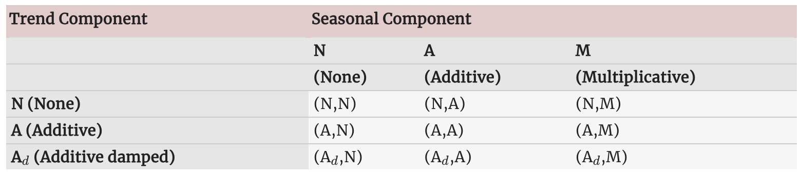
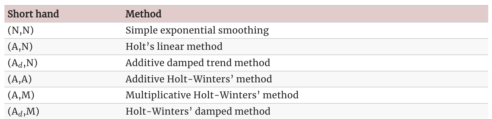
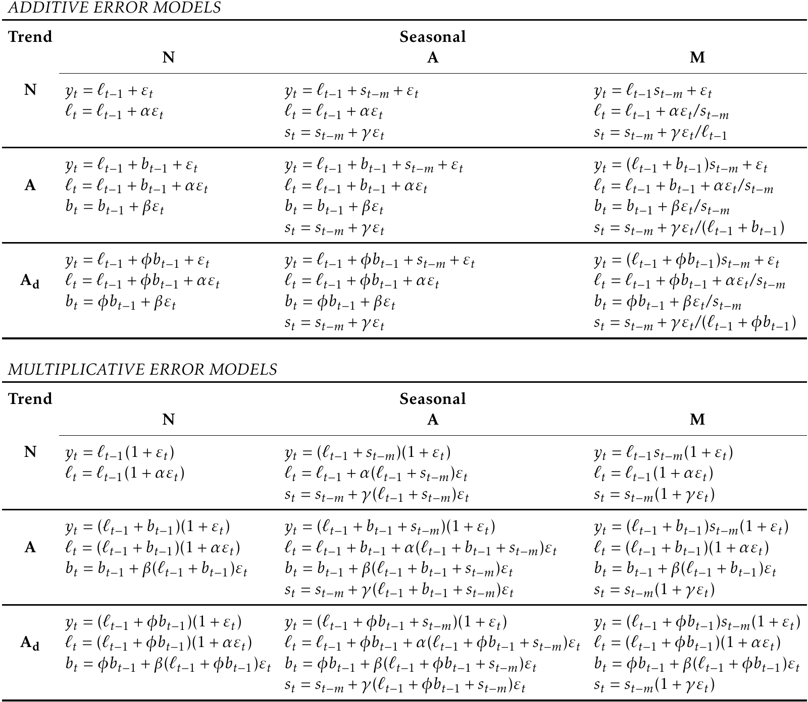
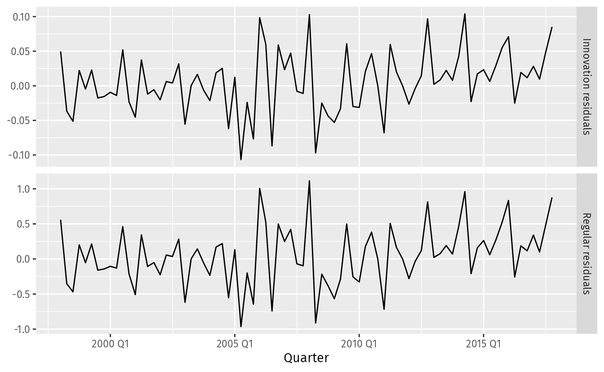

*based on [link][1]*
*created on: 2024-11-24 19:56:14*
## 8 Exponential Smoothing

Exponential smoothing is a time series forecasting method that gives more weight to recent observations and less weight to observations from the distant past. The weights assigned to past observations decrease exponentially over time, following a decay pattern.

## 8.1 Simple Exponential Smoothing (SES)

The simplest form of exponential smoothing is called simple exponential smoothing. It is suitable for time series **data without a trend or seasonal pattern**. The forecast at time $t+1$ is a weighted average of all the observations in the series up to time $t$. The weights decrease exponentially as we move back in time. 
$$\begin{align}
  \hat{y}_{T+1|T} &= \alpha y_T + \alpha(1-\alpha) y_{T-1} + \alpha(1-\alpha)^2 y_{T-2}+ \cdots \\

  \hat{y}_{T+1|T} & =  \sum_{j=0}^{T-1} \alpha(1-\alpha)^j y_{T-j} + (1-\alpha)^T \ell_{0}. \\

  \hat{y}_{T+1|T} &= \ell_{T} = \alpha y_T + (1-\alpha)\ell_{T-1},
\end{align}
$$

where $0 \le \alpha \le 1$  is the smoothing parameter. The one-step-ahead forecast for time $T+1$ is a weighted average of all of the observations in the series $y_1,…,y_T$ .

The rate at which the weights decrease is controlled by the parameter $\alpha$. The higher the alpha the faster the weights decrease (hence more recent observations have more weight), the lower, the slower the weights decrease (hence more past observations have more weight).

Each exponential smoothing method can be represented based on some "forms" the upper one is known as the "weighted average form", and here we present the **"component form"**:

$$
\begin{align*}
  \text{Forecast equation}  && \hat{y}_{t+h|t} & = \ell_{t}\\
  \text{Smoothing equation} && \ell_{t}        & = \alpha y_{t} + (1 - \alpha)\ell_{t-1},
\end{align*}
$$

Both representations are equivalent, but depending on the context we will use one or the other. On the **"component form"** we separate our exponential smoothing on two components: the forecast equation and the smoothing equation.

### Finding parameters $\alpha$ and $\ell_0$

To find the parameters we minimize the SSE error (sum of squared errors) between the forecast and the actual values. The SSE is defined as:

$$
\text{SSE}=\sum_{t=1}^T(y_t - \hat{y}_{t|t-1})^2=\sum_{t=1}^Te_t^2. 
$$

then our optimization problem is

$$
\min_{\alpha,\ell_0} SSE(\alpha, \ell_0)
$$

## 8.2 Methods with trend 

### Holt’s linear trend method

Holt (1957) extended simple exponential smoothing to allow the forecasting of data with a trend. This method involves a forecast equation and two smoothing equations (one for the level and one for the trend):

$$
\begin{align*}
  \text{Forecast equation}&& \hat{y}_{t+h|t} &= \ell_{t} + hb_{t} \\
  \text{Level equation}   && \ell_{t} &= \alpha y_{t} + (1 - \alpha)(\ell_{t-1} + b_{t-1})\\
  \text{Trend equation}   && b_{t}    &= \beta^*(\ell_{t} - \ell_{t-1}) + (1 -\beta^*)b_{t-1},
\end{align*}
$$

1. Two smoothing parameters $\alpha$ and $\beta*$ $(0 \le \alpha, \beta* \le 1)$
1. $\ell_t$ level: weighted average between $y_t$ and one-step ahead forecast for time $t$, $(\ell_{t-1} + b_{t-1} = \hat{y}_{t|t-1})$
1. $b_t$ slope: weighted average of $(\ell_t+ - \ell_{t-1})$ and $b_{t-1}$, current and previous estimate of slope.
1. Choose $\alpha, \beta*, \ell_0, b_0$ to minimise SSE.

### Damped trend method

The forecasts generated by Holt’s linear method display a constant trend (increasing or decreasing) indefinitely into the future. Empirical evidence indicates that these methods tend to over-forecast, especially for longer forecast horizons. Motivated by this observation, Gardner & McKenzie (1985) introduced a parameter that “dampens” the trend to a flat line some time in the future.

In conjunction with the smoothing parameters from the Holt’s model, this method also includes a **damping parameter** $0<\phi<1$

$$
\begin{align*}
  \hat{y}_{t+h|t} &= \ell_{t} + (\phi+\phi^2 + \dots + \phi^{h})b_{t} \\
  \ell_{t} &= \alpha y_{t} + (1 - \alpha)(\ell_{t-1} + \phi b_{t-1})\\
  b_{t} &= \beta^*(\ell_{t} - \ell_{t-1}) + (1 -\beta^*)\phi b_{t-1}.
\end{align*}

$$

1. If $\phi = 1$, identical to Holt's linear trend.
1. As $h \rightarrow \infty$, $\hat{y}_{T+h|T} \rightarrow \ell_T + \phi b_T / (1 - \phi)$.
1. Short-run forecasts trended, long-run forecasts constant.

## 8.3 Methods with seasonality

Holt (1957) and Winters (1960) extended Holt’s method to capture seasonality. 

We will add a $s_t$ component (and his corresponding decay rate $0\le \gamma \le \alpha$). We will parametrize a season of periods of length $m$ For example, for quarterly data $m=4$ and for monthly data $m=12$. 

The additive version of the method is:

$$
\begin{align*}
  \hat{y}_{t+h|t} &= \ell_{t} + hb_{t} + s_{t+h-m(k+1)} \\
  \ell_{t} &= \alpha(y_{t} - s_{t-m}) + (1 - \alpha)(\ell_{t-1} + b_{t-1})\\
  b_{t} &= \beta^*(\ell_{t} - \ell_{t-1}) + (1 - \beta^*)b_{t-1}\\
  s_{t} &= \gamma (y_{t}-\ell_{t-1}-b_{t-1}) + (1-\gamma)s_{t-m},
\end{align*}
$$

and the multiplicative version is:

$$
\begin{align*}
  \hat{y}_{t+h|t} &= (\ell_{t} + hb_{t})s_{t+h-m(k+1)} \\
  \ell_{t} &= \alpha \frac{y_{t}}{s_{t-m}} + (1 - \alpha)(\ell_{t-1} + b_{t-1})\\
  b_{t} &= \beta^*(\ell_{t}-\ell_{t-1}) + (1 - \beta^*)b_{t-1}                \\
  s_{t} &= \gamma \frac{y_{t}}{(\ell_{t-1} + b_{t-1})} + (1 - \gamma)s_{t-m}.
\end{align*}
$$

## Summary of methods 

Exponential smoothing methods are not restricted to those we have presented so far. By considering variations in the combinations of the trend and seasonal components, nine exponential smoothing methods are possible, listed in Table 8.5. Each method is labelled by a pair of letters (T,S) defining the type of ‘Trend’ and ‘Seasonal’ components. For example, (A,M) is the method with an additive trend and multiplicative seasonality. 

We do not consider the multiplicative trend methods in this book as they tend to produce poor forecasts.

## 8.5 Models and Methods 

So far exponential smoothing is described as a method of forecasting, given that it lacked from some fundamental statistical theory about random variables, however on the 90's some authors standarized this methods into a proper statistical model, with some defined distributions of the forecasts and errors.

To distinguish between a model with additive errors and one with multiplicative errors (and also to distinguish the models from the methods), we add a third letter to the classification of Table 8.5. We label each state space model as ETS(.,.,.) for (Error, Trend, Seasonal). This label can also be thought of as ExponenTial Smoothing. Using the same notation as in Table 8.5, the possibilities for each component (or state) are: Error ={ A,M } , Trend  ={ N,A,$A_d$}  and Seasonal={N,A,M} .

### ETS(A,N,N): simple exponential smoothing with additive errors

Recall the component form of simple exponential smoothing:
$$
\begin{align*}
  \text{Forecast equation}  && \hat{y}_{t+1|t} & = \ell_{t}\\
  \text{Smoothing equation} && \ell_{t}        & = \alpha y_{t} + (1 - \alpha)\ell_{t-1}.
\end{align*}
$$
If we re-arrange the smoothing equation for the level, we get the “error correction” form,
$$
\begin{align*}
\ell_{t} %&= \alpha y_{t}+\ell_{t-1}-\alpha\ell_{t-1}\\
         &= \ell_{t-1}+\alpha( y_{t}-\ell_{t-1})\\
         &= \ell_{t-1}+\alpha e_{t},
\end{align*}

$$
For a model with additive errors, we assume that residuals (the one-step training errors) $e_t$ re normally distributed white noise with mean 0 and variance $\sigma^2$. A short-hand notation for this is $e_t \sim NID(0,\sigma^2)$. NID stands for “normally and independently distributed”.
Then the equations of the model can be written as:

$$
\begin{align}
  y_t &= \ell_{t-1} + \varepsilon_t \tag{8.3}\\
  \ell_t&=\ell_{t-1}+\alpha \varepsilon_t. \tag{8.4}
\end{align}
$$

We refer to (8.3) as the measurement (or observation) equation and (8.4) as the state (or transition) equation. These two equations, together with the statistical distribution of the errors, form a fully specified statistical model. Specifically, these constitute an innovations state space model underlying simple exponential smoothing.

The term “innovations” comes from the fact that all equations use the same random error process,  $ε_t$. For the same reason, this formulation is also referred to as a “single source of error” model. There are alternative multiple source of error formulations which we do not present here.

In general you can use this following table for all the especifications of the ETS models:

## 8.6 Estimating and choosing ETS models

Each model, given certain characteristics of ETS(Error, Trend, Seasonal), has a few parameters to estimate:
1. $\alpha$: smoothing parameter for the level.
1. $\beta$: smoothing parameter for the trend.
1. $\gamma$: smoothing parameter for the seasonal component.
1. $\phi$: smoothing parameter for the damped trend.
1. $\ell_0, b_0$: initial conditions 

depending on the ETS model, we will define one of many of those parameters, we do this maximizing likelihood (minimizing the log-likelihood). For models with additive error this is equivalent of minimizing SSE. for multiplicative errors is not the same.  

### model selection 
A great advantage of the ETS statistical framework is that information criteria can be used for model selection. The AIC, $AIC_c$ and BIC, can be used here to determine which of the ETS models is most appropriate for a given time series. We usually prefer AIC and $AIC_c$ (over BIC)

Three of the combinations of (Error, Trend, Seasonal) can lead to numerical difficulties. Specifically, the models that can cause such instabilities are ETS(A,N,M), ETS(A,A,M), and ETS(A,$A_d$,M), due to division by values potentially close to zero in the state equations. We normally do not consider these particular combinations when selecting a model.

Models with multiplicative errors are useful when the data are strictly positive, but are not numerically stable when the data contain zeros or negative values. Therefore, multiplicative error models will not be considered if the time series is not strictly positive. In that case, only the six fully additive models will be applied.

### Inov and Residuals 

For (errors) additive models the residuals and the innovation error are the same 

$$e_t = y_t - \hat{y}_{t|t-1}$$

but for multiplicative errors we need to escale them back

$$e_t = \frac{y_t - \hat{y}_{t|t-1}}{\hat{y}_{t|t-1}}$$

similarly with transformation models $y'_t = f(y_t)$ the innovation error is different than the residuals 

In the following plot you can see a error-multiplicative model plotting both, the innovation residuals and the regular residuals.

## 8.7 Forecasting using ETS models 

For some of the ETS(error, trend, season) models we can derive analytical expresion for the variances of the forecast distributions, but for some other we haven't. on those cases we need to relay on simulation of future sample paths, and this will give us simulated distributions where we can derive percentiles for the confidence intervals. 

[//]: <> (References)
[1]: <https://otexts.com/fpp3/ets.html>

[//]: <> (Some snippets)
[//]: # (add an image )