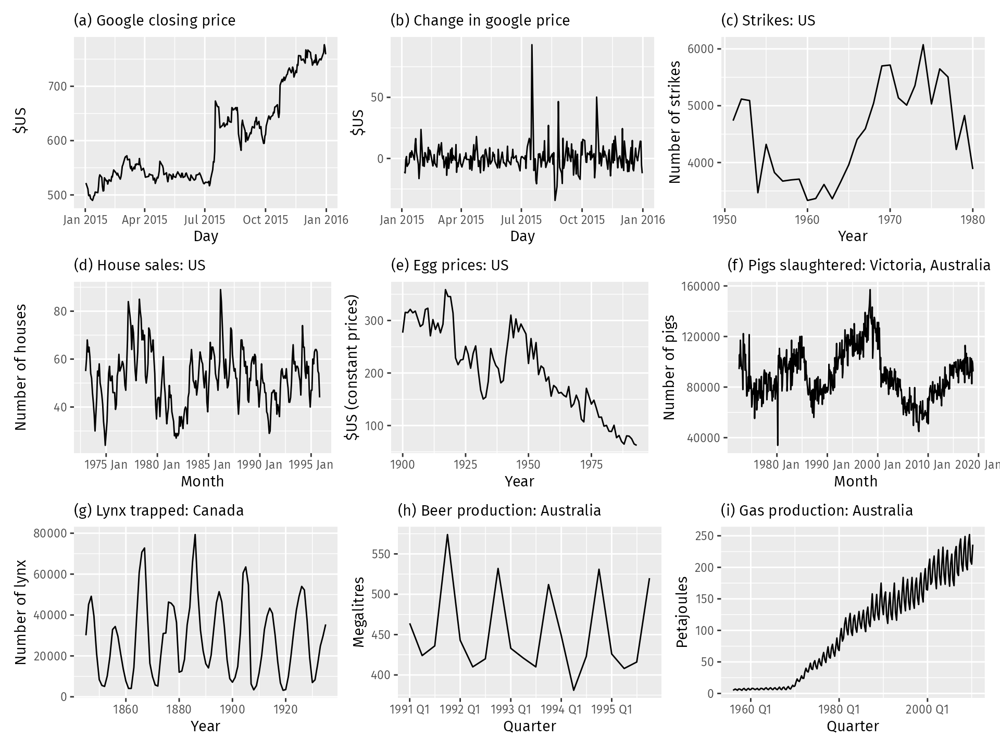
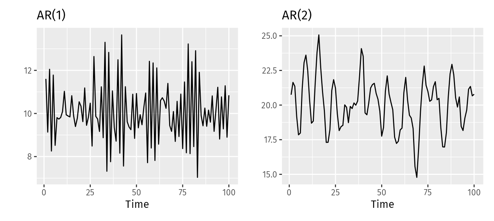
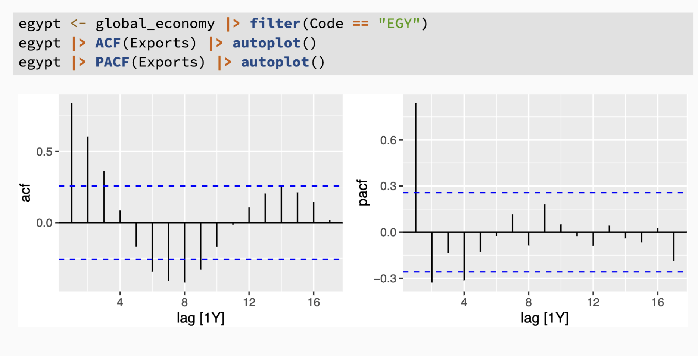
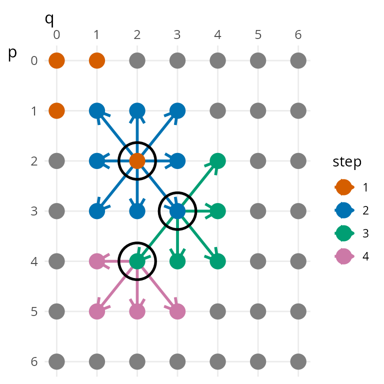
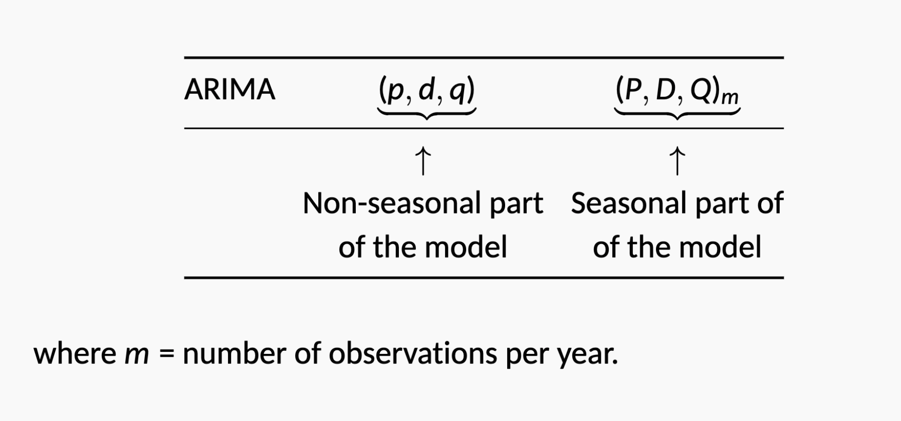
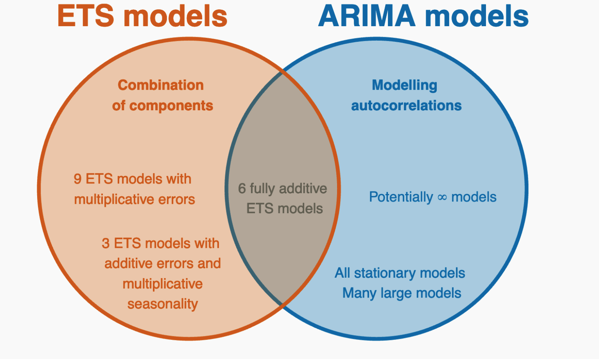

*based on [link][1]*
*created on: 2024-11-25 13:41:42*
# 9 Arima 

## 9.1 Stationary and Differencing

We will define a stationary series as a time series, if ${y_t}$ for all $s$ $(y_t, ..., y_{t+s})$ does "not depend on $t$". This is a little bit confusing, but in simple terms, if we took two windows of size $s$ from the time series, both **values distributions** should look the same (or very similar).

A stationary series is:
1. roughly horizontal (no trend ?)
1. **constant variance**
1. no patterns predictable in the long-term

Some cases can be confusing — a time series with cyclic behavior (but with no trend or seasonality) is stationary. This is because the cycles are not of a fixed length, so before we observe the series we cannot be sure where the peaks and troughs of the cycles will be. 

In the upper plot (a) is non stationary (you can see that there's a trend change overtime). while the differencing series, changes over time of (a), looks stationary. The other one that is not that ovbious is the (g) plot, The only argument here is that the cycles on the series have different-and not predicatable- periods, hence is "same as random". 

We can transform non-stationary series into stationary series, for example (similar to (b)) we can apply differentiation over the original series to get a stationary one.

There are other, non-graphical ways, to determinate if a series is stationary:
1. the ACF of stationary data drops to zero relatively quickly, or is below the significance range, while the ACF of non-stationary data decreases slowly and is significant. 
1. for non-stationary data the value of $\rho_1$ (first order autocorrelation) is often large and positive 

### Differencing 

Is the procedure of mapping the timeseries change rather the values themselves. $y'_t=y_t-y_{t-1}$. Differenced series has always $T-1$ data points given that we need at least two points to calculate the difference.

Sometimes differencing is not enough to make the series stationary, in this case we can apply a second order differencing, 

$$
\begin{align*}
  y''_{t}  &=  y'_{t}  - y'_{t - 1} \\
           &= (y_t - y_{t-1}) - (y_{t-1}-y_{t-2})\\
           &= y_t - 2y_{t-1} +y_{t-2}.
\end{align*}
$$
usually we don't go beyond second order differencing, because first order or second order differencing is enough to make the series stationary.

#### Seasonal Differencing

A seasonal difference is the difference between an observation and the same corresponding period in the previous season. $m$ observations before (length of the period).

$$
y'_t = y_t - y_{t-m}
$$

This series will only have $T-m$ data points.

is it possible to stack seasonal differences and first order differencing and this is commutative, however, we might suggest goig first with the seasonal differencing, then check if the data still doesn't look stationary, then apply first order differencing. 

this is because seasonal differencing tends to be more effective in removing seasonality than first order differencing.

#### The backward shift operator B

The backshift operator $B$ is a useful notational device when working with time series lags:

$$B y_{t} = y_{t - 1}  $$
for two lags
$$B(By_{t}) = B^{2}y_{t} = y_{t-2}$$

The backward shift operator is convenient for describing the process of differencing. A first difference can be written as
$$
y'_{t} = y_{t} - y_{t-1} = y_t - By_{t} = (1 - B)y_{t}\: .
$$

In general the $d$th difference of a time series is given by

$$(1 - B)^{d} y_{t}.$$

Seasonal $m$ differencing can be written as:
$$(1-B^{m})y_t$$

## 9.3 Autorregresive models 

In an autoregression model, we forecast the variable of interest using a linear combination of past values of the variable. The term autoregression indicates that it is a regression of the variable against itself.

Thus, an autoregressive model of order $p$ (denoted $AR(p)$) is given by:

$$
y_{t} = c + \phi_{1}y_{t-1} + \phi_{2}y_{t-2} + \dots + \phi_{p}y_{t-p} + \varepsilon_{t},
$$

Autoregressive models are remarkably flexible at handling a wide range of different time series patterns. The two series in Figure 9.5 show series from an AR(1) model and an AR(2) model. Changing the parameters $\phi_1,…,\phi_p$ results in different time series patterns

For an AR(1) model:
1. when $\phi_1=0$ and  $c=0$ , $y_t$  is equivalent to white noise
2. when  $\phi_1=1-$ and  $c=0$ ,  $y_t$  is equivalent to a random walk
3. when $|\phi|<1$ we have an stationary series
4. when  $\phi_1<0$, $y_t$  tends to oscillate around the mean.

the stationary constrains over the parameters $\phi_i$ are more complicated when the degree of the AR increases. The general condition is that the roots of the polinomial $(1-\phi z+...)$ are outside the unit circle on the complex plane.

This same condition for stationarity is translated into the "invertivility" property of the AR model. This condition will be necesary for the ARIMA model to be used in forecasting.

## 9.4 Moving Average Models

Rather than using past values of the forecast variable in a regression, a moving average model uses past forecast errors in a regression-like model
$$
y_{t} = c + \varepsilon_t + \theta_{1}\varepsilon_{t-1} + \theta_{2}\varepsilon_{t-2} + \dots + \theta_{q}\varepsilon_{t-q},
$$

where $ε_t$ is white noise. We refer to this as an MA($q$) model, a moving average model of order$q$. Of course, we do not observe the values of $ε_t$ , so it is not really a regression in the usual sense.

**be careful not to confuse moving average models with the moving average smoothing method for smoothing, these are models, while moving average smoothing is trend estimation method.**

It is possible to write any stationary AR($p$) model as an MA($∞$) model. For example, using repeated substitution.

The reverse result holds if we impose some constraints on the MA parameters. Then the MA model is called invertible. That is, we can write any invertible MA($q$) process as an AR($∞$) process. 

## 9.5 Non-Seasonal ARIMA

1. AR: autoregressive (lagged observations as inputs)
1. I: integrated (differencing to make series stationary)
1. MA: moving average (lagged errors as inputs)

if we combine this three components we will get a non-seasonal ARIMA model.

$$
\begin{equation}
  y'_{t} = c + \phi_{1}y'_{t-1} + \cdots + \phi_{p}y'_{t-p}
     + \theta_{1}\varepsilon_{t-1} + \cdots + \theta_{q}\varepsilon_{t-q} + \varepsilon_{t},  \tag{9.1}
\end{equation}
$$
We call this an ARIMA($p,d,q$) model, where:
1. $p$: order of the autoregressive part;
1. $d$ degree of first differencing involved;
1. $q$ order of the moving average part.

we have constraint over $\phi_i$ and $\theta_i$ so both AR is stationary and MA is invertible.

**An ARIMA model is rarely interpretable in terms of visible data structures like trend and seasonality. But it can capture a huge range of time series patterns.** particularly some series that are hard to model with ETS /STL

### Partial Autocorrelation 

In the ACF plot we estimate the correlation of $\text{lag}_k$ for all the datapoints, meaning that for example if $\rho_1$ and $\rho_2$ (first and second order autocorrelation ACF(1), ACF(2)) are significant the element $y_t$ and $y_{t-4}$ are correlated on the combination of $\rho_1$ and $\rho_2$ (because there's 1-lag and 2-lag correlation). 

The concept behind partial autocorrelation is to estimate the correlation between $y_t$ and $y_{t-k}$ after removing the effect of the intermediate lags $\rho_1$... $\rho_{k-1}$. 

We do this by regressing $y_t$ on $y_{t-1}$, $y_{t-2}$, ... $y_{t-k}$. and then the Partial autocorrelation is the coefficient of $y_{t-k}$ in this regression (commonly known as $\alpha_k$)

Last significant partial autocorrelation ($\alpha_k$) indicates the order of the AR model.

on the upper plot the last significant PACF is the 4 ($\alpha_4$). which means that if we model this series as an AR(4) we will have a good model. **we can't apply this for mixed models such as ARMA or ARIMA**, so if we model our timeseries only as an AR model we could use $p=4$, but when using ARIMA this might not be the case.

Also we can use ACF and PACF to determine the order of the MA model. but again, this procedure will fail if we try to use ARIMA models.

### Estimation and Oder Selection
If we do already have some order parameters ($p,d,q$) we can use the maximum likelihood estimation to estimate the parameters of the model. ($\phi_i, \theta_i, c$)

To select between different orders ()$p,d,q$) we can use the AIC or $AIC_c$

## 9.7 How does `ARIMA()` work ?

The `ARIMA()` function in the fable package uses a variation of the Hyndman-Khandakar algorithm (Hyndman & Khandakar, 2008), which combines unit root tests, minimisation of the AICc and MLE to obtain an ARIMA model. The arguments to `ARIMA()` provide for many variations on the algorithm. What is described here is the default behaviour.

Hyndman-Khandakar algorithm for automatic ARIMA modelling

1. The number of differences $0≤d≤2$ is determined using repeated KPSS tests.
1. The values of $p$ and $q$ are then chosen by minimising the AICc after differencing the data $d$ times. Rather than considering every possible combination of $p$ and $q$, the algorithm uses a stepwise search to traverse the model space.
1. it starts with 4 basic models (ARIMA(2,d,2), ARIMA(0,d,1), ARIMA(1,d,0), ARIMA(0,d,0)) and then iteratively adds AR and MA terms to the model until the AICc can no longer be improved.
1. it test local improvements increasing and decreasing $p$ and $q$ or adding and deleting the $c$ constant

**remember, before using this method, always check the variance of the data, if tends to increase or decrease overtime apply the log or box-cox transformation.**

## 9.9 Seasonal ARIMA
So far, we have restricted our attention to non-seasonal data and non-seasonal ARIMA models. However, ARIMA models are also capable of modelling a wide range of seasonal data.

A seasonal ARIMA model is formed by including additional seasonal terms in the ARIMA models we have seen so far. It is written as follows:

so uppercase letter will represent the seasonal part of the model, and the lowercase letter will represent the non-seasonal. This seasonal ARIMA model will be given by the multiplication of the non-seasonal and seasonal parts.

$$ARIMA = ARIMA (p,d,q)*ARIMA (P,D,Q)$$

## 9.10 ARIMA vs ETS
1. Myth that ARIMA models are more general than exponential smoothing.
1. Linear exponential smoothing models all special cases of ARIMA models.
1. Non-linear exponential smoothing models have no equivalent
ARIMA counterparts.
1. Many ARIMA models have no exponential smoothing counterparts.
1. ETS models all non-stationary. Models with seasonality or non-damped trend (or both) have two unit roots; all other models have one unit root.

The AICc is useful for selecting between models in the same class. For example, we can use it to select an ARIMA model between candidate ARIMA models or an ETS model between candidate ETS models. However, **it cannot be used to compare between ETS and ARIMA models because they are in different model classes**, and the likelihood is computed in different ways.

[//]: <> (References)
[1]: <https://google.com>

[//]: <> (Some snippets)
[//]: # (add an image )